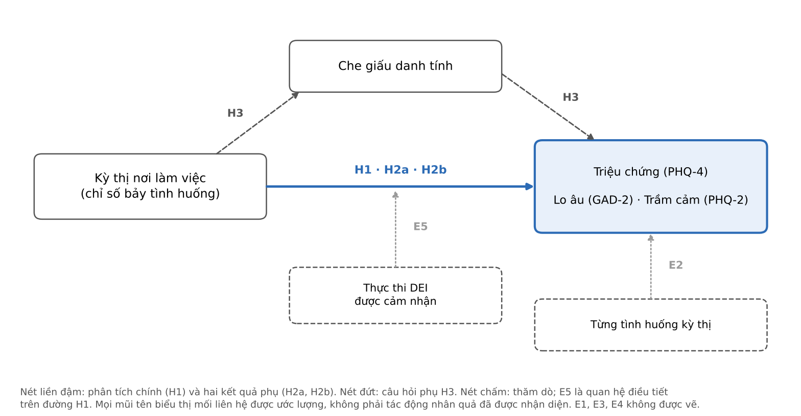

# BỆNH LÝ HAY ĐỊNH KIẾN? KỲ THỊ NƠI LÀM VIỆC VÀ SỨC KHỎE TÂM THẦN CỦA NGƯỜI LAO ĐỘNG LGBT TẠI VIỆT NAM

*Pathology or Prejudice? Workplace Stigma and Mental Health among LGBT Workers in Vietnam*

Công trình nghiên cứu khoa học sinh viên, Học viện Ngân hàng

> **Tình trạng văn bản (bản chờ duyệt).** Văn bản này gồm Mở đầu, Chương 1 và Chương 2 của bài nghiên cứu năm chương. Chương 3 (Phương pháp nghiên cứu), Chương 4 (Kết quả), Chương 5 (Thảo luận) và phần Tổng kết sẽ được viết sau khi bản này được duyệt. Các chỗ đánh dấu [CẦN XÁC NHẬN] cần tác giả kiểm tra trước khi hoàn thiện.

## DANH MỤC TỪ VIẾT TẮT

| Viết tắt | Nghĩa |
|---|---|
| DEI | Đa dạng, bình đẳng và bao trùm (diversity, equity and inclusion) |
| GAD-2 | Thang lo âu hai câu (Generalized Anxiety Disorder-2) |
| HC3 | Sai số chuẩn vững với phương sai sai số thay đổi, dạng HC3 |
| ICD | Bảng phân loại bệnh tật quốc tế (International Classification of Diseases) |
| LGBT | Đồng tính nữ, đồng tính nam, song tính và chuyển giới |
| OLS | Bình phương nhỏ nhất thông thường (ordinary least squares) |
| OSF | Open Science Framework |
| PHQ-2 | Thang trầm cảm hai câu (Patient Health Questionnaire-2) |
| PHQ-4 | Thang sàng lọc lo âu và trầm cảm bốn câu (Patient Health Questionnaire-4) |
| SOGIE | Xu hướng tính dục, bản dạng giới và thể hiện giới |

---

## MỞ ĐẦU

### 1. Tính cấp thiết và vấn đề nghiên cứu

Người thuộc nhóm thiểu số tình dục có tỷ lệ trầm cảm và rối loạn lo âu cao hơn người dị tính. Kết luận này đã được xác lập qua nhiều tổng quan hệ thống và phân tích gộp (King và cộng sự, 2008; Plöderl & Tremblay, 2015). Tuy vậy, một chênh lệch về tỷ lệ không tự nói lên nguyên nhân của nó. Cùng một con số có thể được đọc theo hai cách đối lập. Cách đọc thứ nhất xem bản dạng tính dục hoặc bản dạng giới là nguồn gốc của triệu chứng. Cách đọc thứ hai xem triệu chứng là hệ quả của cách xã hội đối xử với người mang bản dạng đó (I. H. Meyer, 2003).

Ở Việt Nam, cách đọc thứ nhất chưa thuộc về quá khứ. Năm 2022, Bộ Y tế ban hành Công văn số 4132/BYT-PC, yêu cầu các cơ sở khám bệnh, chữa bệnh không coi đồng tính, song tính và chuyển giới là bệnh (Bộ Y tế, 2022). Việc phải có một chỉ đạo như vậy cho thấy quan niệm bệnh lý hóa vẫn còn trong thực hành. Trong một môi trường như thế, số liệu về triệu chứng lo âu và trầm cảm ở người LGBT có thể bị đọc như bằng chứng xác nhận định kiến. Trong khi đó, chính định kiến lại là một lời giải thích cạnh tranh cho các triệu chứng ấy.

Lý thuyết căng thẳng thiểu số (minority stress theory) cho phép chuyển câu hỏi "bệnh lý hay định kiến" thành một dự báo có thể kiểm tra. Nếu triệu chứng gắn với định kiến, thì trong cùng một nhóm thiểu số, người gặp kỳ thị thường xuyên hơn được kỳ vọng có mức triệu chứng cao hơn (I. H. Meyer, 2003). Cách đọc bệnh lý hóa đặt nguyên nhân ở bản dạng, một đặc điểm không đổi giữa các thành viên của nhóm, nên không đưa ra dự báo này. Dự báo có tính bất đối xứng. Nếu dữ liệu đủ chính xác mà không cho thấy gradient giữa kỳ thị và triệu chứng, lời giải thích dựa trên căng thẳng thiểu số mất đi một căn cứ thực nghiệm. Nếu gradient được quan sát, kết quả phù hợp với lý thuyết nhưng chưa đủ để loại trừ các lời giải thích khác, chẳng hạn khả năng người đang có triệu chứng nhớ lại và báo cáo nhiều sự kiện tiêu cực hơn.

Nơi làm việc là bối cảnh thích hợp để kiểm tra dự báo này. Người trưởng thành dành một phần lớn thời gian thức tại nơi làm việc. Quan hệ với đồng nghiệp, cấp trên và khách hàng mang tính lặp lại và khó tránh né. Nơi làm việc còn là nơi định kiến có thể được chuyển thành quyết định về phân công, đánh giá, đào tạo và tiền lương. Tại Việt Nam, khoản 8 Điều 3 Bộ luật Lao động 2019 liệt kê các căn cứ cấm phân biệt đối xử trong lao động nhưng không nêu rõ xu hướng tính dục hay bản dạng giới (Quốc hội, 2019). Do đó, mức bảo vệ mà người lao động LGBT nhận được phụ thuộc nhiều vào chính sách và cách thực thi của từng nơi làm việc.

Bằng chứng hiện có chưa trả lời được câu hỏi này cho Việt Nam. Các nghiên cứu nền tảng về căng thẳng thiểu số tại nơi làm việc được thực hiện chủ yếu tại Hoa Kỳ (Ragins & Cornwell, 2001; Velez và cộng sự, 2013; Waldo, 1999). Tổng quan hệ thống gần đây về sức khỏe tâm thần của người lao động LGBTQ+ cho thấy phần lớn nghiên cứu có thiết kế cắt ngang và báo cáo kết quả dưới dạng chênh lệch giữa người lao động LGBTQ+ và người lao động không thuộc nhóm này (Tomic và cộng sự, 2025). Tại Việt Nam, các báo cáo của tổ chức quốc tế và tổ chức xã hội đã mô tả kỳ thị tại nơi làm việc (iSEE, 2015; UNDP & USAID, 2014). Các nghiên cứu định lượng được bình duyệt lại tập trung vào kỳ thị nội tâm hóa, tự kỳ thị và thường chỉ khảo sát một nhóm SOGIE (Ngo và cộng sự, 2026; Tran và cộng sự, 2020). Chương 1 và Chương 2 phân tích chi tiết các khoảng trống này.

### 2. Mục tiêu và câu hỏi nghiên cứu

Câu hỏi nghiên cứu chính là: *trong người lao động LGBT tại Việt Nam, mức độ kỳ thị thể hiện (enacted stigma) tại nơi làm việc có liên hệ với mức độ triệu chứng lo âu và trầm cảm hay không, sau khi điều chỉnh các đặc điểm có trước phơi nhiễm?*

Câu hỏi này không hỏi vì sao người LGBT có sức khỏe tâm thần kém. Câu hỏi này hỏi mức triệu chứng liên hệ đến đâu với mức phơi nhiễm với định kiến.

Nghiên cứu có ba mục tiêu. Mục tiêu thứ nhất là ước lượng mối liên hệ giữa mức độ kỳ thị tại nơi làm việc và mức độ triệu chứng, đối với tổng điểm triệu chứng cũng như riêng đối với lo âu và trầm cảm. Mục tiêu thứ hai là xác định những dạng hành vi kỳ thị nào đi kèm mức triệu chứng cao hơn. Mục tiêu thứ ba, ở mức thăm dò, là xem xét liệu mức thực thi chính sách DEI được cảm nhận có đi kèm một mối liên hệ yếu hơn giữa kỳ thị và triệu chứng hay không, và liệu mối liên hệ chính có khác nhau theo giới tính khi sinh và theo nhóm xu hướng tính dục hay không. Bên cạnh ba mục tiêu này, nghiên cứu đánh giá mức độ phù hợp của dữ liệu với một đường dẫn qua che giấu danh tính.

### 3. Đối tượng, phạm vi và phương pháp nghiên cứu

Đối tượng nghiên cứu là mối liên hệ giữa kỳ thị thể hiện tại nơi làm việc và triệu chứng lo âu, trầm cảm. Khách thể nghiên cứu là người lao động từ 18 tuổi trở lên, hiện có công việc chính tạo thu nhập tại Việt Nam và tự nhận là thuộc cộng đồng LGBT.

Về nội dung, nghiên cứu chỉ xem xét kỳ thị tại nơi làm việc hiện tại trong 12 tháng gần nhất. Nghiên cứu không đo kỳ thị trong gia đình, trường học hay cộng đồng. Nghiên cứu cũng không phân tích thu nhập, dù bảng hỏi có thu thập biến này. Về thời gian, dữ liệu được thu thập từ ngày 24/7 đến ngày 28/9/2026. Về không gian, người tham gia được tuyển chọn qua các kênh trực tuyến trên phạm vi cả nước, nhưng phần lớn làm việc tại Hà Nội, Thành phố Hồ Chí Minh và Đà Nẵng.

Nghiên cứu sử dụng thiết kế định lượng, quan sát, cắt ngang, với một khảo sát trực tuyến ẩn danh triển khai trên KoboToolbox. Trong 850 phiếu thu được, mẫu phân tích chính gồm 278 người lao động LGBT. Mối liên hệ được ước lượng bằng hồi quy tuyến tính theo phương pháp OLS với sai số chuẩn HC3, điều chỉnh các đặc điểm có trước phơi nhiễm. Kế hoạch phân tích được đăng ký trên Open Science Framework trước khi ước lượng mô hình chính [CẦN XÁC NHẬN: bản đăng ký đã được nộp; đường dẫn và ngày đăng ký]. Vì vị trí chính của câu hỏi về sức khỏe tâm thần được xác lập sau khi tác giả đã tiếp xúc một phần với dữ liệu, nghiên cứu được trình bày là một nghiên cứu khám phá có kế hoạch phân tích công bố trước, không phải một kiểm định khẳng định.

### 4. Đóng góp của nghiên cứu

*Về lý thuyết*, nghiên cứu kiểm tra dự báo trong nội bộ nhóm của lý thuyết căng thẳng thiểu số tại nơi làm việc. Đây là một bối cảnh có thứ bậc, nơi tác nhân xa có thể vận hành qua cả hành vi liên cá nhân lẫn quyết định chính thức. Nghiên cứu cũng làm rõ rằng che giấu danh tính có vị trí hai chiều trong quan hệ với kỳ thị thể hiện. Che giấu có thể là phản ứng trước kỳ thị, nhưng cũng có thể làm giảm phơi nhiễm với kỳ thị. Vị trí hai chiều này ảnh hưởng trực tiếp đến cách đọc một gradient quan sát được.

*Về thực nghiệm*, nghiên cứu cung cấp ước lượng từ người lao động thuộc nhiều nhóm SOGIE tại Việt Nam. Bối cảnh này khác các bối cảnh mà phần lớn bằng chứng hiện có xuất phát ở ba điểm: pháp luật lao động không gọi tên kỳ thị dựa trên xu hướng tính dục và bản dạng giới, che giấu danh tính có thể phổ biến, và cách đọc bệnh lý hóa vẫn hiện diện trong diễn ngôn xã hội.

*Về đo lường*, nghiên cứu sử dụng một chỉ số gồm các tình huống kỳ thị cụ thể tại nơi làm việc. Chỉ số cho phép tách các hành vi liên cá nhân khỏi các quyết định nhân sự đòi hỏi người trả lời tự quy nguyên, từ đó cung cấp một phép kiểm tra gián tiếp về thiên lệch quy nguyên. Chỉ số này chưa được chuẩn hóa, và giới hạn đó được trình bày công khai.

*Về phương pháp*, nghiên cứu xác định trước đại lượng ước lượng, lựa chọn biến kiểm soát theo thứ tự thời gian, cố định cách tính sai số chuẩn trước khi ước lượng, hiệu chỉnh kiểm định đa lần theo họ và định lượng mức nhạy của kết quả với gây nhiễu không quan sát. Nghiên cứu cũng công khai lịch sử phân tích, kể cả những phân tích đã thực hiện trước khi đăng ký.

*Về thực tiễn*, nếu mối liên hệ được xác nhận, kết quả gợi ý rằng kỳ thị tại nơi làm việc cần được đưa vào phạm vi quan tâm của sức khỏe tâm thần nghề nghiệp, kể cả những hành vi thường bị xem nhẹ như câu đùa xúc phạm hay câu hỏi xâm phạm đời tư.

### 5. Kết cấu của nghiên cứu

Ngoài Mở đầu, Tổng kết, tài liệu tham khảo và phụ lục, nghiên cứu gồm năm chương. Chương 1 xác lập vấn đề nghiên cứu: chênh lệch sức khỏe tâm thần, hai cách diễn giải chênh lệch đó và bối cảnh Việt Nam. Chương 2 xây dựng cơ sở lý thuyết, tổng hợp bằng chứng về các cơ chế, xác định khoảng trống và phát triển các giả thuyết. Chương 3 trình bày thiết kế nghiên cứu, dữ liệu, đo lường, chiến lược phân tích và các giới hạn của suy luận. Chương 4 trình bày kết quả theo trình tự các giả thuyết. Chương 5 thảo luận kết quả trong quan hệ với lý thuyết và bằng chứng trước đây, nêu hàm ý và hạn chế. Phần Tổng kết nêu các kết luận chính và khuyến nghị.

---

## CHƯƠNG 1. VẤN ĐỀ NGHIÊN CỨU: SỨC KHỎE TÂM THẦN CỦA NGƯỜI LGBT, HAI CÁCH DIỄN GIẢI VÀ BỐI CẢNH VIỆT NAM

Chương này xác lập vấn đề mà nghiên cứu cần giải quyết. Chương bắt đầu bằng các khái niệm về nhóm dân số và về biến kết quả (mục 1.1). Sau đó, chương trình bày bằng chứng về chênh lệch sức khỏe tâm thần và lập luận vì sao chênh lệch đó cần được diễn giải cẩn trọng (mục 1.2). Mục 1.3 phân tích bối cảnh pháp lý, chính sách và bằng chứng tại Việt Nam. Mục 1.4 tổng hợp các yếu tố trên thành vấn đề nghiên cứu cụ thể.

### 1.1. Các khái niệm cốt lõi

#### 1.1.1. Người thiểu số tình dục và giới

Giới tính, bản dạng giới và xu hướng tính dục là những khái niệm liên quan nhưng khác biệt về nội hàm, và các hướng dẫn đo lường hiện nay khuyến nghị đo chúng riêng rẽ (National Academies of Sciences, Engineering, and Medicine, 2022). Giới tính được chỉ định khi sinh là giới tính được ghi nhận lúc sinh ra, thường dựa trên đặc điểm sinh học. Bản dạng giới là cảm nhận bên trong của một người về giới của mình, có thể trùng hoặc không trùng với giới tính được chỉ định khi sinh. Thể hiện giới là cách một người biểu đạt giới qua trang phục, giọng nói hay hành vi. Xu hướng tính dục là sự hấp dẫn về tình cảm hoặc tình dục, cùng với bản dạng và hành vi đi kèm. Cụm từ SOGIE được dùng để chỉ chung xu hướng tính dục, bản dạng giới và thể hiện giới.

Người thiểu số tình dục là người có xu hướng tính dục khác dị tính, như đồng tính nam, đồng tính nữ, song tính hay toàn tính. Người thiểu số giới là người có bản dạng giới khác giới tính được chỉ định khi sinh, như người chuyển giới hay người phi nhị nguyên. Nghiên cứu này dùng thuật ngữ LGBT như một thuật ngữ bao quát cho cả hai nhóm. Cách dùng này phù hợp với câu hỏi tự nhận diện trong bảng hỏi ("Anh/chị có tự nhận mình thuộc cộng đồng LGBT/LGBTQ+ không?"), nhưng có hai giới hạn.

Giới hạn đầu tiên là nhóm LGBT không đồng nhất. Người song tính, người đồng tính và người chuyển giới có thể khác nhau về mức độ hiển thị của danh tính, về loại kỳ thị gặp phải và về mức triệu chứng. Vì vậy, một ước lượng cho toàn nhóm là một ước lượng trung bình trên những trải nghiệm khác nhau. Giới hạn còn lại là tự nhận diện không trùng hoàn toàn với các thuộc tính SOGIE. Một người có xu hướng tính dục không dị tính có thể không tự nhận là thuộc cộng đồng LGBT, và ngược lại. Bảng hỏi của nghiên cứu đo riêng giới tính được chỉ định khi sinh, bản dạng giới hiện tại, xu hướng tính dục và tự nhận diện LGBT. Cách đo này cho phép kiểm tra mức nhạy của kết quả đối với định nghĩa nhóm, như sẽ trình bày ở Chương 3.

#### 1.1.2. Triệu chứng lo âu và trầm cảm

Nghiên cứu đo mức độ triệu chứng, không đo rối loạn. Rối loạn lo âu và rối loạn trầm cảm là các chẩn đoán lâm sàng, đòi hỏi đánh giá của người có chuyên môn theo tiêu chuẩn chẩn đoán. Triệu chứng là các trải nghiệm như lo lắng không kiểm soát được, cảm giác buồn chán hay mất hứng thú. Các trải nghiệm này có thể xuất hiện ở nhiều mức độ và có thể phát sinh từ nhiều nguồn, trong đó có điều kiện sống. Thang PHQ-4 được xây dựng như một công cụ sàng lọc ngắn gồm hai câu về lo âu và hai câu về trầm cảm (Kroenke và cộng sự, 2009). Trong nghiên cứu này, thang được dùng như một thước đo liên tục về mức độ triệu chứng trong hai tuần gần nhất.

Sự phân biệt giữa triệu chứng và rối loạn có ý nghĩa cho chính câu hỏi "bệnh lý hay định kiến". Một mức triệu chứng cao hơn không đồng nghĩa với việc mắc rối loạn. Một mức triệu chứng cao hơn càng không đồng nghĩa với việc bản dạng là một bệnh lý. Câu hỏi của nghiên cứu là liệu một điều kiện xã hội cụ thể, kỳ thị tại nơi làm việc, có đi kèm mức triệu chứng cao hơn hay không.

### 1.2. Chênh lệch sức khỏe tâm thần và hai cách diễn giải

Chênh lệch về sức khỏe tâm thần giữa người thiểu số tình dục và người dị tính là một phát hiện được lặp lại nhất quán trong dịch tễ học. Tổng quan và phân tích gộp của King và cộng sự (2008) ghi nhận nguy cơ trầm cảm và rối loạn lo âu ở người đồng tính và song tính cao hơn ít nhất 1,5 lần so với người dị tính. Tổng quan hệ thống của Plöderl và Tremblay (2015) cho thấy phần lớn nghiên cứu ghi nhận nguy cơ cao hơn về trầm cảm, lo âu và hành vi tự sát ở cả nam và nữ, ở cả vị thành niên và người trưởng thành, và ở nhiều khu vực địa lý. Chênh lệch không đồng đều giữa các nhóm. Phân tích gộp của Ross và cộng sự (2018) cho thấy người song tính có tỷ lệ trầm cảm và lo âu cao hơn cả người dị tính lẫn người đồng tính. Kết quả này đặc biệt liên quan đến nghiên cứu hiện tại, vì người song tính và toàn tính là nhóm đông nhất trong mẫu.

Chênh lệch là đối tượng cần giải thích, không phải lời giải thích. Trong phần lớn thế kỷ XX, tâm thần học xem chính đồng tính là một rối loạn. Hiệp hội Tâm thần học Hoa Kỳ đưa đồng tính ra khỏi Sổ tay chẩn đoán và thống kê các rối loạn tâm thần năm 1973, sau khi đối chiếu các lý thuyết bệnh lý hóa với các lý thuyết xem đồng tính là một biến thể bình thường của tính dục con người (Drescher, 2015). Năm 1990, Tổ chức Y tế Thế giới thông qua ICD-10, trong đó đồng tính không còn là một chẩn đoán. ICD-11, có hiệu lực từ năm 2022, chuyển tình trạng không phù hợp giới (gender incongruence) ra khỏi chương rối loạn tâm thần và hành vi sang chương các tình trạng liên quan đến sức khỏe tình dục (World Health Organization, 2019). Các quyết định phân loại này phản ánh đồng thuận khoa học. Chúng không tự xóa bỏ cách đọc bệnh lý hóa trong xã hội.

Tiêu đề "Bệnh lý hay định kiến?" vì vậy cần được hiểu như một câu hỏi về cách diễn giải dữ liệu, không như một cuộc tranh luận giữa hai lý thuyết khoa học có vị thế ngang nhau. Bản dạng tính dục và bản dạng giới không phải là rối loạn, và nghiên cứu này không xem bản dạng là bệnh lý cần giải thích. Câu hỏi thực nghiệm có ý nghĩa là liệu triệu chứng có biến thiên theo những điều kiện xã hội mà người LGBT trải qua hay không. Cách đặt vấn đề này dẫn đến hai yêu cầu đối với thiết kế nghiên cứu.

Yêu cầu đầu tiên là phân tích được thực hiện trong nội bộ nhóm LGBT. Chỉ khi tư cách thành viên của nhóm được giữ cố định, biến thiên của triệu chứng mới có thể được đối chiếu với biến thiên của phơi nhiễm với kỳ thị. Một phép so sánh giữa người LGBT và người dị tính chỉ cho biết lại độ lớn của chênh lệch, điều mà các tổng quan đã xác lập. Phép so sánh đó cũng không phân biệt được hai cách đọc, vì cả hai cách đọc đều dự báo có chênh lệch.

Yêu cầu còn lại là xác định đúng lời giải thích cạnh tranh. Đối với một gradient giữa kỳ thị và triệu chứng trong nội bộ nhóm, lời giải thích cạnh tranh nghiêm túc nhất không phải là "bản dạng gây ra triệu chứng". Lời giải thích cạnh tranh nghiêm túc nhất có hai dạng. Dạng thứ nhất là khả năng triệu chứng làm thay đổi việc trải nghiệm và báo cáo kỳ thị. Người đang có triệu chứng trầm cảm có thể nhớ lại nhiều sự kiện tiêu cực hơn, người đang lo âu có thể diễn giải một hành vi mơ hồ như hành vi kỳ thị, và triệu chứng cũng có thể làm một người dễ trở thành mục tiêu của kỳ thị hơn. Dạng thứ hai là khả năng một yếu tố khác, như căng thẳng trong gia đình, đồng thời liên quan đến cả kỳ thị tại nơi làm việc và triệu chứng. Đây là các vấn đề nhận diện, và Chương 3 xử lý chúng như vậy.

### 1.3. Bối cảnh Việt Nam

#### 1.3.1. Cấu hình pháp lý và chính sách

Khung pháp lý của Việt Nam liên quan đến người LGBT có một cấu hình riêng. Ngành y tế đã chính thức từ bỏ cách nhìn bệnh lý hóa. Công văn số 4132/BYT-PC ngày 03/8/2022 của Bộ Y tế yêu cầu các cơ sở khám bệnh, chữa bệnh không coi đồng tính, song tính và chuyển giới là bệnh (Bộ Y tế, 2022). Bộ luật Dân sự 2015 thừa nhận việc chuyển đổi giới tính và quyền đăng ký thay đổi hộ tịch của người đã chuyển đổi giới tính, đồng thời quy định việc chuyển đổi giới tính được thực hiện theo quy định của luật (Quốc hội, 2015, Điều 37). Ngược lại, pháp luật lao động không gọi tên xu hướng tính dục và bản dạng giới. Khoản 8 Điều 3 Bộ luật Lao động 2019 định nghĩa phân biệt đối xử trong lao động là hành vi phân biệt, loại trừ hoặc ưu tiên dựa trên chủng tộc, màu da, nguồn gốc quốc gia hoặc nguồn gốc xã hội, dân tộc, giới tính, độ tuổi, tình trạng thai sản, tình trạng hôn nhân, tôn giáo, tín ngưỡng, chính kiến, khuyết tật, trách nhiệm gia đình hoặc trên cơ sở tình trạng nhiễm HIV hoặc vì lý do thành lập, gia nhập và hoạt động công đoàn, tổ chức của người lao động tại doanh nghiệp, có tác động làm ảnh hưởng đến bình đẳng về cơ hội việc làm hoặc nghề nghiệp (Quốc hội, 2019). Danh mục có "giới tính" nhưng không nêu rõ xu hướng tính dục hay bản dạng giới. Luật Hôn nhân và gia đình 2014 quy định Nhà nước không thừa nhận hôn nhân giữa những người cùng giới tính (Quốc hội, 2014, khoản 2 Điều 8).

Cấu hình này ảnh hưởng đến nghiên cứu theo hai cách. Cách thứ nhất liên quan đến khả năng gọi tên trải nghiệm. Khi pháp luật lao động không gọi tên kỳ thị dựa trên xu hướng tính dục và bản dạng giới, người lao động khó có căn cứ để phản ánh, và tổ chức không có nghĩa vụ pháp lý cụ thể phải xử lý. Các hành vi như câu đùa xúc phạm hay câu hỏi xâm phạm đời tư càng dễ bị xem là chuyện riêng giữa các cá nhân.

Cách thứ hai liên quan đến biến thiên giữa các nơi làm việc. Khi không có yêu cầu pháp lý chung, chính sách đa dạng, bình đẳng và bao trùm (DEI) là lựa chọn tự nguyện của từng tổ chức. Điều này áp dụng cho cả những lợi ích gắn với tình trạng hôn nhân. Vì hôn nhân cùng giới không được thừa nhận, việc người lao động có bạn đời cùng giới có được hưởng phúc lợi dành cho gia đình hay không phụ thuộc vào quyết định của từng nơi làm việc. Tương tự, khi việc chuyển đổi giới tính được giao cho một đạo luật riêng quy định, việc người lao động chuyển giới được dùng tên gọi, trang phục và tiện ích phù hợp với bản dạng giới tại nơi làm việc phụ thuộc nhiều vào cách từng nơi làm việc ứng xử. Mức bảo vệ mà người lao động LGBT nhận được vì vậy có thể khác nhau nhiều giữa các nơi làm việc. Biến thiên này là điều kiện để mức thực thi DEI được cảm nhận có thể được nghiên cứu như một yếu tố bối cảnh ở cấp nơi làm việc.

Cấu hình pháp lý cũng phân biệt Việt Nam với các bối cảnh mà phần lớn bằng chứng về căng thẳng thiểu số tại nơi làm việc xuất phát. Tại Hoa Kỳ, Ragins và Cornwell (2001) ghi nhận người lao động đồng tính báo cáo nhiều phân biệt đối xử hơn khi nơi làm việc không được pháp luật bảo vệ. Herry và Dyar (2025) ghi nhận người thiểu số tình dục và đa dạng giới được chỉ định là nữ khi sinh sống tại các bang có nhiều chính sách chống phân biệt đối xử hơn báo cáo ít phân biệt đối xử dựa trên xu hướng tính dục hơn. Những nghiên cứu này khai thác biến thiên về chính sách giữa các địa phương trong cùng một quốc gia. Tại Việt Nam, khung pháp luật lao động áp dụng thống nhất trên cả nước, nên biến thiên về mức bảo vệ chủ yếu nằm ở cấp tổ chức.

#### 1.3.2. Bằng chứng về kỳ thị và sức khỏe tâm thần

Bằng chứng về người LGBT tại Việt Nam đến từ hai nguồn có chức năng khác nhau. Các báo cáo của tổ chức quốc tế và tổ chức xã hội mô tả mức độ phổ biến và hình thức của kỳ thị. UNDP và USAID (2014) tổng quan tình hình của người LGBT tại Việt Nam trong việc làm, giáo dục, y tế, gia đình và truyền thông. Khảo sát của Viện Nghiên cứu Xã hội, Kinh tế và Môi trường (iSEE, 2015) với 2.363 người tại 63 tỉnh, thành ghi nhận khoảng một phần ba số người trả lời cảm thấy bị phân biệt đối xử vì xu hướng tính dục hoặc bản dạng giới trong 12 tháng trước khảo sát, với gia đình, trường học và nơi làm việc là những nơi kỳ thị xảy ra nhiều nhất. Human Rights Watch (2020) ghi nhận rằng nhiều bài giảng trong trường học vẫn duy trì quan niệm sai lầm rằng hấp dẫn cùng giới là một rối loạn tâm thần có thể chẩn đoán và chữa khỏi. Như vậy, cách đọc bệnh lý hóa vẫn hiện diện ngay trong môi trường đào tạo nên người lao động tương lai. Tuy vậy, các báo cáo này không ước lượng mối liên hệ giữa kỳ thị và sức khỏe tâm thần.

Các nghiên cứu định lượng được bình duyệt có chức năng khác. Một phần của nhóm nghiên cứu này xây dựng công cụ đo lường, gồm thang đo kỳ thị nội tâm hóa bằng tiếng Việt cho phụ nữ thiểu số tình dục (T. Q. Nguyen, Poteat, và cộng sự, 2016) và đánh giá thang PHQ-9 như một công cụ đo mức độ triệu chứng trầm cảm ở cùng nhóm này (T. Q. Nguyen, Bandeen-Roche, và cộng sự, 2016). Khi xem xét các mối quan hệ, các nghiên cứu tập trung vào tác nhân gần. Tran và cộng sự (2020) xem xét quan hệ giữa việc tự bộc lộ, bao gồm bộc lộ với đồng nghiệp, kỳ thị nội tâm hóa và triệu chứng trầm cảm ở 302 phụ nữ thiểu số tình dục. Ngo và cộng sự (2026) ghi nhận tự kỳ thị ở 250 người thuộc cộng đồng LGBTQ+ liên quan đến tuổi, giới tính sinh học và mức độ công khai. Đối với người chuyển giới, L. V. Nguyen và cộng sự (2026) khảo sát 347 người và xem xét quan hệ giữa bức bối giới (gender dysphoria), khả năng phục hồi và đau khổ tâm lý. Trong các nghiên cứu được rà soát, Ha và cộng sự (2015) là nghiên cứu đo kỳ thị từ bên ngoài một cách rõ ràng nhất. Nghiên cứu này khảo sát 451 nam quan hệ tình dục đồng giới tại Hà Nội và ghi nhận trầm cảm và sử dụng chất là các mắt xích trung gian giữa kỳ thị và hành vi tình dục nguy cơ.

Tổng hợp lại, bằng chứng được bình duyệt tại Việt Nam có hai đặc điểm. Tác nhân xa trong một lĩnh vực cụ thể của đời sống, chẳng hạn nơi làm việc, chưa được đo một cách có hệ thống. Bên cạnh đó, phần lớn nghiên cứu khảo sát một nhóm SOGIE riêng lẻ, thường là phụ nữ thiểu số tình dục, nam quan hệ tình dục đồng giới hoặc người chuyển giới. Một điểm chung đáng chú ý là mức độ công khai danh tính xuất hiện như một biến quan trọng trong cả Tran và cộng sự (2020) lẫn Ngo và cộng sự (2026). Điểm này phù hợp với lập luận ở Chương 2 rằng che giấu danh tính là một quá trình trung tâm cần được tính đến khi nghiên cứu kỳ thị tại Việt Nam.

### 1.4. Vấn đề đặt ra cho nghiên cứu

Các phần trên cho phép phát biểu vấn đề nghiên cứu một cách cụ thể. Chênh lệch sức khỏe tâm thần giữa người thiểu số tình dục và người dị tính đã được xác lập, nhưng chênh lệch không tự cho biết nguyên nhân. Tại Việt Nam, cách đọc bệnh lý hóa vẫn hiện diện trong diễn ngôn xã hội và trong một số thể chế, dù ngành y tế đã chính thức từ bỏ nó. Kỳ thị đối với người LGBT, kể cả tại nơi làm việc, đã được các báo cáo mô tả. Điều chưa được biết là liệu, trong nội bộ nhóm người lao động LGBT, mức kỳ thị tại nơi làm việc có đi kèm mức triệu chứng lo âu và trầm cảm cao hơn hay không.

Câu hỏi này có ý nghĩa ở ba phương diện. Về khoa học, câu hỏi là một kiểm tra trực tiếp đối với dự báo trung tâm của cách đọc dựa trên định kiến, trong một bối cảnh khác với bối cảnh mà dự báo được hình thành. Về thực tiễn, nơi làm việc là một môi trường có tổ chức, có người chịu trách nhiệm và có công cụ can thiệp, khác với gia đình hay cộng đồng. Nếu kỳ thị tại nơi làm việc đi kèm mức triệu chứng cao hơn, người sử dụng lao động và người làm chính sách sức khỏe nghề nghiệp có thêm căn cứ để hành động. Về diễn giải, trong một bối cảnh mà triệu chứng của người LGBT có thể bị đọc như bằng chứng bệnh lý, bằng chứng về quan hệ giữa triệu chứng và điều kiện xã hội có giá trị điều chỉnh cách đọc đó.

Để trả lời câu hỏi, nghiên cứu cần một lý thuyết cho biết vì sao kỳ thị tại nơi làm việc có thể liên hệ với triệu chứng, qua những con đường nào và trong những điều kiện nào. Chương 2 xây dựng cơ sở lý thuyết đó.

---

## CHƯƠNG 2. CƠ SỞ LÝ THUYẾT, KHOẢNG TRỐNG NGHIÊN CỨU VÀ GIẢ THUYẾT

Chương 1 kết thúc bằng một câu hỏi: trong nội bộ nhóm người lao động LGBT, kỳ thị tại nơi làm việc có đi kèm mức triệu chứng cao hơn hay không. Chương này xây dựng cơ sở lý thuyết để trả lời câu hỏi đó, xác định các khoảng trống nghiên cứu (mục 2.6) và phát triển các giả thuyết (mục 2.7).

### 2.1. Lý thuyết căng thẳng thiểu số

#### 2.1.1. Cấu trúc và các hướng phát triển của lý thuyết

Lý thuyết căng thẳng thiểu số giải thích chênh lệch sức khỏe tâm thần bằng điều kiện xã hội thay vì bằng bản dạng. I. H. Meyer (1995) xem xét các thành phần của căng thẳng thiểu số ở nam đồng tính, gồm kỳ thị nội tâm hóa, cảm nhận về kỳ thị và các sự kiện định kiến. I. H. Meyer (2003) phát triển các thành phần này thành một mô hình tích hợp cho người đồng tính và song tính. Mô hình dựa trên ba tính chất của căng thẳng thiểu số. Thứ nhất, căng thẳng thiểu số mang tính bổ sung, vì nó cộng thêm vào các tác nhân gây căng thẳng mà mọi người đều gặp. Thứ hai, nó mang tính mãn tính, vì nó gắn với những cấu trúc xã hội và văn hóa tương đối ổn định. Thứ ba, nó có nguồn gốc xã hội, vì nó phát sinh từ các quá trình và thể chế nằm ngoài cá nhân.

Trong mô hình của I. H. Meyer (2003), các tác nhân gây căng thẳng được sắp xếp theo khoảng cách với cá nhân. Tác nhân xa (distal stressors) là các sự kiện và điều kiện khách quan, như bị phân biệt đối xử, bị quấy rối hoặc bị bạo lực vì bản dạng. Tác nhân gần (proximal stressors) là các quá trình chủ quan, gồm sự chờ đợi bị từ chối, việc che giấu danh tính (identity concealment) và kỳ thị nội tâm hóa (internalized stigma). Sự phân biệt này có ý nghĩa lý thuyết, không chỉ có ý nghĩa phân loại. Tác nhân xa tồn tại trong môi trường, dù việc ghi nhận chúng trong một khảo sát luôn phải đi qua nhận thức của người trả lời. Tác nhân gần là cách cá nhân nội tâm hóa và ứng phó với một môi trường kỳ thị, nên chúng có thể duy trì ngay cả khi không có sự kiện kỳ thị nào xảy ra trong một khoảng thời gian. Mô hình cũng đặt các nguồn lực ứng phó và hỗ trợ xã hội, ở cấp cá nhân và cộng đồng, vào vị trí có thể làm thay đổi mối quan hệ giữa căng thẳng và sức khỏe.

Mô hình ban đầu để ngỏ câu hỏi kỳ thị "đi vào bên trong" con người bằng cách nào. Khung trung gian tâm lý của Hatzenbuehler (2009) đề xuất rằng căng thẳng liên quan đến kỳ thị làm gia tăng các khó khăn trong điều tiết cảm xúc, trong quan hệ liên cá nhân và các khuôn mẫu nhận thức tiêu cực, và chính các quá trình chung này dẫn tới triệu chứng. Khung này kết nối căng thẳng thiểu số với các cơ chế đã được nghiên cứu trong tâm lý bệnh học nói chung. Đối với nghiên cứu thực nghiệm, khung này có một hệ quả quan trọng. Một tác nhân xa có thể liên hệ với triệu chứng qua nhiều con đường cùng lúc, và các tác nhân gần đặc thù cho nhóm thiểu số chỉ là một phần trong số đó.

Lý thuyết đã được mở rộng theo hai hướng có liên quan trực tiếp đến nghiên cứu này. Hướng thứ nhất là kỳ thị cấu trúc, tức các điều kiện ở cấp xã hội, chuẩn mực văn hóa và chính sách thể chế hạn chế cơ hội, nguồn lực và an lạc của nhóm bị kỳ thị (Hatzenbuehler, 2016). Một phần bằng chứng về kỳ thị cấu trúc đến từ các thiết kế theo thời gian. Hatzenbuehler và cộng sự (2010) ghi nhận tỷ lệ rối loạn tâm thần tăng ở người đồng tính và song tính sống tại các bang Hoa Kỳ vừa thông qua lệnh cấm hôn nhân cùng giới. Một phần khác đến từ so sánh giữa các quốc gia. Pachankis và Bränström (2018) ghi nhận kỳ thị cấu trúc liên hệ với việc che giấu xu hướng tính dục và với mức hài lòng cuộc sống thấp hơn ở người thiểu số tình dục tại 28 quốc gia châu Âu. Hướng thứ hai là mở rộng mô hình cho người chuyển giới và người không tuân theo chuẩn mực giới (Hendricks & Testa, 2012). Nhìn lại hai thập kỷ phát triển, Frost và Meyer (2023) nhấn mạnh rằng các quá trình căng thẳng thiểu số cần được xem xét trong những bối cảnh xã hội và chính sách khác nhau và đang thay đổi. Nhận định này là một lý do để kiểm tra các dự báo của lý thuyết ngoài những bối cảnh mà lý thuyết được hình thành.

#### 2.1.2. Từ cơ chế đến dự báo có thể kiểm tra

Lý thuyết căng thẳng thiểu số là một lý thuyết nhân quả về các quá trình diễn ra theo thời gian. Từ lý thuyết này có thể rút ra ba loại dự báo thực nghiệm. Loại thứ nhất là dự báo về chênh lệch: nhóm thiểu số có mức triệu chứng cao hơn nhóm đa số. Loại thứ hai là dự báo về gradient trong nội bộ nhóm: trong cùng một nhóm thiểu số, người gặp nhiều tác nhân xa hơn có mức triệu chứng cao hơn. Loại thứ ba là dự báo về con đường: các tác nhân gần nằm giữa tác nhân xa và triệu chứng.

Ba loại dự báo đòi hỏi những điều kiện dữ liệu khác nhau. Dự báo về chênh lệch cần một nhóm so sánh được tuyển chọn tương đương với nhóm thiểu số. Dự báo về con đường cần dữ liệu có thứ tự thời gian, vì phân tích trung gian trên dữ liệu cắt ngang có thể cho ước lượng chệch đáng kể so với quá trình diễn ra theo thời gian (Maxwell & Cole, 2007). Dự báo về gradient trong nội bộ nhóm chỉ cần biến thiên về phơi nhiễm giữa các thành viên của nhóm. Vì vậy, đây là dự báo mà một khảo sát cắt ngang trên người LGBT có thể kiểm tra trực tiếp nhất. Kiểm tra đó vẫn có giới hạn. Một gradient quan sát được có thể phát sinh từ những quá trình khác ngoài quá trình mà lý thuyết mô tả, như đã phân tích ở mục 1.2.

Dự báo về gradient cũng là dự báo phân biệt rõ nhất hai cách diễn giải được trình bày ở Chương 1. Dự báo về chênh lệch không phân biệt được hai cách diễn giải, vì cả hai đều dự báo có chênh lệch. Dự báo về con đường giả định trước rằng tác nhân xa có vai trò, nên không phải là phép thử đầu tiên. Chỉ dự báo về gradient đặt hai cách diễn giải vào thế đối lập: một cách diễn giải dự báo triệu chứng biến thiên theo mức kỳ thị giữa những người cùng nhóm, còn cách diễn giải kia không dự báo điều đó. Vì vậy, nghiên cứu lấy dự báo về gradient làm kiểm định trung tâm, chỉ đánh giá dự báo về con đường ở mức độ phù hợp của dữ liệu, và không kiểm tra dự báo về chênh lệch.

### 2.2. Nơi làm việc như một bối cảnh của căng thẳng thiểu số

#### 2.2.1. Đặc điểm cấu trúc của nơi làm việc

Nhiều nghiên cứu về căng thẳng thiểu số đo kỳ thị trong đời sống nói chung, không gắn với một lĩnh vực cụ thể. Nơi làm việc khác các lĩnh vực khác ở bốn đặc điểm cấu trúc. Các đặc điểm này giải thích vì sao tác nhân xa tại nơi làm việc có thể vận hành khác với tác nhân xa ở nơi công cộng.

Tương tác tại nơi làm việc lặp lại và khó tránh né. Người lao động gặp cùng một nhóm đồng nghiệp và cấp trên hằng ngày, trong một thời gian dài. Rời bỏ một môi trường kỳ thị có chi phí cao, vì nó đồng nghĩa với mất thu nhập hoặc phải tìm việc mới. Một hành vi kỳ thị tại nơi làm việc vì vậy ít có khả năng là sự kiện đơn lẻ, và người lao động ít có khả năng tự loại bỏ phơi nhiễm.

Nơi làm việc là một hệ thống thứ bậc phân bổ nguồn lực. Cấp trên quyết định việc phân công, đánh giá hiệu suất, cơ hội đào tạo và mức lương. Khi định kiến của người có quyền quyết định được chuyển thành quyết định nhân sự, kỳ thị không còn chỉ là một tương tác khó chịu mà trở thành một bất lợi chính thức. Hebl và cộng sự (2002) phân biệt phân biệt đối xử chính thức, như quyết định tuyển dụng, với phân biệt đối xử liên cá nhân, như sự lạnh nhạt hay thời gian tương tác ngắn hơn. Trong thí nghiệm thực địa của nhóm tác giả, ứng viên được giới thiệu là người đồng tính không bị phân biệt đối xử về mặt chính thức nhưng nhận được phản ứng tiêu cực hơn về mặt liên cá nhân. Kết quả này cho thấy hai hình thức kỳ thị có thể tách rời nhau. Một thước đo chỉ ghi nhận quyết định chính thức sẽ bỏ sót một phần quan trọng của trải nghiệm kỳ thị tại nơi làm việc.

Nơi làm việc là nơi người lao động liên tục bị đánh giá, và người đánh giá có thể mang định kiến. Khi một quyết định bất lợi xảy ra, người lao động thiểu số phải xác định liệu quyết định đó phản ánh hiệu suất của mình hay phản ánh định kiến. Sự mơ hồ trong quy nguyên này vừa là một nguồn căng thẳng, vừa là một nguồn sai lệch khi đo lường. Cùng một quyết định có thể được quy cho các nguyên nhân khác nhau tùy theo kỳ vọng và tâm trạng của người trả lời.

Nơi làm việc có quy tắc và bầu không khí của tổ chức. Tổ chức có thể xử lý, dung thứ hoặc khuyến khích hành vi kỳ thị. Ragins và Cornwell (2001) ghi nhận người lao động đồng tính báo cáo nhiều phân biệt đối xử hơn khi làm việc trong nhóm chủ yếu là người dị tính và trong tổ chức thiếu chính sách hỗ trợ. Vai trò của tổ chức được phân tích riêng ở mục 2.5.

Bốn đặc điểm trên dẫn đến một hệ quả lý thuyết. Nơi làm việc là nơi định kiến liên cá nhân có thể được thể chế hóa thành quyết định phân bổ. Vì vậy, nơi làm việc cho phép quan sát tác nhân xa ở hai cấp trong cùng một bối cảnh: cấp tương tác và cấp quyết định. Đối với lý thuyết căng thẳng thiểu số, điều này cụ thể hóa cách một tác nhân xa có thể vận hành trong một môi trường thể chế. Hệ quả này không hàm ý rằng kỳ thị tại nơi làm việc liên hệ với triệu chứng mạnh hơn kỳ thị ở gia đình hay nơi công cộng. Nghiên cứu không có dữ liệu để so sánh giữa các lĩnh vực đời sống.

#### 2.2.2. Bằng chứng thực nghiệm về căng thẳng thiểu số tại nơi làm việc

Bằng chứng về căng thẳng thiểu số tại nơi làm việc nhất quán về hướng nhưng hạn chế về thiết kế và bối cảnh. Về hướng, trải nghiệm dị tính chuẩn mực và phân biệt đối xử tại nơi làm việc đi kèm mức đau khổ tâm lý cao hơn (Velez và cộng sự, 2013; Waldo, 1999) và thái độ công việc kém hơn (Ragins & Cornwell, 2001). Tổng quan hệ thống của Tomic và cộng sự (2025), gồm 32 nghiên cứu với 8.369 người lao động LGBTQ+, ghi nhận kỳ thị nội tâm hóa, dị tính chuẩn mực, căng thẳng công việc và thu nhập thấp là các yếu tố đi kèm kết cục sức khỏe tâm thần bất lợi. Một số nghiên cứu xem xét thêm đặc điểm việc làm, như tính bấp bênh của việc làm, ngành và mức hỗ trợ người LGBTQ được cảm nhận (Owens và cộng sự, 2022). Điểm này liên quan đến cách nghiên cứu xử lý các đặc điểm việc làm trong mô hình, được trình bày ở Chương 3.

Về thiết kế, 30 trong 32 nghiên cứu trong tổng quan của Tomic và cộng sự (2025) có thiết kế cắt ngang. Kết quả của tổng quan chủ yếu được trình bày dưới dạng chênh lệch giữa người lao động LGBTQ+ và người lao động không thuộc nhóm này. Một chênh lệch như vậy phù hợp với lý thuyết căng thẳng thiểu số, nhưng không kiểm tra dự báo trong nội bộ nhóm.

Về bối cảnh, các nghiên cứu nền tảng được thực hiện tại Hoa Kỳ, trong một hệ thống pháp lý có mức bảo vệ khác nhau giữa các địa phương (Ragins & Cornwell, 2001; Velez và cộng sự, 2013; Waldo, 1999). Bằng chứng từ châu Á mới bắt đầu xuất hiện. Lo và cộng sự (2025) khảo sát 706 người lao động LGBTQ tại Trung Quốc. Bốn tác nhân căng thẳng thiểu số, gồm trải nghiệm phân biệt đối xử, kỳ thị nội tâm hóa, sự chờ đợi bị từ chối và che giấu danh tính, đều liên hệ với cảm nhận tiêu cực hơn về bầu không khí nơi làm việc, và cảm nhận này liên hệ với mức triệu chứng trầm cảm cao hơn. Nghiên cứu này cho thấy các quá trình căng thẳng thiểu số tại nơi làm việc có thể được quan sát ngoài bối cảnh Bắc Mỹ. Tuy vậy, nghiên cứu chỉ đo triệu chứng trầm cảm.

### 2.3. Kỳ thị tại nơi làm việc

#### 2.3.1. Kỳ thị, phân biệt đối xử và các dạng kỳ thị thể hiện

Kỳ thị và phân biệt đối xử thường được dùng thay cho nhau, nhưng hai khái niệm có phạm vi khác nhau. Link và Phelan (2001) định nghĩa kỳ thị là sự đồng thời xuất hiện của năm thành phần: gán nhãn, rập khuôn, tách biệt, mất vị thế và phân biệt đối xử, trong một bối cảnh có chênh lệch quyền lực cho phép các thành phần đó diễn ra. Theo định nghĩa này, phân biệt đối xử là một thành phần của kỳ thị, cụ thể là thành phần hành vi dẫn đến bất lợi. Kỳ thị rộng hơn, vì nó bao gồm cả các hành vi gán nhãn và hạ thấp vị thế không nhất thiết gắn với một quyết định phân bổ.

Nghiên cứu này sử dụng khái niệm kỳ thị thể hiện (enacted stigma), tức các biểu hiện kỳ thị mà người lao động trực tiếp trải qua. Kỳ thị thể hiện tại nơi làm việc được hiểu là các hành vi và điều kiện tại nơi làm việc nhắm vào, hoặc dựa trên, xu hướng tính dục, bản dạng giới hay thể hiện giới của người lao động, và có tính chất hạ thấp, xâm phạm hoặc gây bất lợi. Khái niệm này bao gồm năm dạng:

- *Xúc phạm liên cá nhân*, như câu đùa, lời bình luận hay gọi tên mang tính xúc phạm. Một phần của dạng này trùng với khái niệm hành vi xúc phạm vi mô (microaggressions), tức các hành vi tinh vi, thường được xem là vô hại, nhưng truyền tải thông điệp thù địch hoặc hạ thấp (Nadal và cộng sự, 2016).
- *Xâm phạm đời tư*, gồm các câu hỏi riêng tư không mong muốn và việc bị tiết lộ hoặc bị đe dọa tiết lộ danh tính khi chưa đồng ý. Dạng này đặc thù cho các danh tính có thể che giấu, vì nó xâm phạm trực tiếp quyền kiểm soát thông tin về bản thân.
- *Phân biệt đối xử chính thức*, gồm việc bị loại khỏi cơ hội đào tạo, bị đánh giá hoặc trả lương không công bằng và bị phân công bất lợi.
- *Áp lực tuân theo khuôn mẫu giới* trong cách ăn mặc, nói năng hay hành xử.
- *Rào cản đối với bản dạng giới*, như khó khăn khi sử dụng tên gọi, đại từ, trang phục hay nhà vệ sinh phù hợp.

Cách phân loại này trả lời một câu hỏi mà người phản biện thường đặt ra: kỳ thị tại nơi làm việc có thực sự khác phân biệt đối xử hay không. Chỉ dạng thứ ba tương ứng với phân biệt đối xử theo nghĩa hẹp, tức các hành vi ảnh hưởng đến bình đẳng về cơ hội việc làm hay nghề nghiệp, gần với cách Bộ luật Lao động 2019 định nghĩa phân biệt đối xử trong lao động. Các dạng còn lại là kỳ thị thể hiện nhưng không phải phân biệt đối xử theo nghĩa pháp lý. Vì vậy, nghiên cứu dùng thuật ngữ "kỳ thị tại nơi làm việc" cho khái niệm tổng hợp, và chỉ dùng "phân biệt đối xử" khi nói về các quyết định chính thức hoặc khi trích dẫn nghiên cứu sử dụng thuật ngữ đó.

#### 2.3.2. Tính lặp lại và vấn đề quy nguyên

Hai thuộc tính của kỳ thị thể hiện có ý nghĩa lý thuyết đặc biệt đối với nghiên cứu này. Thuộc tính thứ nhất là tính lặp lại. Phân tích gộp của Schmitt và cộng sự (2014) ghi nhận phân biệt đối xử được cảm nhận liên hệ với mức an lạc tâm lý thấp hơn, kể cả trong các nghiên cứu dọc đã điều chỉnh mức an lạc ban đầu. Trong các nghiên cứu thực nghiệm của cùng phân tích gộp, việc thao tác nhận thức về mức độ phổ biến của phân biệt đối xử làm giảm an lạc. Ngược lại, việc quy một sự kiện tiêu cực đơn lẻ cho phân biệt đối xử thay vì cho bản thân không cho thấy khác biệt. Các tác giả kết luận rằng tính phổ biến của phân biệt đối xử là yếu tố căn bản trong tác hại của nó. Kết quả này có hệ quả cho việc đo lường. Một thước đo phơi nhiễm phù hợp với lý thuyết cần ghi nhận tần suất trong một khoảng thời gian, không chỉ ghi nhận việc từng gặp hay chưa.

Thuộc tính thứ hai là mức độ phụ thuộc vào quy nguyên. Các dạng kỳ thị khác nhau ở mức độ người trải qua phải tự suy luận về động cơ của người khác. Một câu đùa xúc phạm về xu hướng tính dục mang nội dung kỳ thị ngay trong chính nó. Ngược lại, một quyết định đánh giá hay trả lương bất lợi chỉ được ghi nhận là kỳ thị khi người trải qua cho rằng quyết định đó có liên quan đến xu hướng tính dục hoặc bản dạng giới của mình. Lewis và cộng sự (2015) tổng hợp các tiến bộ và các tranh luận còn mở trong nghiên cứu về phân biệt đối xử tự báo cáo và sức khỏe, trong đó có các tranh luận về cách đo lường. Đối với nghiên cứu này, sự khác biệt về mức độ phụ thuộc vào quy nguyên có hai hệ quả. Về lý thuyết, các dạng kỳ thị chính thức có thể gắn với triệu chứng qua sự mơ hồ và cảm giác bất công, còn các dạng liên cá nhân có thể gắn với triệu chứng qua thông điệp hạ thấp trực tiếp. Về đo lường, các dạng phụ thuộc vào quy nguyên dễ chịu ảnh hưởng của kỳ vọng và tâm trạng hơn. Nếu mối liên hệ giữa kỳ thị và triệu chứng chỉ xuất hiện ở các dạng phụ thuộc vào quy nguyên, khả năng thiên lệch quy nguyên hoặc hồi tưởng cần được cân nhắc nghiêm túc.

Hai thuộc tính này định hướng cách đo kỳ thị trong nghiên cứu. Phơi nhiễm được đo bằng một tập các tình huống cụ thể, mỗi tình huống được ghi nhận theo tần suất trong 12 tháng, để có thể phân tích cả ở cấp tổng hợp lẫn ở cấp từng tình huống. Cách xây dựng chỉ số, giới hạn của chỉ số và lý do chỉ số không được đánh giá như một thang đo phản ánh được trình bày ở Chương 3.

### 2.4. Che giấu danh tính: một tác nhân gần có vị trí hai chiều

Xu hướng tính dục và, trong nhiều trường hợp, bản dạng giới là những danh tính có thể che giấu. Với những danh tính này, quyết định công khai hay che giấu được đưa ra lặp lại trong từng tương tác. Clair và cộng sự (2005) mô tả quá trình quản lý danh tính vô hình tại nơi làm việc như một chuỗi lựa chọn giữa che giấu và bộc lộ, chịu ảnh hưởng của đặc điểm cá nhân và bối cảnh tổ chức. Ragins và cộng sự (2007) chỉ ra rằng nỗi sợ hậu quả của việc công khai gắn với môi trường làm việc và với mức hỗ trợ mà người lao động cảm nhận.

I. H. Meyer (2003) xếp che giấu vào nhóm tác nhân gần vì nó có chi phí tâm lý. Mô hình nhận thức, cảm xúc và hành vi của Pachankis (2007) mô tả các chi phí đó. Che giấu đòi hỏi sự cảnh giác liên tục, sự bận tâm về khả năng bị phát hiện và việc tự giám sát hành vi. Các quá trình này có thể dẫn tới lo âu, trầm cảm và cô lập xã hội. Từ mô hình này có thể phân biệt hai thành phần của che giấu: thành phần hành vi, tức những gì người lao động làm để giữ kín thông tin, và thành phần cảm xúc, tức sự lo lắng và mệt mỏi đi kèm.

Bằng chứng tổng hợp phức tạp hơn mô hình lý thuyết. Phân tích gộp của Pachankis và cộng sự (2020) ghi nhận mối liên hệ giữa che giấu xu hướng tính dục và triệu chứng trầm cảm phụ thuộc vào khía cạnh của che giấu được đo và vào đặc điểm của mẫu, với mối liên hệ mạnh hơn trong các mẫu chỉ gồm người song tính. Như vậy, che giấu không đồng nhất là có hại. Che giấu đồng thời là một chiến lược ứng phó mà người lao động có thể lựa chọn có chủ đích để tránh kỳ thị.

Điểm quan trọng nhất đối với nghiên cứu này là vị trí của che giấu trong quan hệ với kỳ thị thể hiện có tính hai chiều. Theo hướng thứ nhất, kỳ thị thể hiện có thể làm người lao động che giấu nhiều hơn, và che giấu, với các chi phí nhận thức và cảm xúc của nó, có thể đi kèm mức triệu chứng cao hơn. Đây là con đường mà lý thuyết căng thẳng thiểu số mô tả và giả thuyết H3 phát biểu. Theo hướng thứ hai, che giấu có thể làm giảm khả năng người khác biết về danh tính, và do đó làm giảm phơi nhiễm với những hình thức kỳ thị nhắm vào người đã bị nhận diện. Hai hướng này dự báo dấu ngược nhau cho mối liên hệ giữa kỳ thị và che giấu. Dữ liệu cắt ngang không phân tách được hai hướng.

Vị trí hai chiều của che giấu có thêm một hệ quả cho việc đọc gradient chính. Nếu che giấu vừa làm giảm phơi nhiễm vừa có chi phí tâm lý riêng, nhóm người báo cáo ít kỳ thị có thể bao gồm những người che giấu nhiều và có mức triệu chứng không thấp. Trong trường hợp đó, gradient quan sát được giữa kỳ thị và triệu chứng có thể nhỏ hơn mức mà một tác động của kỳ thị, nếu có, sẽ tạo ra. Hệ quả này đặc biệt đáng lưu ý ở những bối cảnh mà che giấu có thể phổ biến, như các bối cảnh có mức kỳ thị cấu trúc cao hơn (Pachankis & Bränström, 2018). Vì những lý do trên, nghiên cứu xem che giấu là một biến trung gian giả định. Nghiên cứu chỉ đánh giá mức độ phù hợp của dữ liệu với con đường kỳ thị → che giấu → triệu chứng, và không diễn giải kết quả như bằng chứng về trung gian.

### 2.5. Thực thi DEI được cảm nhận như một điều kiện của tổ chức

Mô hình của I. H. Meyer (2003) đặt các nguồn lực ứng phó và hỗ trợ xã hội vào vị trí điều tiết. Logic này gần với giả thuyết đệm căng thẳng của Cohen và Wills (1985), theo đó hỗ trợ xã hội làm giảm mối liên hệ giữa tác nhân gây căng thẳng và kết cục sức khỏe. Tại nơi làm việc, tổ chức là một nguồn hỗ trợ tiềm năng. Có ít nhất ba lý do để kỳ vọng mối liên hệ giữa kỳ thị và triệu chứng yếu hơn ở nơi người lao động cảm nhận chính sách DEI được thực thi tốt hơn.

Lý do đầu tiên liên quan đến ý nghĩa của sự kiện. Khi tổ chức nhắc nhở hoặc xử lý hành vi xúc phạm, một câu đùa kỳ thị có thể được trải nghiệm như hành vi của một cá nhân, thay vì như thông điệp rằng cả tổ chức chấp nhận sự kỳ thị. Lập luận này nối với kết quả của Schmitt và cộng sự (2014) về vai trò của tính phổ biến: một sự kiện bị tổ chức xử lý ít có khả năng được hiểu là biểu hiện của một sự kỳ thị lan tỏa. Lý do tiếp theo liên quan đến khả năng phản ứng. Một kênh phản ánh an toàn cho người lao động một lựa chọn ngoài việc chịu đựng hoặc rời bỏ. Lý do cuối cùng liên quan đến người có quyền quyết định. Một người quản lý trực tiếp tôn trọng người LGBT có thể làm giảm khả năng định kiến được chuyển thành quyết định nhân sự.

Nghiên cứu đo mức thực thi được cảm nhận thay vì sự tồn tại của văn bản chính sách. Lựa chọn này có cơ sở cả về lý thuyết lẫn thực nghiệm. Về lý thuyết, lý thuyết thể chế mô tả hiện tượng tách rời (decoupling): tổ chức có thể chấp nhận một cấu trúc chính thức để đạt tính chính danh mà không đưa cấu trúc đó vào hoạt động thực tế (J. W. Meyer & Rowan, 1977). Ở nơi pháp luật lao động không yêu cầu chính sách chống phân biệt đối xử dựa trên xu hướng tính dục và bản dạng giới, như tại Việt Nam (mục 1.3.1), khoảng cách giữa văn bản và thực hành có thể lớn. Về thực nghiệm, phân tích gộp của Webster và cộng sự (2018) tổng hợp ba loại hỗ trợ tại nơi làm việc, gồm chính sách chính thức, bầu không khí hỗ trợ người LGBT và các mối quan hệ hỗ trợ. Các mối quan hệ hỗ trợ liên hệ mạnh nhất với thái độ công việc và mức căng thẳng tâm lý, còn bầu không khí hỗ trợ liên hệ mạnh nhất với mức công khai danh tính và phân biệt đối xử được cảm nhận. Như vậy, ở cả bốn nhóm kết cục được xem xét, chính sách chính thức không phải là loại hỗ trợ có mối liên hệ mạnh nhất. Huffman và cộng sự (2008) cho thấy hỗ trợ từ cấp trên, từ đồng nghiệp và từ tổ chức liên hệ với những kết cục khác nhau, nên các nguồn hỗ trợ cần được phân biệt. Bốn khía cạnh của mức thực thi được đo trong nghiên cứu tương ứng với các thành phần này: sự an toàn khi phản ánh, thái độ của người quản lý trực tiếp, việc xử lý hành vi xúc phạm và việc được sử dụng tên gọi, đại từ, trang phục phù hợp với bản dạng giới.

Ba giới hạn khiến phân tích về DEI chỉ có thể là phân tích thăm dò. Mức thực thi DEI do chính người lao động báo cáo, nên phản ánh nhận thức chứ không phải đặc điểm khách quan của tổ chức. Khái niệm mức thực thi DEI và khái niệm kỳ thị thể hiện cũng không độc lập về nội dung. Việc hành vi xúc phạm có bị xử lý hay không là phản ứng của tổ chức đối với chính loại sự kiện mà chỉ số kỳ thị đo, và chính trải nghiệm kỳ thị có thể làm người lao động đánh giá thấp mức thực thi chính sách. Cuối cùng, các kiểm định tương tác trong dữ liệu quan sát có lực thống kê thấp hơn nhiều so với kiểm định hệ số chính (McClelland & Judd, 1993). Vì vậy, nghiên cứu xem mức thực thi DEI được cảm nhận là một điều kiện có thể đi kèm sự khác biệt của mối liên hệ thống kê, không phải một cơ chế điều tiết nhân quả.

### 2.6. Khoảng trống nghiên cứu

Tổng hợp Chương 1 và các mục trên cho thấy ba khoảng trống. Mỗi khoảng trống gắn với một giới hạn cụ thể của bằng chứng hiện có, không chỉ với việc chưa có nghiên cứu tại Việt Nam.

Khoảng trống thứ nhất nằm ở dự báo được kiểm tra. Bằng chứng về sức khỏe tâm thần của người lao động LGBT chủ yếu được trình bày dưới dạng chênh lệch giữa người LGBT và người không thuộc nhóm này (Tomic và cộng sự, 2025). Như đã lập luận ở mục 2.1.2, chênh lệch không phân biệt được hai cách đọc. Dự báo phân biệt được hai cách đọc, tức gradient trong nội bộ nhóm theo mức phơi nhiễm với kỳ thị tại nơi làm việc, ít được kiểm tra trực tiếp. Trong các mẫu thuận tiện, phép so sánh giữa hai nhóm còn dễ bị sai lệch bởi khác biệt về kênh tuyển chọn.

Khoảng trống thứ hai nằm ở bối cảnh thể chế. Các nghiên cứu nền tảng về căng thẳng thiểu số tại nơi làm việc được thực hiện tại Hoa Kỳ, nơi biến thiên về bảo vệ pháp lý giữa các bang và về chính sách tổ chức là một phần của chính đối tượng nghiên cứu (Ragins & Cornwell, 2001). Bằng chứng từ các bối cảnh mà pháp luật lao động không gọi tên kỳ thị dựa trên xu hướng tính dục và bản dạng giới, nơi che giấu có thể phổ biến và nơi cách đọc bệnh lý hóa vẫn hiện diện, còn hạn chế. Những đặc điểm này không chỉ làm cho bối cảnh "mới". Chúng có thể làm thay đổi điều kiện mà dự báo phải đứng vững: phơi nhiễm phụ thuộc nhiều hơn vào từng nơi làm việc, và che giấu có thể thu hẹp gradient quan sát được. Tại Việt Nam, trong phạm vi rà soát của tác giả, chưa có nghiên cứu được bình duyệt nào ước lượng mối liên hệ giữa kỳ thị thể hiện tại nơi làm việc và triệu chứng lo âu, trầm cảm ở người lao động thuộc nhiều nhóm SOGIE. Nhận định này sẽ chỉ được giữ trong bản công bố sau khi một rà soát tài liệu có cấu trúc trên Scopus, Web of Science, PubMed, Google Scholar và các tạp chí khoa học trong nước được hoàn tất và báo cáo.

Khoảng trống thứ ba nằm ở đo lường và suy luận. Khi kỳ thị tại nơi làm việc được tổng hợp thành một điểm duy nhất, không thể biết mối liên hệ với triệu chứng tập trung ở dạng hành vi nào. Tác giả chưa tìm thấy nghiên cứu nào về người lao động LGBT sử dụng sự khác biệt giữa các dạng kỳ thị phụ thuộc và không phụ thuộc vào quy nguyên như một phép kiểm tra thiên lệch báo cáo. Một số nghiên cứu gần đây chỉ đo triệu chứng trầm cảm (Lo và cộng sự, 2025; Tran và cộng sự, 2020), trong khi lý thuyết gợi ý rằng lo âu và trầm cảm cần được xem xét riêng. Cuối cùng, khi phần lớn bằng chứng trong lĩnh vực đến từ thiết kế cắt ngang, giá trị gia tăng của một nghiên cứu cắt ngang mới phụ thuộc vào mức độ minh bạch về đại lượng ước lượng, về các lựa chọn phân tích và về mức nhạy của kết quả với các nguồn sai lệch.

Bảng 2.1 ánh xạ từng khoảng trống với cách tiếp cận của nghiên cứu và với các phân tích tương ứng.

**Bảng 2.1. Khoảng trống nghiên cứu và cách tiếp cận của nghiên cứu**

| Khoảng trống | Cách tiếp cận của nghiên cứu | Phân tích tương ứng |
|---|---|---|
| 1. Dự báo trong nội bộ nhóm ít được kiểm tra trực tiếp | Phân tích chỉ trong nhóm người lao động LGBT, so sánh những người có mức phơi nhiễm khác nhau | H1, H2a, H2b; E1 |
| 2. Thiếu bằng chứng từ bối cảnh không có bảo vệ pháp lý theo SOGIE tại nơi làm việc | Mẫu người lao động LGBT thuộc nhiều nhóm SOGIE tại Việt Nam; xem xét che giấu danh tính và mức thực thi DEI ở cấp nơi làm việc | H3; E4; E5 |
| 3. Đo lường tổng hợp che khuất dạng kỳ thị; lo âu và trầm cảm ít được xem xét riêng; suy luận từ dữ liệu cắt ngang thiếu minh bạch | Chỉ số gồm các tình huống cụ thể và phân tích từng tình huống; phân tích riêng GAD-2 và PHQ-2; đại lượng ước lượng xác định trước, đăng ký trước, hiệu chỉnh kiểm định đa lần và phân tích độ nhạy (Chương 3) | E2; H2a, H2b; toàn bộ phân tích |

### 2.7. Khung khái niệm và giả thuyết nghiên cứu

#### 2.7.1. Khung khái niệm

Hình 2.1 trình bày khung khái niệm của nghiên cứu. Biến phơi nhiễm là kỳ thị thể hiện tại nơi làm việc, đo bằng chỉ số bảy tình huống, được xem là một tác nhân xa. Biến kết quả là mức độ triệu chứng, gồm tổng điểm PHQ-4 và hai thành phần lo âu (GAD-2) và trầm cảm (PHQ-2). Mối liên hệ giữa hai biến này là đối tượng của H1, H2a và H2b.

Che giấu danh tính được đặt ở vị trí trung gian giả định trên đường dẫn từ kỳ thị đến triệu chứng (H3). Vị trí này phản ánh con đường mà lý thuyết căng thẳng thiểu số mô tả, không phản ánh một thứ tự thời gian đã được xác lập (mục 2.4). Mức thực thi DEI được cảm nhận được đặt ở vị trí điều kiện thăm dò trên đường dẫn chính (E5). Từng tình huống kỳ thị được phân tích riêng như một phân tích thăm dò (E2).

*Hình 2.1. Khung khái niệm của nghiên cứu. Nét liền đậm: phân tích chính (H1) và hai kết quả phụ (H2a, H2b). Nét đứt: giả thuyết phụ H3. Nét chấm: phân tích thăm dò (E2, E5). Mọi mũi tên biểu thị mối liên hệ được ước lượng, không phải tác động nhân quả đã được nhận diện. E1, E3 và E4 không được vẽ.*

Khung khái niệm không phải là một đồ thị nhân quả. Biến kiểm soát được lựa chọn dựa trên một đồ thị nhân quả giản lược riêng, trình bày ở Chương 3. Khung khái niệm cũng có những thành phần lý thuyết không được đo. Sự chờ đợi bị từ chối và kỳ thị nội tâm hóa, hai tác nhân gần quan trọng trong mô hình của I. H. Meyer (2003), không được đo bằng thang riêng. Căng thẳng thiểu số ngoài nơi làm việc, chẳng hạn từ gia đình, cũng không được đo. Những thành phần này giới hạn khả năng tách con đường qua che giấu khỏi các con đường khác, và là nguồn gây nhiễu tiềm năng được phân tích ở Chương 3.

#### 2.7.2. Giả thuyết nghiên cứu

Các giả thuyết được tổ chức thành hai tầng. Giả thuyết chính H1 là kiểm định trung tâm của nghiên cứu. Các giả thuyết phụ H2a, H2b và H3 được xác định trước khi ước lượng và được kiểm soát sai số loại I theo họ kiểm định bằng thủ tục Holm (1979).

H1 là dạng thực nghiệm trực tiếp của dự báo trong nội bộ nhóm đã trình bày ở mục 2.1.2. Nếu kỳ thị tại nơi làm việc là một tác nhân xa theo nghĩa của lý thuyết, người lao động gặp kỳ thị thường xuyên hơn được kỳ vọng có mức triệu chứng cao hơn những người cùng nhóm có các đặc điểm có trước phơi nhiễm tương tự nhưng gặp kỳ thị ít hơn.

> **H1.** Trong nhóm LGBT, chỉ số kỳ thị tại nơi làm việc liên hệ đồng biến với tổng điểm PHQ-4.

Lo âu và trầm cảm có quan hệ chặt chẽ nhưng khác biệt. Phân tích nhân tố trong nghiên cứu gốc xây dựng thang PHQ-4 xác nhận hai nhân tố riêng biệt tương ứng với trầm cảm và lo âu (Kroenke và cộng sự, 2009), và Löwe và cộng sự (2010) ghi nhận cấu trúc này trong một mẫu dân số chung. Về lý thuyết, sự cảnh giác và sự chờ đợi bị từ chối hướng về các mối đe dọa trong tương lai, nên có thể gắn với lo âu theo cơ chế khác với trầm cảm (I. H. Meyer, 2003; Pachankis, 2007). Ngược lại, sự lặp lại của kỳ thị và cảm giác không thể kiểm soát tình huống có thể gắn với các triệu chứng mất hứng thú và tuyệt vọng. Lập luận này đủ để phân tích riêng hai chiều triệu chứng. Lập luận này không đủ để đặt một giả thuyết rằng kỳ thị liên hệ mạnh hơn với một chiều cụ thể. Mỗi chiều chỉ được đo bằng hai câu, và hai hệ số khác nhau về mức ý nghĩa không chứng minh hai hệ số khác nhau về độ lớn (Gelman & Stern, 2006). Vì vậy, H2a và H2b được phát biểu như hai giả thuyết song song.

> **H2a.** Chỉ số kỳ thị liên hệ đồng biến với điểm lo âu (GAD-2).
>
> **H2b.** Chỉ số kỳ thị liên hệ đồng biến với điểm trầm cảm (PHQ-2).

H3 phát biểu con đường qua che giấu danh tính mà lý thuyết mô tả. Như đã lập luận ở mục 2.4, H3 không phải một giả thuyết về trung gian nhân quả. H3 chỉ yêu cầu hai mối liên hệ thành phần, giữa kỳ thị và che giấu và giữa che giấu và triệu chứng, cùng dương và cùng có ý nghĩa thống kê.

> **H3.** Các mối liên hệ giữa kỳ thị, che giấu danh tính và điểm PHQ-4 phù hợp với cấu trúc đường dẫn kỳ thị → che giấu danh tính → triệu chứng.

#### 2.7.3. Phân tích thăm dò và thời điểm hình thành giả thuyết

Năm phân tích thăm dò bổ sung cho các giả thuyết (Bảng 2.2). E1 xem xét liệu mối liên hệ tập trung ở bước chuyển từ không gặp sang có gặp kỳ thị hay tăng dần theo mức kỳ thị. E2 phục vụ mục tiêu thứ hai và phép kiểm tra về quy nguyên ở mục 2.3.2. E3 chỉ mô tả phân bố triệu chứng, không kèm kiểm định. Câu hỏi của E4 về nhóm xu hướng tính dục có cơ sở từ bằng chứng về mức triệu chứng cao hơn ở người song tính (Ross và cộng sự, 2018) và về mối liên hệ mạnh hơn giữa che giấu và trầm cảm trong các mẫu người song tính (Pachankis và cộng sự, 2020). E5 dựa trên lập luận ở mục 2.5. Các phân tích thăm dò chỉ được dùng để mô tả và gợi hướng cho nghiên cứu sau, không được dùng để thay thế hoặc củng cố kết luận về các giả thuyết.

**Bảng 2.2. Giả thuyết và phân tích thăm dò**

| Ký hiệu | Nội dung | Vị trí | Thời điểm hình thành |
|---|---|---|---|
| H1 | Trong nhóm LGBT, chỉ số kỳ thị tại nơi làm việc liên hệ đồng biến với tổng điểm PHQ-4. | Giả thuyết chính | Nội dung có trong kế hoạch ban đầu; vị trí chính được xác lập sau khi tác giả tiếp xúc một phần với dữ liệu |
| H2a | Chỉ số kỳ thị liên hệ đồng biến với điểm lo âu (GAD-2). | Giả thuyết phụ | Bổ sung khi đăng ký, trước khi ước lượng |
| H2b | Chỉ số kỳ thị liên hệ đồng biến với điểm trầm cảm (PHQ-2). | Giả thuyết phụ | Bổ sung khi đăng ký, trước khi ước lượng |
| H3 | Các mối liên hệ giữa kỳ thị, che giấu danh tính và điểm PHQ-4 phù hợp với cấu trúc đường dẫn kỳ thị → che giấu danh tính → triệu chứng. | Giả thuyết phụ | Kế hoạch ban đầu |
| E1 | Mối liên hệ giữa kỳ thị và PHQ-4 khi kỳ thị được chia thành ba mức. | Thăm dò | Sau khi tiếp xúc với dữ liệu |
| E2 | Mối liên hệ giữa từng tình huống kỳ thị và PHQ-4. | Thăm dò | Sau khi tiếp xúc với dữ liệu |
| E3 | Phân bố điểm PHQ-4 giữa người non-LGBT, người LGBT chưa gặp và đã gặp kỳ thị. | Thăm dò, chỉ mô tả | Sau khi tiếp xúc với dữ liệu |
| E4 | Mối liên hệ chính khác nhau theo giới tính khi sinh và theo nhóm xu hướng tính dục. | Thăm dò | Bổ sung khi đăng ký, trước khi ước lượng |
| E5 | Mức thực thi DEI được cảm nhận làm suy yếu mối liên hệ giữa kỳ thị và PHQ-4. | Thăm dò | Bổ sung khi đăng ký, trước khi ước lượng |

*Ghi chú.* Nội dung các giả thuyết được giữ nguyên như trong kế hoạch phân tích. Mọi mô hình điều chỉnh các đặc điểm có trước phơi nhiễm, như trình bày ở Chương 3. Cụm từ "làm suy yếu" ở E5 được hiểu là "đi kèm một mối liên hệ yếu hơn", tức một tương tác thống kê, không phải một tác động điều tiết nhân quả (mục 2.5).

Cột thời điểm hình thành được đưa vào bảng vì giá trị bằng chứng của một kiểm định phụ thuộc vào thời điểm giả thuyết được đặt ra. Kế hoạch phân tích ban đầu, xây dựng trước khi thu thập dữ liệu, đặt thu nhập làm trọng tâm. Trong kế hoạch đó, mối liên hệ giữa kỳ thị và sức khỏe tâm thần là một mắt xích trên đường dẫn đến thu nhập. Sau khi tiếp xúc một phần với dữ liệu, tác giả đặt mối liên hệ này vào vị trí phân tích chính và loại toàn bộ các phân tích về thu nhập khỏi phạm vi nghiên cứu. Một số phân tích sơ bộ thực hiện trước khi đăng ký đã bao gồm ước lượng mối liên hệ giữa một dạng của chỉ số kỳ thị và PHQ-4. Vì vậy, H1 có giá trị của một kiểm định được đặc tả trước, nhưng không có giá trị của một kiểm định khẳng định độc lập với dữ liệu. Việc công khai thời điểm hình thành của từng nội dung giúp tránh trình bày một giả thuyết hình thành sau khi xem dữ liệu như thể nó đã được đặt ra từ trước (Kerr, 1998). Chi tiết về các phân tích sơ bộ và về bản đăng ký được trình bày ở Chương 3.

---

## TÀI LIỆU THAM KHẢO (cho Mở đầu, Chương 1 và Chương 2)

### Văn bản pháp lý

Bộ Y tế. (2022). *Công văn số 4132/BYT-PC ngày 03/8/2022 về việc chấn chỉnh công tác khám bệnh, chữa bệnh đối với người đồng tính, song tính và chuyển giới*.

Quốc hội. (2014). *Luật Hôn nhân và gia đình* (Luật số 52/2014/QH13).

Quốc hội. (2015). *Bộ luật Dân sự* (Luật số 91/2015/QH13).

Quốc hội. (2019). *Bộ luật Lao động* (Luật số 45/2019/QH14).

### Tài liệu học thuật và báo cáo

Clair, J. A., Beatty, J. E., & MacLean, T. L. (2005). Out of sight but not out of mind: Managing invisible social identities in the workplace. *Academy of Management Review, 30*(1), 78–95. https://doi.org/10.5465/amr.2005.15281431

Cohen, S., & Wills, T. A. (1985). Stress, social support, and the buffering hypothesis. *Psychological Bulletin, 98*(2), 310–357. https://doi.org/10.1037/0033-2909.98.2.310

Drescher, J. (2015). Out of DSM: Depathologizing homosexuality. *Behavioral Sciences, 5*(4), 565–575. https://doi.org/10.3390/bs5040565

Frost, D. M., & Meyer, I. H. (2023). Minority stress theory: Application, critique, and continued relevance. *Current Opinion in Psychology, 51*, Article 101579. https://doi.org/10.1016/j.copsyc.2023.101579

Gelman, A., & Stern, H. (2006). The difference between "significant" and "not significant" is not itself statistically significant. *The American Statistician, 60*(4), 328–331. https://doi.org/10.1198/000313006X152649

Ha, H., Risser, J. M. H., Ross, M. W., Huynh, N. T., & Nguyen, H. T. M. (2015). Homosexuality-related stigma and sexual risk behaviors among men who have sex with men in Hanoi, Vietnam. *Archives of Sexual Behavior, 44*(2), 349–356. https://doi.org/10.1007/s10508-014-0450-8

Hatzenbuehler, M. L. (2009). How does sexual minority stigma "get under the skin"? A psychological mediation framework. *Psychological Bulletin, 135*(5), 707–730. https://doi.org/10.1037/a0016441

Hatzenbuehler, M. L. (2016). Structural stigma: Research evidence and implications for psychological science. *American Psychologist, 71*(8), 742–751. https://doi.org/10.1037/amp0000068

Hatzenbuehler, M. L., McLaughlin, K. A., Keyes, K. M., & Hasin, D. S. (2010). The impact of institutional discrimination on psychiatric disorders in lesbian, gay, and bisexual populations: A prospective study. *American Journal of Public Health, 100*(3), 452–459. https://doi.org/10.2105/AJPH.2009.168815

Hebl, M. R., Foster, J. B., Mannix, L. M., & Dovidio, J. F. (2002). Formal and interpersonal discrimination: A field study of bias toward homosexual applicants. *Personality and Social Psychology Bulletin, 28*(6), 815–825. https://doi.org/10.1177/0146167202289010

Hendricks, M. L., & Testa, R. J. (2012). A conceptual framework for clinical work with transgender and gender nonconforming clients: An adaptation of the Minority Stress Model. *Professional Psychology: Research and Practice, 43*(5), 460–467. https://doi.org/10.1037/a0029597

Herry, E., & Dyar, C. (2025). LGBTQ+ policies in the United States and mental health: The mediating role of sexual orientation discrimination among sexual minority women and gender diverse individuals assigned female at birth. *Sexuality Research and Social Policy*. Advance online publication. https://doi.org/10.1007/s13178-025-01246-w

Holm, S. (1979). A simple sequentially rejective multiple test procedure. *Scandinavian Journal of Statistics, 6*(2), 65–70.

Huffman, A. H., Watrous-Rodriguez, K. M., & King, E. B. (2008). Supporting a diverse workforce: What type of support is most meaningful for lesbian and gay employees? *Human Resource Management, 47*(2), 237–253. https://doi.org/10.1002/hrm.20210

Human Rights Watch. (2020). *"My teacher said I had a disease": Barriers to the right to education for LGBT youth in Vietnam*. https://www.hrw.org/report/2020/02/12/my-teacher-said-i-had-disease/barriers-right-education-lgbt-youth-vietnam

iSEE [Viện Nghiên cứu Xã hội, Kinh tế và Môi trường]. (2015). *Is it because I am LGBT? Discrimination based on sexual orientation and gender identity in Viet Nam*. iSEE.

Kerr, N. L. (1998). HARKing: Hypothesizing after the results are known. *Personality and Social Psychology Review, 2*(3), 196–217. https://doi.org/10.1207/s15327957pspr0203_4

King, M., Semlyen, J., Tai, S. S., Killaspy, H., Osborn, D., Popelyuk, D., & Nazareth, I. (2008). A systematic review of mental disorder, suicide, and deliberate self harm in lesbian, gay and bisexual people. *BMC Psychiatry, 8*, Article 70. https://doi.org/10.1186/1471-244X-8-70

Kroenke, K., Spitzer, R. L., Williams, J. B. W., & Löwe, B. (2009). An ultra-brief screening scale for anxiety and depression: The PHQ-4. *Psychosomatics, 50*(6), 613–621. https://doi.org/10.1176/appi.psy.50.6.613

Lewis, T. T., Cogburn, C. D., & Williams, D. R. (2015). Self-reported experiences of discrimination and health: Scientific advances, ongoing controversies, and emerging issues. *Annual Review of Clinical Psychology, 11*, 407–440. https://doi.org/10.1146/annurev-clinpsy-032814-112728

Link, B. G., & Phelan, J. C. (2001). Conceptualizing stigma. *Annual Review of Sociology, 27*, 363–385. https://doi.org/10.1146/annurev.soc.27.1.363

Lo, I. P. Y., Kim, Y. K., Liu, E. H., & Yan, E. (2025). Typologies of minority stressors and depressive symptoms among LGBTQ employees in the workplace: A moderated mediation model of workplace climate and resilience. *Sexuality Research and Social Policy, 22*, 1043–1057. https://doi.org/10.1007/s13178-024-01027-x

Löwe, B., Wahl, I., Rose, M., Spitzer, C., Glaesmer, H., Wingenfeld, K., Schneider, A., & Brähler, E. (2010). A 4-item measure of depression and anxiety: Validation and standardization of the Patient Health Questionnaire-4 (PHQ-4) in the general population. *Journal of Affective Disorders, 122*(1–2), 86–95. https://doi.org/10.1016/j.jad.2009.06.019

Maxwell, S. E., & Cole, D. A. (2007). Bias in cross-sectional analyses of longitudinal mediation. *Psychological Methods, 12*(1), 23–44. https://doi.org/10.1037/1082-989X.12.1.23

McClelland, G. H., & Judd, C. M. (1993). Statistical difficulties of detecting interactions and moderator effects. *Psychological Bulletin, 114*(2), 376–390. https://doi.org/10.1037/0033-2909.114.2.376

Meyer, I. H. (1995). Minority stress and mental health in gay men. *Journal of Health and Social Behavior, 36*(1), 38–56. https://doi.org/10.2307/2137286

Meyer, I. H. (2003). Prejudice, social stress, and mental health in lesbian, gay, and bisexual populations: Conceptual issues and research evidence. *Psychological Bulletin, 129*(5), 674–697. https://doi.org/10.1037/0033-2909.129.5.674

Meyer, J. W., & Rowan, B. (1977). Institutionalized organizations: Formal structure as myth and ceremony. *American Journal of Sociology, 83*(2), 340–363. https://doi.org/10.1086/226550

Nadal, K. L., Whitman, C. N., Davis, L. S., Erazo, T., & Davidoff, K. C. (2016). Microaggressions toward lesbian, gay, bisexual, transgender, queer, and genderqueer people: A review of the literature. *The Journal of Sex Research, 53*(4–5), 488–508. https://doi.org/10.1080/00224499.2016.1142495

National Academies of Sciences, Engineering, and Medicine. (2022). *Measuring sex, gender identity, and sexual orientation*. The National Academies Press. https://doi.org/10.17226/26424

Ngo, T. T., To, T. N., Luong, T. V. A., Ngo, V. H., Tran, M. C., Trinh, T. T. H., & Nguyen, T. T. H. (2026). Self-stigma and associated factors among the LGBTQ+ community in northern and central Vietnam in 2024. *Tạp chí Nghiên cứu Y học, 202*(5E18), 399–406. https://doi.org/10.52852/tcncyh.v202i5E18.4681

Nguyen, L. V., Vu, N. T., & Thai, Q. V. (2026). Gender dysphoria and psychological distress among transgender individuals: The moderating role of resilience. *Health Psychology Report, 14*(1), 9–23. [CẦN XÁC NHẬN: DOI]

Nguyen, T. Q., Bandeen-Roche, K., Bass, J. K., German, D., Nguyen, N. T. T., & Knowlton, A. R. (2016). A tool for sexual minority mental health research: The Patient Health Questionnaire (PHQ-9) as a depressive symptom severity measure for sexual minority women in Viet Nam. *Journal of Gay & Lesbian Mental Health, 20*(2), 173–191. https://doi.org/10.1080/19359705.2015.1080204

Nguyen, T. Q., Poteat, T., Bandeen-Roche, K., German, D., Nguyen, Y. H., Vu, L. K.-C., Nguyen, N. T.-T., & Knowlton, A. R. (2016). The Internalized Homophobia Scale for Vietnamese sexual minority women: Conceptualization, factor structure, reliability, and associations with hypothesized correlates. *Archives of Sexual Behavior, 45*(6), 1329–1346. https://doi.org/10.1007/s10508-016-0694-6

Owens, B., Mills, S., Lewis, N., & Guta, A. (2022). Work-related stressors and mental health among LGBTQ workers: Results from a cross-sectional survey. *PLOS ONE, 17*(10), Article e0275771. https://doi.org/10.1371/journal.pone.0275771

Pachankis, J. E. (2007). The psychological implications of concealing a stigma: A cognitive-affective-behavioral model. *Psychological Bulletin, 133*(2), 328–345. https://doi.org/10.1037/0033-2909.133.2.328

Pachankis, J. E., & Bränström, R. (2018). Hidden from happiness: Structural stigma, sexual orientation concealment, and life satisfaction across 28 countries. *Journal of Consulting and Clinical Psychology, 86*(5), 403–415. https://doi.org/10.1037/ccp0000299

Pachankis, J. E., Mahon, C. P., Jackson, S. D., Fetzner, B. K., & Bränström, R. (2020). Sexual orientation concealment and mental health: A conceptual and meta-analytic review. *Psychological Bulletin, 146*(10), 831–871. https://doi.org/10.1037/bul0000271

Plöderl, M., & Tremblay, P. (2015). Mental health of sexual minorities. A systematic review. *International Review of Psychiatry, 27*(5), 367–385. https://doi.org/10.3109/09540261.2015.1083949

Ragins, B. R., & Cornwell, J. M. (2001). Pink triangles: Antecedents and consequences of perceived workplace discrimination against gay and lesbian employees. *Journal of Applied Psychology, 86*(6), 1244–1261. https://doi.org/10.1037/0021-9010.86.6.1244

Ragins, B. R., Singh, R., & Cornwell, J. M. (2007). Making the invisible visible: Fear and disclosure of sexual orientation at work. *Journal of Applied Psychology, 92*(4), 1103–1118. https://doi.org/10.1037/0021-9010.92.4.1103

Ross, L. E., Salway, T., Tarasoff, L. A., MacKay, J. M., Hawkins, B. W., & Fehr, C. P. (2018). Prevalence of depression and anxiety among bisexual people compared to gay, lesbian, and heterosexual individuals: A systematic review and meta-analysis. *The Journal of Sex Research, 55*(4–5), 435–456. https://doi.org/10.1080/00224499.2017.1387755

Schmitt, M. T., Branscombe, N. R., Postmes, T., & Garcia, A. (2014). The consequences of perceived discrimination for psychological well-being: A meta-analytic review. *Psychological Bulletin, 140*(4), 921–948. https://doi.org/10.1037/a0035754

Tomic, D., O'Dwyer, M., Keegel, T., & Walker-Bone, K. (2025). Mental health of LGBTQ+ workers: A systematic review. *BMC Psychiatry, 25*, Article 114. https://doi.org/10.1186/s12888-025-06556-2

Tran, T. M. D., Ha, K. O., Bui, T. H. T., & Nguyen, T. A. T. (2020). Sexual self-disclosure, internalized homophobia and depression symptoms among sexual minority women in Vietnam. *Health Psychology Open, 7*(2). https://doi.org/10.1177/2055102920959576

UNDP & USAID. (2014). *Being LGBT in Asia: Viet Nam country report*. United Nations Development Programme.

Velez, B. L., Moradi, B., & Brewster, M. E. (2013). Testing the tenets of minority stress theory in workplace contexts. *Journal of Counseling Psychology, 60*(4), 532–542. https://doi.org/10.1037/a0033346

Waldo, C. R. (1999). Working in a majority context: A structural model of heterosexism as minority stress in the workplace. *Journal of Counseling Psychology, 46*(2), 218–232. https://doi.org/10.1037/0022-0167.46.2.218

Webster, J. R., Adams, G. A., Maranto, C. L., Sawyer, K., & Thoroughgood, C. (2018). Workplace contextual supports for LGBT employees: A review, meta-analysis, and agenda for future research. *Human Resource Management, 57*(1), 193–210. https://doi.org/10.1002/hrm.21873

World Health Organization. (2019). *International statistical classification of diseases and related health problems* (11th ed.). https://icd.who.int/
