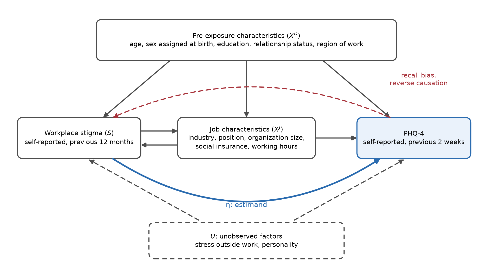
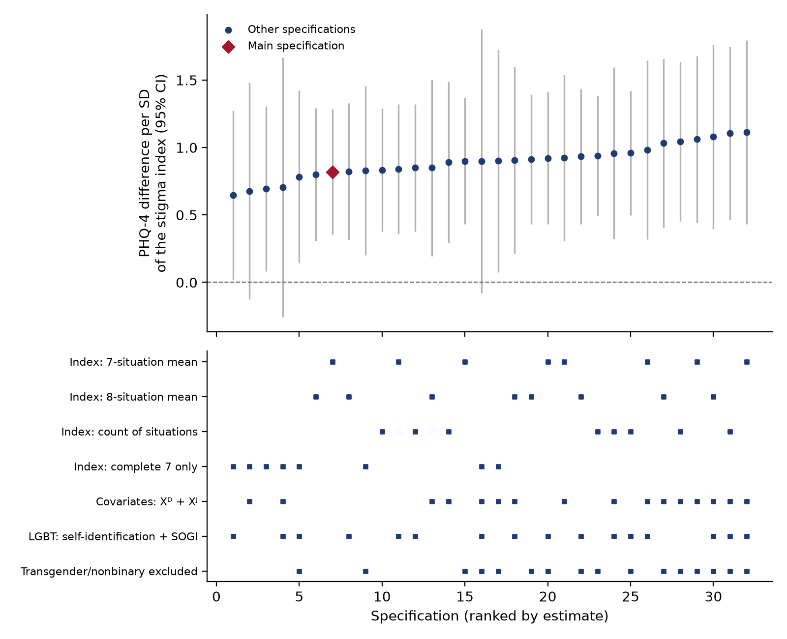

RESEARCH

# Pathology or Prejudice? Workplace Stigma and Mental Health among LGBT Workers in Vietnam

[Author names]¹

¹ Banking Academy of Vietnam, Hanoi, Vietnam

Corresponding author: [name, email]

---

## Abstract

**Introduction** Sexual minority adults report more anxiety and depression than heterosexual adults, but a disparity cannot show whether distress originates in identity or in prejudice. Minority stress theory predicts that members of a minority group who encounter more stigma report more symptoms. We tested this prediction among LGBT workers in Vietnam, where labor law does not name sexual orientation or gender identity as grounds of discrimination.

**Methods** In a cross-sectional survey of 850 workers, we estimated the association between an index of enacted stigma at work and PHQ-4 symptom scores among 256 LGBT workers, adjusting for characteristics that precede exposure. Secondary analyses examined anxiety and depression, a concealment pathway, and moderators.

**Results** Fifty-five percent reported at least one stigma situation in the previous 12 months. A one-unit difference in the index was associated with 1.72 points higher PHQ-4 scores (95% CI [0.74, 2.69]), about 0.26 standard deviations per standard deviation of the index, and with higher anxiety and depressive symptoms, which did not differ detectably. The association was positive in all 32 specifications and every robustness check. The data did not support a pathway through concealment.

**Conclusions** Symptoms varied with exposure to stigma within the group, a gradient predicted by minority stress theory but not by an identity-based account. The design does not establish direction.

**Policy Implications** Elevated symptoms among LGBT people should not be read as evidence of pathology. Naming sexual orientation and gender identity in Vietnam's Labor Code, and workplace rules against derogatory jokes and intrusive questions, would address the forms of stigma most clearly associated with symptoms.

**Keywords** Minority stress · Workplace stigma · Identity concealment · Anxiety · Depression · Vietnam

---

## Introduction

Sexual minority adults report higher rates of depression and anxiety disorders than heterosexual adults (King et al., 2008; Plöderl & Tremblay, 2015), and bisexual people report higher rates than both heterosexual and gay or lesbian people (Ross et al., 2018). A difference in rates, however, does not identify its source. One reading treats sexual or gender minority identity as the origin of psychological distress. The other treats distress as a consequence of how societies treat people who hold these identities (I. H. Meyer, 2003).

The first reading has lost its scientific standing. Homosexuality was removed from the American Psychiatric Association's diagnostic manual in 1973 (Drescher, 2015), and ICD-11 moved gender incongruence out of the chapter on mental disorders (World Health Organization, 2019). Pathologizing interpretations nonetheless persist in social life. In Vietnam, the Ministry of Health instructed medical facilities in 2022 not to regard homosexuality, bisexuality, or being transgender as illnesses (Ministry of Health of Vietnam, 2022), and school lessons have been documented as presenting same-sex attraction as a mental disorder that can be cured (Human Rights Watch, 2020). In such an environment, evidence of elevated distress among LGBT people risks being absorbed into the very prejudice that may help to produce it.

Minority stress theory turns this dispute into a testable prediction. If symptoms arise partly from prejudice, members of a minority group who encounter stigma more often should report more symptoms (I. H. Meyer, 2003). An account that locates distress in identity, which all members of the group share, offers no reason to expect such a gradient. The test is asymmetric. A precisely estimated absence of a gradient would weaken the minority stress account in the setting studied. A gradient would be consistent with the account, but it would not exclude rival explanations, such as people with more symptoms recalling more negative events, or a third factor shaping both.

The workplace is an informative setting for this test. Adults spend much of their waking time at work, interact repeatedly with the same colleagues and supervisors, and cannot easily avoid them. Workplaces also convert prejudice into decisions about assignments, evaluation, and pay. In Vietnam, the Labor Code prohibits employment discrimination on a list of grounds that does not include sexual orientation or gender identity (National Assembly of Vietnam, 2019), so the protection that LGBT workers receive depends largely on their employers. The present study examines whether, among LGBT workers in Vietnam, more frequent enacted stigma at work accompanies more anxiety and depressive symptoms.

### Minority Stress and the Within-Group Prediction

Minority stress theory explains mental health disparities through social conditions rather than identity. Building on work with gay men (I. H. Meyer, 1995), I. H. Meyer (2003) described minority stress as unique, chronic, and socially based. The model distinguishes distal stressors, such as discrimination and harassment, from proximal stressors, such as expectations of rejection, concealment, and internalized stigma, and places coping and social support in a position to alter the link between stress and health. Hatzenbuehler (2009) added that stigma-related stress may impair emotion regulation, interpersonal functioning, and cognition, which in turn lead to psychopathology. Later work extended the theory to structural stigma (Hatzenbuehler, 2016; Hatzenbuehler et al., 2010; Pachankis & Bränström, 2018) and to transgender and gender nonconforming people (Hendricks & Testa, 2012), and emphasized that minority stress processes must be studied across different social and policy contexts (Frost & Meyer, 2023).

The theory yields three kinds of prediction. Minority groups should report more symptoms than majority groups, which is a disparity prediction. Members exposed to more distal stressors should report more symptoms than other members, which is a gradient prediction. Proximal stressors should lie between distal stressors and symptoms, which is a pathway prediction. A disparity test requires an equivalently recruited comparison group, and a pathway test requires temporally ordered data, because cross-sectional mediation estimates can be substantially biased (Maxwell & Cole, 2007). A gradient test requires only variation in exposure within the group. It is also the prediction that sets the two readings against each other: both predict a disparity, but only the prejudice reading predicts a gradient.

Evidence for the gradient is stronger for concurrent than for prospective associations. Across stigmatized groups, people who report more discrimination also report more symptoms (Lewis et al., 2015; Schmitt et al., 2014). Perceived discrimination remained associated with lower well-being in longitudinal studies that controlled for earlier well-being (*r* = −.15; Schmitt et al., 2014). Among sexual and gender minority individuals assigned female at birth, minority stress predicted increases in anxiety and depressive symptoms six months later (Dyar et al., 2020, as cited in Herry & Dyar, 2025). In an eight-year study of young gay and bisexual men, by contrast, distal stressors were associated with concurrent symptoms but did not predict later change (Pachankis et al., 2018, as cited in Herry & Dyar, 2025). A cross-sectional gradient therefore establishes co-occurrence, not temporal order.

Anxiety and depression are closely related but distinct, and factor analyses of the PHQ-4 identified separate anxiety and depression factors (Kroenke et al., 2009; Löwe et al., 2010). Vigilance and the expectation of rejection are oriented toward future threat and are plausibly linked to anxiety (Hollinsaid et al., 2023; I. H. Meyer, 2003; Pachankis, 2007). Repeated stigma that a person cannot control may instead be expressed in loss of interest and hopelessness. Herry and Dyar (2025) found that sexual orientation discrimination predicted later anxiety after adjustment for baseline anxiety, whereas evidence for depression was less consistent. This reasoning justifies examining the two dimensions separately. It does not justify a directional hypothesis about which dimension is more strongly associated with stigma, because a difference in statistical significance between two coefficients is not evidence that the coefficients differ (Gelman & Stern, 2006).

### Stigma in the Workplace

Several features of the workplace may change how distal stressors operate. Interaction at work is repeated and hard to avoid, and leaving a stigmatizing workplace means losing income. Workplaces allocate resources hierarchically, so the prejudice of a decision-maker can become a formal disadvantage. Hebl et al. (2002) found that job applicants presented as gay were not treated differently in formal terms but received more negative interpersonal responses. Because work involves continuous evaluation, a worker who receives an unfavorable decision must also judge whether it reflects prejudice. Organizations can sanction or tolerate stigma: gay and lesbian employees reported more discrimination in organizations that lacked supportive policies (Ragins & Cornwell, 2001).

Link and Phelan (2001) define stigma as the co-occurrence of labeling, stereotyping, separation, status loss, and discrimination in a situation of power, so discrimination is one component of stigma. We use the broader concept of enacted stigma, defined as workplace behavior and conditions that target, or are based on, a worker's sexual orientation, gender identity, or gender expression and that demean, intrude upon, or disadvantage the worker. It can take five forms: interpersonal derogation, such as offensive jokes, which partly overlaps with microaggressions (Nadal et al., 2016); intrusion into privacy, including unwanted questions and outing; formal discrimination in training, evaluation, pay, or work assignments; pressure to conform to gender stereotypes; and barriers to gender identity, such as difficulty using one's name, pronouns, dress, or restrooms. Only the third form corresponds to discrimination as defined in Vietnam's Labor Code (National Assembly of Vietnam, 2019).

Two properties of enacted stigma matter for measurement. First, in experiments included in the meta-analysis of Schmitt et al. (2014), perceptions that discrimination is pervasive lowered well-being, whereas attributing a single negative event to discrimination did not. A measure should therefore record how often stigma occurs over time. Second, some forms depend on attribution. An offensive joke carries its stigmatizing content within itself, whereas an unfavorable evaluation counts as stigma only if the worker attributes it to their sexual orientation or gender identity. Reports of attribution-dependent forms are more open to the influence of mood and expectations (Lewis et al., 2015). If an association with symptoms appeared only for these forms, attribution or recall bias would need serious consideration.

Evidence on minority stress at work is consistent in direction but limited in design and context. Heterosexism and discrimination at work accompany greater psychological distress (Velez et al., 2013; Waldo, 1999). A systematic review of 32 studies including 8,369 LGBTQ+ workers identified internalized stigma, heterosexism, job stress, and low income as correlates of poorer mental health. Thirty of the 32 studies were cross-sectional, and the main findings were expressed as differences between LGBTQ+ and other workers (Tomic et al., 2025; see also Owens et al., 2022). Evidence from Asia has only recently appeared. Among 706 LGBTQ employees in China, minority stressors were associated with less favorable perceptions of workplace climate, which were associated with more depressive symptoms; anxiety was not examined (Lo et al., 2025).

### The Vietnamese Context

Vietnam's legal treatment of LGBT people combines elements that pull in different directions. The health sector has rejected the pathologizing view (Ministry of Health of Vietnam, 2022), and the Civil Code recognizes gender transition while leaving its regulation to a separate law (National Assembly of Vietnam, 2015, Art. 37). The Law on Marriage and Family does not recognize marriage between people of the same sex (National Assembly of Vietnam, 2014, Art. 8(2)), and Article 3(8) of the Labor Code defines employment discrimination through a list of grounds that omits sexual orientation and gender identity (National Assembly of Vietnam, 2019). Workers therefore have weak grounds for complaint, employers have no specific legal duty to respond, and offensive jokes or intrusive questions are especially likely to be treated as private matters between colleagues. Because labor law applies uniformly across the country, protection varies mainly across organizations, whereas research in the United States has exploited variation across jurisdictions (Herry & Dyar, 2025; Ragins & Cornwell, 2001).

Reports by international and civil society organizations document the prevalence of stigma. In a national survey of 2,363 respondents, about one in three felt they had experienced discrimination because of their sexual orientation or gender identity in the previous 12 months, most often in the family, at school, and at work (Institute for Studies of Society, Economy and Environment, 2015; see also United Nations Development Programme & United States Agency for International Development, 2014). These reports do not estimate associations with mental health. Peer-reviewed quantitative studies have developed measures (T. Q. Nguyen, Bandeen-Roche, et al., 2016; T. Q. Nguyen, Poteat, et al., 2016) and have examined mainly proximal processes within single groups: internalized homophobia, disclosure, and depressive symptoms among sexual minority women (Tran et al., 2020), self-stigma among LGBTQ+ people (Ngo et al., 2026), and gender dysphoria and distress among transgender people (L. V. Nguyen et al., 2026). Among men who have sex with men in Hanoi, depression and substance use were intermediate links between stigma and sexual risk behavior (Ha et al., 2015). Distal stressors within a specific domain of life, such as the workplace, have not been measured systematically.

### Identity Concealment

Sexual orientation and, in many cases, gender identity are concealable, so workers repeatedly choose between concealment and disclosure, and these choices are shaped by individual characteristics and organizational context (Clair et al., 2005; Ragins et al., 2007). I. H. Meyer (2003) classifies concealment as a proximal stressor. Concealment demands vigilance, preoccupation with discovery, and self-monitoring, processes that can lead to anxiety, depression, and isolation (Pachankis, 2007). Its association with depressive symptoms nonetheless depends on the facet of concealment measured and on the sample (Pachankis et al., 2020), and concealment is also a coping strategy.

Concealment therefore stands in a two-way position relative to enacted stigma. Stigma may lead workers to conceal more, and concealment may be accompanied by more symptoms, which is the pathway the theory describes. Concealment may also reduce the chance that others know a worker's identity and so reduce exposure to stigma. The two directions predict opposite signs for the association between stigma and concealment, and cross-sectional data cannot separate them. If concealment both reduces exposure and carries its own costs, workers who report little stigma may include extensive concealers whose symptoms are not low, which would narrow the observed gradient, particularly where structural stigma is high (Pachankis & Bränström, 2018). We therefore assess only whether the data are consistent with a pathway from stigma to concealment to symptoms.

### Perceived DEI Enforcement

Social support may weaken the association between stressors and health (Cohen & Wills, 1985; I. H. Meyer, 2003). Where workers perceive diversity, equity, and inclusion (DEI) policies to be enforced, a stigmatizing joke that is sanctioned may be experienced as the act of an individual rather than as evidence of pervasive rejection (Schmitt et al., 2014). A safe reporting channel gives workers an option other than enduring or leaving, and a respectful manager may keep prejudice out of personnel decisions. We focus on perceived enforcement rather than written policy, because organizations may adopt formal structures without implementing them (J. W. Meyer & Rowan, 1977). In a meta-analysis, formal LGBT policies were not the strongest correlate of any group of outcomes, compared with supportive climate and supportive relationships (Webster et al., 2018), and support from supervisors, coworkers, and the organization relates to different outcomes (Huffman et al., 2008). Three features confine our analysis of enforcement to exploratory status. It is reported by workers themselves, it overlaps in content with the stigma measure, and tests of interaction in observational data have low power (McClelland & Judd, 1993).

### Current Study

Three limitations of the existing evidence motivate the present study. First, evidence on LGBT workers' mental health is reported mainly as differences from non-LGBT workers (Tomic et al., 2025), which cannot discriminate between the pathology and prejudice readings. Second, the foundational studies of minority stress at work come from the United States. Evidence from settings in which labor law does not name sexual orientation or gender identity, in which concealment may be common, and in which pathologizing views persist is scarce. To our knowledge, no peer-reviewed study in Vietnam has estimated the association between enacted stigma at work and anxiety or depressive symptoms among workers from several sexual and gender minority groups. Third, when workplace stigma is summed into a single score or combined with stigma in other domains (e.g., Herry & Dyar, 2025), it is not possible to tell which forms of behavior carry the association, and some studies measure depressive symptoms only (Lo et al., 2025; Tran et al., 2020).

We ask whether, among LGBT workers in Vietnam, the frequency of enacted stigma at work is associated with the severity of anxiety and depressive symptoms after adjustment for characteristics that precede exposure. We use LGBT as an umbrella term for sexual minorities and gender minorities, recognizing that sex assigned at birth, gender identity, and sexual orientation are distinct (National Academies of Sciences, Engineering, and Medicine, 2022). We examine symptom severity rather than disorder; a higher score indicates neither a disorder nor that an identity is pathological. All inferential analyses compare LGBT workers with one another. The analysis plan was finalized before the models were estimated but registered afterwards, and the mental health question was placed at the center of the analysis after partial contact with the data. We therefore present the study as exploratory research with a prespecified analysis plan rather than as a confirmatory test.

#### Hypotheses

We tested one primary and three secondary hypotheses. Among LGBT workers, we hypothesized that the workplace stigma index would be positively associated with total symptom severity on the PHQ-4 (H1, primary), with anxiety symptoms on the GAD-2 (H2a), and with depressive symptoms on the PHQ-2 (H2b), and that the associations among stigma, identity concealment, and PHQ-4 scores would be consistent with a path structure from stigma to concealment to symptoms (H3). Given the two-way position of concealment, H3 concerns consistency with a pathway, not evidence of mediation.

Five exploratory analyses complement the hypotheses. They examine stigma divided into three levels (E1); each stigma situation (E2); the distribution of PHQ-4 scores among non-LGBT workers and among LGBT workers with and without reported stigma, presented descriptively (E3); differences in the main association by sex assigned at birth and by sexual orientation group (E4); and moderation by perceived DEI enforcement (E5). These analyses describe the data and inform future research. They are not used to replace or strengthen the conclusions drawn from the hypotheses.

---

## Methods

### Participants and Procedures

We used data from a cross-sectional survey of workers in Vietnam. Respondents were eligible if they were 18 years or older and had a main income-generating job in Vietnam, as verified by two screening questions. Because no sampling frame exists for LGBT people in Vietnam, participants were recruited by convenience and snowball sampling through community networks. LGBT and non-LGBT respondents were reached through channels that only partly overlapped, which is one reason why all inferential analyses compare LGBT workers with one another. Before answering, participants read an information page that described the purpose of the study, warned that the questionnaire contained sensitive questions, and explained that they could skip any question or stop at any time. The questionnaire did not collect names, contact details, places of residence, or names of employers.

Table 1 shows how the analytic samples were formed. Of 850 responses, 37 came from respondents younger than 18 and 86 from respondents without a main income-generating job, leaving 727 eligible respondents. A further 87 could not be classified on the LGBT self-identification item (32 preferred not to answer, 29 were unsure or questioning, and 26 left the item blank). The analytic sample therefore comprised 340 non-LGBT and 300 LGBT respondents. The main sample consists of the 278 LGBT respondents with complete PHQ-4 responses and a valid stigma index. Of these, 256 had complete pre-exposure covariates when "prefer not to answer" was coded as a separate category (main rule), and 247 when it was treated as missing (alternative rule). Each model uses the respondents with complete data on the variables it contains.

**Table 1** *Formation of the analytic samples*

| Step | Non-LGBT | LGBT |
|---|---|---|
| Responses received | 850 (total) | |
| Eligible: aged 18 or older and with a main income-generating job | 727 (total) | |
| Classified on the self-identification item (analytic sample) | 340 | 300 |
| Complete PHQ-4 (descriptive comparison, E3) | 323 | 278 |
| Complete PHQ-4 and valid stigma index (main sample) | | 278 |
| Main sample with complete pre-exposure covariates, main rule | | 256 |
| Main sample with complete pre-exposure covariates, alternative rule | | 247 |
| Main-rule sample with a valid DEI enforcement score (E5) | | 243 |

*Note.* Under the main rule, "prefer not to answer" on a covariate is a separate category; under the alternative rule it is treated as missing.

By the sexual orientation item, the main sample included 87 bisexual, 74 lesbian, 68 gay, and 23 pansexual respondents, and 13 respondents reported a transgender or nonbinary gender identity. Results are not reported separately for transgender and nonbinary respondents, because the group is too small for estimates that are both stable and safe from re-identification. The recruitment channels left observable traces: in the analytic sample, 54% of LGBT respondents worked in Ho Chi Minh City compared with 42% of non-LGBT respondents, and 12% compared with 28% worked outside Hanoi, Ho Chi Minh City, and Da Nang.

### Measures

**Anxiety and depressive symptoms.** Symptoms over the previous two weeks were measured with the PHQ-4 (Kroenke et al., 2009), which comprises the two anxiety items of the GAD-7 (Spitzer et al., 2006), forming the GAD-2, and the two depression items of the PHQ-9 (Kroenke et al., 2001), forming the PHQ-2 (Kroenke et al., 2003). Items are rated from 0 (*not at all*) to 3 (*nearly every day*), giving totals of 0-12 for the PHQ-4 and 0-6 for each subscale, computed only when all relevant items were answered. Internal consistency of the PHQ-4 was α = .81 (*n* = 601); the inter-item correlation was .49 for the GAD-2 and .56 for the PHQ-2. We found no validation study of the Vietnamese PHQ-4. The closest evidence is the evaluation of the PHQ-9 among Vietnamese sexual minority women (T. Q. Nguyen, Bandeen-Roche, et al., 2016), from which the two depression items are drawn. We therefore treat scores as continuous measures of symptom severity, and use the conventional cut-off of 6 only for description. Because 26.6% of respondents scored 0, the outcome has a floor, which the robustness checks address.

**Workplace stigma.** LGBT respondents reported how often, in the previous 12 months at their current workplace, they had experienced eight situations: (1) offensive jokes or comments; (2) unwanted personal questions about their sexual orientation, gender identity, or romantic life; (3) disclosure, or threatened disclosure, of their sexual orientation or gender identity without consent; (4) exclusion from training or career development; (5) unfair evaluation, pay, or promotion; (6) unfavourable work assignments; (7) pressure to conform to gender stereotypes; and (8) difficulty using a name, pronouns, dress, or restrooms consistent with their gender identity. Responses ranged from 0 (*never*) to 4 (*very often*); "not applicable or prefer not to answer" was coded as missing. The situations were adapted from Waldo (1999) and behavioural indicators of workplace stigma, developed with the project supervisor, revised after expert consultation, and piloted with 30 respondents. The instrument has not been validated.

We treat the situations as a formative index rather than a reflective scale. Each situation is a distinct type of event, and experiencing one does not imply experiencing another, so internal consistency is not a criterion of quality (Bollen & Lennox, 1991); Cronbach's α was .62 for seven situations (*n* = 182) and .66 for eight (*n* = 142). The stigma index *S* is the mean frequency of situations 1-7, computed when at least four were answered; all 278 respondents in the main sample answered at least five. Situation 8 is excluded from the main index because 65 of the 297 LGBT respondents who answered the section marked it "not applicable", mostly because its content concerns transgender and nonbinary people. For situation-level analyses, each situation is coded 1 if it occurred at least once. Following the distinction drawn in the Introduction, situations 4, 5, and 6 are attribution-dependent, and situations 1, 2, 3, and 7 are event-based.

**Identity concealment.** Four statements rated from 1 (*strongly disagree*) to 5 (*strongly agree*), based on Ragins et al. (2007) and Clair et al. (2005), measured efforts to conceal one's sexual orientation or gender identity at work, avoidance of talk about one's personal life, worry that colleagues would find out before one was ready, and fatigue from controlling information about oneself. The concealment score *C* is the mean of the four statements and requires all four to be answered (α = .78, *n* = 290). Because the fatigue statement is close in content to the PHQ-4, *C3* omits it.

**Perceived DEI enforcement.** Four statements on the same scale asked whether workers felt safe reporting discrimination, whether their direct manager respected LGBT people, whether offensive jokes or behaviour toward LGBT people were reprimanded or sanctioned, and whether employees could use a name, pronouns, and dress consistent with their gender identity. The score *Q* is the mean of the statements, requires at least three to be answered (α = .66, *n* = 458), and is centred on the mean of the E5 sample. It measures perceived, not documented, enforcement.

**Covariates.** Pre-exposure characteristics (Xᴰ) were formed before workers encountered stigma at their current workplace: age group, sex assigned at birth, education, relationship status, and region of work. Job characteristics (Xᴶ) were work experience, industry, position, employment relationship, type and size of organization, social insurance coverage, and weekly working hours. All covariates are categorical. Before estimation, categories with fewer than five respondents in the estimation sample were merged by a rule that uses counts only (Supplementary Methods), because categories with one or two respondents produce leverage values near one, at which heteroskedasticity-consistent standard errors become unstable. Descriptive tables use the original categories.

**Response quality.** We flagged respondents who chose the same option for every item of all three of the PHQ-4, concealment, and DEI scales, and respondents with clearly contradictory answers, such as the youngest age group combined with a senior management position. Flagged responses are retained in the main analyses and excluded in a robustness check.

### Analytic Plan

**Estimand and identification.** The estimand, η, is the expected difference in PHQ-4 scores between two LGBT workers whose stigma indices differ by one unit on the 0-4 scale and who share the same pre-exposure characteristics. It would equal a causal effect only if no unadjusted factor affected both stigma and symptoms and if reported stigma were not itself shaped by current symptoms. A cross-sectional design with self-reported measures cannot establish either assumption, so we interpret η as an adjusted association.

Covariates were selected from a causal diagram (Figure 1; Greenland et al., 1999), following the principle of adjusting for pre-exposure causes of the exposure or the outcome (VanderWeele, 2019). Job characteristics may confound the association, because the type and size of an organization may shape exposure. They may also lie on the pathway, because stigma may push workers into lower positions or less secure employment, and adjusting for a mediator removes part of the association of interest (Angrist & Pischke, 2009). Job characteristics are therefore added only in a second specification. Two pre-exposure covariates are not beyond doubt: relationship status may partly reflect symptoms, and region of work may reflect moves to cities perceived as more accepting.

**Figure 1** *Simplified causal diagram used to select covariates*

*Note.* Solid arrows are assumed paths. The blue arrow is the association of interest. The dashed red arrow marks recall bias and reverse causation; *U* denotes unobserved factors.

**Main models (H1, H2a, H2b).** H1 was tested with PHQᵢ = α + η·Sᵢ + γ′Xᵢᴰ + εᵢ, estimated by ordinary least squares, whose coefficient on *S* is directly the estimand. Standard errors are heteroskedasticity-consistent of type HC3, which perform better than HC1 in samples of a few hundred observations (Long & Ervin, 2000); this choice was fixed before estimation, whatever the results of heteroskedasticity tests. H1 is supported if η is positive and statistically significant in a two-sided test at the 5% level. H2a and H2b use the same right-hand side, with GAD-2 and PHQ-2 scores as outcomes. A second specification adds Xᴶ; it indicates how far the association may run through job characteristics and is never used to select results.

**Concealment pathway (H3).** H3 was examined with two equations estimated on the same respondents:

Cᵢ = α₁ + a·Sᵢ + γ₁′Xᵢᴰ + uᵢ,
PHQᵢ = α₂ + b·Cᵢ + c′·Sᵢ + γ₂′Xᵢᴰ + vᵢ.

The data are considered consistent with the pathway if both *a* and *b* are positive and significant; the *p* value of H3 is the larger of the two *p* values, following the intersection-union principle. Because concealment may also reduce exposure and cross-sectional mediation estimates can be substantially biased (Maxwell & Cole, 2007), the indirect product *a* × *b*, with a percentile bootstrap interval from 5,000 resamples (Preacher & Hayes, 2008), is reported only in the supplementary material. H3 is re-estimated with *C3*.

**Multiple testing.** H1 is the single primary test and is not adjusted. H2a, H2b, and H3 form one family of secondary tests, adjusted with the Holm (1979) procedure.

**Exploratory analyses.** All exploratory analyses use the main specification. Coefficients are adjusted with the Benjamini and Hochberg (1995) procedure within two separate families: the situation-level models (E2) and the interaction coefficients (E4). E1 replaces *S* with indicators for low and high exposure, with no exposure as the reference; the cut point is the median of *S* among exposed respondents in the main sample. E2 estimates one model per situation, replacing *S* with the indicator for that situation. Situations experienced by fewer than 10 respondents, or not experienced by fewer than 10, are not estimated, so that small cells are not disclosed. A contrast model enters the event-based and attribution-dependent sub-indices together and tests the difference between their coefficients directly (Gelman & Stern, 2006); situation 4 is included only if at least 10 respondents experienced it. E3 describes PHQ-4 scores among non-LGBT workers, LGBT workers without reported stigma, and LGBT workers with reported stigma, without hypothesis tests, because non-LGBT workers were not asked about negative experiences at work. E4 adds the interaction of *S* with sex assigned at birth and, separately, with sexual orientation group (bisexual or pansexual, lesbian, and gay); respondents outside these three groups are excluded from the orientation model only. The difference between the GAD-2 and PHQ-2 coefficients is tested directly by seemingly unrelated estimation with robust standard errors. E5 estimates PHQᵢ = α + η·Sᵢ + δ·Qᵢ + κ·(Sᵢ × Qᵢ) + γ′Xᵢᴰ + εᵢ, where a negative κ is consistent with a weaker association where enforcement is perceived to be stronger.

**Inference and decision rules.** All coefficients are reported with 95% confidence intervals. To distinguish an absent association from an imprecise one, we fixed the smallest effect size of interest at 1.0 PHQ-4 point per unit of *S*, about 0.15 standard deviations of the PHQ-4 per standard deviation of *S* in the main sample. The bound is smaller than the average association between perceived discrimination and well-being reported by Schmitt et al. (2014), so an association of the size typical in that literature is not treated as negligible. For H1 we report, alongside the conventional test, a two one-sided tests procedure (Lakens, 2017; Lakens et al., 2018) with three possible conclusions: no practically meaningful association, only if the 90% confidence interval lies entirely within ±1.0; a positive association, if the 95% interval excludes zero and the estimate is positive; and inconclusive, if the interval contains both zero and values beyond the bound. Before estimation, the minimum detectable effect at 5% significance and 80% power was about 1.2 points, a value that ignores the covariates and is indicative only. After estimation we report it as 2.8 times the standard error of η.

**Threats to identification and sensitivity analysis.** Four sources of bias could inflate η: unmeasured minority stress outside work, reverse causation, recall bias, and common-method variance (Podsakoff et al., 2003). The stigma and PHQ-4 sections use different response scales and reference periods. However, the stigma section immediately precedes the PHQ-4, and recalling stigmatizing events just before rating one's symptoms may raise symptom reports (Schwarz, 1999). We quantified sensitivity to unmeasured confounding with the omitted-variable bias framework of Cinelli and Hazlett (2020), reporting the partial *R*² of *S* with the PHQ-4 and the robustness values at which an omitted confounder would reduce η to zero or make its 95% interval include zero. These values are compared with the explanatory power of sex assigned at birth and of education, each entered as a group of dummy variables, at one, two, and three times their strength. Instrumental variables, propensity score matching, selection models, Harman's single-factor test, and coefficient-stability bounds (Oster, 2019) were not used, for reasons given in the Supplementary Methods. Diagnostics of the main model (the Breusch-Pagan test, generalized variance inflation factors [Fox & Monette, 1992], Ramsey's RESET test, Cook's distance, and leverage) are descriptive and do not change the estimator.

**Robustness checks.** Each check answers a question that the main model does not: (1) adding Xᴶ; (2) coding "prefer not to answer" as missing; (3) separating any exposure from intensity among the exposed, and a restricted cubic spline with knots at the 10th, 50th, and 90th percentiles of *S* among exposed respondents; (4) a fractional logit model for the PHQ-4 divided by 12, reporting the average marginal effect multiplied by 12 (Papke & Wooldridge, 1996); (5) multiple imputation by chained equations with 20 imputed datasets among the 300 LGBT respondents of the analytic sample, imputing the PHQ-4, *S*, *C*, *Q*, and missing covariates (van Buuren & Groothuis-Oudshoorn, 2011); (6) excluding flagged responses; (7) excluding observations with Cook's distance above 4/*n*; (8) a restricted wild bootstrap with Webb weights and 9,999 replications (Davidson & Flachaire, 2008; Roodman et al., 2019); and (9) adding sexual orientation group to the pre-exposure covariates (Ross et al., 2018). A specification curve (Simonsohn et al., 2020) crosses four constructions of the stigma index (the seven-situation mean, the eight-situation mean, the count of situations experienced, and the seven-situation mean among respondents who answered all seven), two covariate sets, two definitions of the LGBT group (self-identification alone, or together with a non-heterosexual orientation or a minority gender identity), and the inclusion or exclusion of transgender and nonbinary respondents, giving 32 specifications. We report every result and set no threshold for the share of specifications that must agree.

**Missing data and disclosure control.** The main analyses use complete cases. We compare respondents with and without complete data, and if complete-case and imputation results differed materially, the difference would be reported as a limitation. Every cross-tabulation by sexual orientation, gender identity, demographic, or workplace group suppresses cells with fewer than 10 respondents, and transgender and nonbinary respondents are not presented as a separate group.

**Analysis history and registration.** The analysis plan, including the decisions described in this section, was finalized on 5 October 2026, before any of the models reported in this article were estimated. It was deposited on the Open Science Framework after estimation, and the deposit is labelled accordingly ([registration link]). The original plan, written before data collection, centred on income and treated the association between stigma and mental health as one link on the path to income. After partial contact with the data, we placed the mental health question at the centre of the analysis and removed all income analyses from this article. Before the plan was finalized, we had run, with both covariate blocks and HC1 standard errors, a comparison of PHQ-4 scores across three groups, a three-level version of the eight-situation index, interpersonal and institutional stigma subscales, a parallel mediation model through three facets of concealment, and the income analyses. Because the second specification and the attribution contrast resemble analyses already run, their results are not new tests. Departures from the finalized plan are listed in the Supplementary Methods.

**Software.** Analyses were conducted in Stata 17 with the user-written commands sensemakr and boottest. An independent replication in Python reproduced every estimate that does not depend on random draws. The analysis code is available with the registration.

---

## Results

### Descriptive Statistics

Table 2 describes the 278 LGBT respondents of the main sample and, for context, the 323 non-LGBT respondents with complete PHQ-4 data. Among LGBT respondents, 41.7% were aged 25-34 years, 61.5% were assigned female at birth, 61.5% held a university degree, and 52.9% worked in Ho Chi Minh City. Bisexual respondents formed the largest orientation group (31.3%), followed by lesbian (26.6%), gay (24.5%), and pansexual (8.3%) respondents.

**Table 2** *Characteristics of the main sample and of non-LGBT respondents*

| Characteristic | LGBT, main sample (*n* = 278) | Non-LGBT (*n* = 323) |
|---|---|---|
| **Age group** | | |
| 18-24 | 64 (23.0) | 68 (21.1) |
| 25-34 | 116 (41.7) | 130 (40.2) |
| 35-44 | 49 (17.6) | 61 (18.9) |
| 45 or older | 43 (15.5) | 54 (16.7) |
| **Sex assigned at birth** | | |
| Male | 98 (35.3) | 135 (41.8) |
| Female | 171 (61.5) | 178 (55.1) |
| **Education** | | |
| Upper secondary or below | 45 (16.2) | 44 (13.6) |
| College | 25 (9.0) | 28 (8.7) |
| University | 171 (61.5) | 211 (65.3) |
| Postgraduate | 33 (11.9) | 37 (11.5) |
| **Relationship status** | | |
| No partner | 135 (48.6) | 171 (52.9) |
| Partner | 127 (45.7) | 123 (38.1) |
| Separated, divorced, or widowed | <10 | <10 |
| Prefer not to answer | <10 | 20 (6.2) |
| **Region of work** | | |
| Hanoi | 74 (26.6) | 79 (24.5) |
| Ho Chi Minh City | 147 (52.9) | 132 (40.9) |
| Da Nang | 23 (8.3) | 17 (5.3) |
| Elsewhere | 31 (11.2) | 93 (28.8) |
| **Sexual orientation** | | |
| Gay | 68 (24.5) | - |
| Lesbian | 74 (26.6) | - |
| Bisexual | 87 (31.3) | - |
| Pansexual | 23 (8.3) | - |
| Other, questioning, or not reported | 26 (9.4) | - |

*Note.* Values are *n* (%), with percentages of the column total. Cells with fewer than 10 respondents are suppressed. Missing and "prefer not to answer" responses are not shown, except for relationship status, so categories may not sum to the column total. Sexual orientation is not shown for non-LGBT respondents. Transgender and nonbinary respondents are not shown as a separate group.

Table 3 presents the study variables in the main-rule sample of 256 respondents. The mean PHQ-4 score was 3.30 (*SD* = 3.19), and 21.5% scored 6 or more. Exposure to stigma was concentrated at low frequencies: the mean stigma index was 0.33 (*SD* = 0.48) on the 0-4 scale, the median was 0.14, and 55.1% reported at least one of the seven situations. In the main sample of 278, the most frequently reported situations were unwanted personal questions (32.7% of those who answered the item) and offensive jokes or comments (25.3%), followed by disclosure or threatened disclosure (15.4%), pressure to conform to gender stereotypes (15.1%), unfavourable work assignments (11.9%), and unfair evaluation, pay, or promotion (9.1%). Fewer than 10 respondents reported exclusion from training or career development. Difficulty using a name, pronouns, dress, or restrooms consistent with one's gender identity was reported by 6.0% of those who answered it.

The stigma index correlated with PHQ-4 scores at *r* = .23, with GAD-2 scores at *r* = .19, and with PHQ-2 scores at *r* = .23. Its correlation with concealment was weak (*r* = .10). Its correlation with perceived DEI enforcement was small and positive (*r* = .12), so respondents who reported more stigma did not report weaker enforcement.

**Table 3** *Descriptive statistics and correlations of the study variables (main-rule sample)*

| Variable | *n* | *M* | *SD* | Range | 1 | 2 | 3 | 4 | 5 |
|---|---|---|---|---|---|---|---|---|---|
| 1. PHQ-4 | 256 | 3.30 | 3.19 | 0-12 | | | | | |
| 2. GAD-2 | 256 | 1.60 | 1.66 | 0-6 | .92 | | | | |
| 3. PHQ-2 | 256 | 1.70 | 1.79 | 0-6 | .93 | .71 | | | |
| 4. Stigma index (*S*) | 256 | 0.33 | 0.48 | 0-2.86 | .23 | .19 | .23 | | |
| 5. Concealment (*C*) | 254 | 2.93 | 1.14 | 1-5 | .13 | .09 | .14 | .10 | |
| 6. Perceived DEI enforcement (*Q*) | 243 | 3.35 | 0.78 | 1-5 | −.08 | −.12 | −.04 | .12 | .04 |

*Note.* Pearson correlations computed pairwise. Range is the observed range.

Of the 278 respondents in the main sample, 22 lacked at least one pre-exposure covariate. Their mean PHQ-4 score was higher than that of respondents with complete covariates (4.86, *SD* = 3.78, vs. 3.30, *SD* = 3.19), and their mean stigma index was similar (0.40 vs. 0.33). Of the 300 LGBT respondents in the analytic sample, 22 did not complete the PHQ-4. Among the 19 of them with a valid stigma index, the mean index was 0.19, compared with 0.34 among respondents with complete PHQ-4 data.

### Workplace Stigma and Symptom Severity (H1)

Table 4 presents the main results. In the main specification, a one-unit difference in the stigma index was associated with 1.72 points higher PHQ-4 scores (*SE* = 0.49, 95% CI [0.74, 2.69], *p* < .001). In standardized terms, a difference of one standard deviation in the index corresponded to about 0.26 standard deviations of the PHQ-4. H1 was therefore supported.

The 90% confidence interval, [0.90, 2.53], did not lie within the equivalence bounds of ±1.0, so the conclusion of no practically meaningful association did not apply. By the prespecified decision rule, the result is a positive association. The point estimate exceeded the smallest effect size of interest, but the lower limit of the 90% interval fell just below it, so the data do not exclude an association slightly smaller than 1.0 point per unit of the index. The minimum detectable effect after estimation was about 1.38 points.

Adding job characteristics did not reduce the estimate (η = 1.93, 95% CI [0.65, 3.21], *n* = 225). The two specifications use different samples, because 31 respondents lacked at least one job characteristic, so the comparison is approximate. Treating "prefer not to answer" as missing gave a similar estimate (η = 1.79, 95% CI [0.79, 2.78], *n* = 247).

**Table 4** *Associations between the workplace stigma index and symptom scores (H1, H2a, H2b)*

| Outcome | Specification | *n* | η | *SE* | 95% CI | *p* | Holm *p* |
|---|---|---|---|---|---|---|---|
| PHQ-4 (H1) | Xᴰ | 256 | 1.72 | 0.49 | [0.74, 2.69] | < .001 | - |
| | Xᴰ, alternative rule | 247 | 1.79 | 0.50 | [0.79, 2.78] | < .001 | |
| | Xᴰ + Xᴶ | 225 | 1.93 | 0.65 | [0.65, 3.21] | .003 | |
| GAD-2 (H2a) | Xᴰ | 256 | 0.75 | 0.26 | [0.24, 1.26] | .004 | .009 |
| | Xᴰ + Xᴶ | 225 | 0.87 | 0.35 | [0.18, 1.55] | .013 | |
| PHQ-2 (H2b) | Xᴰ | 256 | 0.97 | 0.27 | [0.44, 1.49] | < .001 | .001 |
| | Xᴰ + Xᴶ | 225 | 1.06 | 0.35 | [0.38, 1.75] | .003 | |

*Note.* Ordinary least squares with HC3 standard errors. η is the difference in symptom score per unit of the stigma index (0-4). Xᴰ = pre-exposure characteristics; Xᴶ = job characteristics. Under the alternative rule, "prefer not to answer" on a covariate is treated as missing. H1: 90% CI [0.90, 2.53]; equivalence bounds ±1.0. Holm *p* values are adjusted over H2a, H2b, and H3. The specifications with Xᴶ are reported for comparison and are not tests of the hypotheses.

### Anxiety and Depressive Symptoms (H2a and H2b)

The stigma index was associated with higher GAD-2 scores (0.75, 95% CI [0.24, 1.26], Holm-adjusted *p* = .009) and with higher PHQ-2 scores (0.97, 95% CI [0.44, 1.49], Holm-adjusted *p* = .001). In standardized terms, the coefficients were about 0.22 and 0.26, respectively. H2a and H2b were therefore supported. In the direct test of the difference between the two coefficients, the GAD-2 coefficient minus the PHQ-2 coefficient was −0.22 (95% CI [−0.55, 0.12], *p* = .204). The data therefore give no indication that stigma was more strongly associated with one symptom dimension than with the other. The interval ranges from a PHQ-2 coefficient 0.55 points larger to a GAD-2 coefficient 0.12 points larger.

### Concealment Pathway (H3)

Table 5 shows the two equations of H3. Both coefficients were positive, but neither was statistically significant. A one-unit difference in the stigma index was associated with 0.25 points higher concealment scores (*a*, 95% CI [−0.08, 0.59], *p* = .140), and a one-point difference in concealment was associated with 0.31 points higher PHQ-4 scores when the stigma index was held constant (*b*, 95% CI [−0.06, 0.68], *p* = .104). The intersection-union *p* value of H3 was .140 (Holm-adjusted *p* = .140), so H3 was not supported. Both intervals contain zero and values that would be practically relevant, so the evidence on the pathway is inconclusive rather than evidence against it. Adjusting for concealment changed the stigma coefficient little (*c*′ = 1.88, 95% CI [0.85, 2.90]). The version of the concealment score without the fatigue statement gave similar results (*a* = 0.29, 95% CI [−0.06, 0.64]; *b* = 0.25, 95% CI [−0.10, 0.59]; intersection-union *p* = .156). The bootstrap estimate of the indirect product *a* × *b* is reported in Table S5.

**Table 5** *Associations among workplace stigma, identity concealment, and PHQ-4 scores (H3; n = 254)*

| Concealment score | Path | Coefficient | *SE* | 95% CI | *p* |
|---|---|---|---|---|---|
| *C* (four statements) | *a*: stigma → concealment | 0.25 | 0.17 | [−0.08, 0.59] | .140 |
| | *b*: concealment → PHQ-4 | 0.31 | 0.19 | [−0.06, 0.68] | .104 |
| | *c*′: stigma → PHQ-4, adjusted for concealment | 1.88 | 0.52 | [0.85, 2.90] | < .001 |
| *C3* (fatigue statement omitted) | *a* | 0.29 | 0.18 | [−0.06, 0.64] | .099 |
| | *b* | 0.25 | 0.17 | [−0.10, 0.59] | .156 |
| | *c*′ | 1.88 | 0.52 | [0.86, 2.91] | < .001 |

*Note.* Ordinary least squares with HC3 standard errors, adjusted for pre-exposure characteristics. The arrows denote the order of the hypothesized path structure, not established causal direction. H3 *p* (intersection-union) = .140 for *C* (Holm-adjusted .140) and .156 for *C3*.

### Exploratory Analyses

Table 6 summarizes the exploratory analyses. When stigma was divided into three levels (E1), respondents with low exposure (an index above 0 and up to 0.50, the median among exposed respondents; *n* = 78) scored 0.90 points higher than unexposed respondents (*n* = 115; 95% CI [0.02, 1.77]), and those with high exposure (*n* = 63) scored 2.21 points higher (95% CI [1.16, 3.27]).

In the situation-level models (E2), two situations were associated with higher PHQ-4 scores after Benjamini-Hochberg adjustment: offensive jokes or comments (1.56, 95% CI [0.66, 2.46], adjusted *p* = .003) and unwanted personal questions (1.77, 95% CI [0.85, 2.69], adjusted *p* = .001). The coefficients for the other situations were also positive, but their intervals included zero (adjusted *p* ≥ .19). These situations were less common, so their coefficients were estimated less precisely. Exclusion from training was not estimated, because fewer than 10 respondents reported it.

In the attribution contrast, the event-based sub-index was associated with higher PHQ-4 scores (1.21, 95% CI [0.45, 1.98]), whereas the attribution-dependent sub-index, which comprised unfair evaluation and unfavourable assignments, was not (0.18, 95% CI [−0.85, 1.20]). The difference between the two coefficients was −1.03 (95% CI [−2.55, 0.49], *p* = .181). The association was therefore not confined to attribution-dependent situations. The point estimates were larger for event-based situations, but the data cannot distinguish the two coefficients.

E3 is described in Table S4 without tests. Mean PHQ-4 scores were 3.27 (*SD* = 3.07) among non-LGBT respondents (*n* = 323), 2.58 (*SD* = 2.85) among LGBT respondents who reported no stigma (*n* = 125), and 4.12 (*SD* = 3.42) among LGBT respondents who reported at least one situation (*n* = 153). The shares scoring 6 or more were 22.9%, 14.4%, and 30.7%, respectively.

The interaction coefficients of E4 were imprecise (Table 6). The coefficient for respondents assigned female at birth relative to those assigned male was 1.10 (95% CI [−0.85, 3.05], adjusted *p* = .402). Relative to bisexual and pansexual respondents, the coefficients were −0.91 for lesbian respondents (95% CI [−3.26, 1.44], adjusted *p* = .447) and −1.36 for gay respondents (95% CI [−3.59, 0.88], adjusted *p* = .402). The intervals include both zero and differences as large as the main association, so the analysis is inconclusive about differences between these groups.

In E5, the interaction between the stigma index and perceived DEI enforcement was negative (κ = −1.19, 95% CI [−2.63, 0.25], *p* = .106). At the mean level of enforcement, the stigma coefficient was 2.34 (95% CI [1.26, 3.43]). The sign of κ is consistent with a weaker association where enforcement is perceived to be stronger, but the interval contains both zero and large values, so this result is also inconclusive.

**Table 6** *Exploratory analyses (PHQ-4 scores)*

| Analysis | Term | *n* | Coefficient | 95% CI | *p* | BH *p* |
|---|---|---|---|---|---|---|
| **E1: three levels** (ref. no exposure) | Low exposure | 256 | 0.90 | [0.02, 1.77] | .044 | |
| | High exposure | 256 | 2.21 | [1.16, 3.27] | < .001 | |
| **E2: situations** (experienced at least once) | 1. Offensive jokes or comments | 252 | 1.56 | [0.66, 2.46] | < .001 | .003 |
| | 2. Unwanted personal questions | 246 | 1.77 | [0.85, 2.69] | < .001 | .001 |
| | 3. Disclosure or threatened disclosure | 239 | 0.57 | [−0.63, 1.78] | .351 | .434 |
| | 4. Exclusion from training | | not estimated | | | |
| | 5. Unfair evaluation, pay, or promotion | 223 | 0.83 | [−0.99, 2.65] | .372 | .434 |
| | 6. Unfavourable work assignments | 240 | 0.97 | [−0.53, 2.48] | .204 | .357 |
| | 7. Pressure to conform to gender stereotypes | 240 | 1.16 | [−0.15, 2.48] | .082 | .192 |
| | 8. Gender identity barriers | 199 | 0.36 | [−2.05, 2.77] | .768 | .768 |
| **E2: attribution contrast** | Event-based (1, 2, 3, 7) | 255 | 1.21 | [0.45, 1.98] | .002 | |
| | Attribution-dependent (5, 6) | 255 | 0.18 | [−0.85, 1.20] | .733 | |
| | Difference | 255 | −1.03 | [−2.55, 0.49] | .181 | |
| **Anxiety vs. depression** | GAD-2 minus PHQ-2 coefficient | 256 | −0.22 | [−0.55, 0.12] | .204 | |
| **E4: interactions with *S*** | Assigned female (ref. male) | 256 | 1.10 | [−0.85, 3.05] | .268 | .402 |
| | Lesbian (ref. bisexual or pansexual) | 231 | −0.91 | [−3.26, 1.44] | .447 | .447 |
| | Gay (ref. bisexual or pansexual) | 231 | −1.36 | [−3.59, 0.88] | .232 | .402 |
| **E5: perceived DEI enforcement** | *S* × *Q* (κ) | 243 | −1.19 | [−2.63, 0.25] | .106 | |
| | *S* at mean *Q* | 243 | 2.34 | [1.26, 3.43] | < .001 | |

*Note.* All models adjust for pre-exposure characteristics and use HC3 standard errors, except the anxiety-versus-depression contrast, which uses seemingly unrelated estimation with robust standard errors. BH *p* = Benjamini-Hochberg adjustment within the E2 family and within the E4 family. Situation 4 was not estimated because fewer than 10 respondents reported it. These analyses are exploratory.

### Robustness and Sensitivity Analyses

Table 7 reports the robustness checks. In every check that kept the stigma index as a single linear term, its coefficient was positive and ranged from 1.57 to 1.93, against 1.72 in the main specification, and its confidence interval excluded zero. The one exception was the check that separated the association into any exposure and intensity among exposed respondents. Both components were positive, but neither was distinguishable from zero on its own (any exposure: 0.75, 95% CI [−0.27, 1.76]; intensity: 1.22, 95% CI [−0.07, 2.50]). The restricted cubic spline gave no evidence of nonlinearity (*p* = .231). The fractional logit model, which respects the bounds of the PHQ-4, gave an average marginal effect of 1.61 points (95% CI [0.87, 2.35]). The restricted wild bootstrap gave *p* < .001 and a 95% interval of [0.77, 2.73]. The estimate from multiple imputation (1.91, 95% CI [1.01, 2.81], *n* = 300) did not differ materially from the complete-case estimate.

**Table 7** *Robustness checks for the association between the stigma index and PHQ-4 scores*

| Check | *n* | η | 95% CI | *p* |
|---|---|---|---|---|
| Main specification | 256 | 1.72 | [0.74, 2.69] | < .001 |
| 1. Adding job characteristics | 225 | 1.93 | [0.65, 3.21] | .003 |
| 2. "Prefer not to answer" as missing | 247 | 1.79 | [0.79, 2.78] | < .001 |
| 3a. Any exposure (indicator) | 256 | 0.75 | [−0.27, 1.76] | .147 |
| 3b. Intensity among exposed, same model | 256 | 1.22 | [−0.07, 2.50] | .063 |
| 3c. Restricted cubic spline, test of nonlinearity | 256 | | | .231 |
| 4. Fractional logit, AME × 12 | 256 | 1.61 | [0.87, 2.35] | < .001 |
| 5. Multiple imputation (*m* = 20) | 300 | 1.91 | [1.01, 2.81] | < .001 |
| 6. Excluding flagged responses | 240 | 1.69 | [0.70, 2.68] | < .001 |
| 7. Excluding Cook's distance > 4/*n* | 234 | 1.57 | [0.82, 2.32] | < .001 |
| 8. Restricted wild bootstrap (Webb, 9,999) | 256 | 1.72 | [0.77, 2.73] | < .001 |
| 9. Adding sexual orientation group | 256 | 1.74 | [0.74, 2.73] | < .001 |

*Note.* All models adjust for pre-exposure characteristics and use HC3 standard errors unless stated otherwise. AME = average marginal effect. Check 5 uses Rubin's rules; checks 4 and 8 report *z*-based and bootstrap intervals, respectively.

The diagnostics of the main model indicated heteroskedasticity (Breusch-Pagan χ²(1) = 13.83, *p* < .001), which the prespecified HC3 standard errors address. The RESET test gave *F*(3, 238) = 2.17, *p* = .092. Collinearity was low (all GVIF^1/(2df) ≤ 1.06). Twenty-two observations had Cook's distance above 4/*n* and 15 had leverage above 2*k*/*n*; the largest leverage was 0.22 (Table S2).

All 32 specifications of the specification curve produced positive estimates (Figure 2; Table S6). Expressed per standard deviation of the respective index, they ranged from 0.65 to 1.11 PHQ-4 points, compared with 0.82 in the main specification. The 95% interval excluded zero in 29 specifications. Each of the three exceptions combined two choices: restricting the index to respondents who answered all seven situations, and adding job characteristics. Together these choices reduced the sample to between 118 and 136 respondents. The fourth specification that combined them (*n* = 129) had an interval that excluded zero. No other choice changed the inferential conclusion.

**Figure 2** *Specification curve*

*Note.* The upper panel shows the estimated difference in PHQ-4 scores per standard deviation of the stigma index, with 95% confidence intervals, for 32 specifications ranked by the estimate. The lower panel marks the choices made in each specification. "LGBT: self-identification + SOGI" requires both LGBT self-identification and a non-heterosexual orientation or a minority gender identity. Sparse covariate categories were merged in the main estimation samples, not separately within each specification.

In the sensitivity analysis (Table S3), the stigma index accounted for 6.9% of the residual variance in PHQ-4 scores. An unmeasured confounder would have to explain 23.7% of the residual variance of both the stigma index and PHQ-4 scores to reduce the estimate to zero, and 13.4% to make the 95% interval include zero. Education, entered as a group, explained 0.9% of the residual variance of the stigma index and 2.4% of the residual variance of PHQ-4 scores. A confounder three times as strong as education would reduce the estimate to 1.42 (95% CI [0.63, 2.20]). Sex assigned at birth explained almost none of the variance in the stigma index, so it provides a negligible benchmark. These values use classical standard errors and serve as indicators rather than as HC3-based tests.

---

## Discussion

This study asked whether, among LGBT workers in Vietnam, the frequency of enacted stigma at work is associated with the severity of anxiety and depressive symptoms. Workers who reported stigma more often reported more symptoms. The association was present for total symptom severity and for both the anxiety and the depression subscales, and the two subscale coefficients did not differ detectably. Its point estimate, about a quarter of a standard deviation in symptoms per standard deviation of stigma, exceeded the smallest effect size of interest set before estimation, although the interval did not exclude slightly smaller values. It changed little across covariate sets, codings of missing responses, estimators, influential-observation checks, and 32 alternative specifications. The data did not support the hypothesized pathway through identity concealment. In exploratory analyses, the association was clearest for the two most common situations, offensive jokes or comments and unwanted personal questions.

### A Gradient Within the Group

The within-group gradient is the prediction that separates the two readings described in the Introduction. Both an identity-based reading and a prejudice-based reading predict that LGBT people report more symptoms than heterosexual and cisgender people. Only the prejudice reading expects symptoms to vary with exposure to stigma among people who share an LGBT identity. The gradient observed here is therefore consistent with minority stress theory (I. H. Meyer, 2003) and with the theory's account of distal stressors. It is not predicted by an account that locates distress in sexual or gender minority identity itself. The zero-order correlation between the stigma index and PHQ-4 scores (*r* = .23) is of the same magnitude as the average association between perceived discrimination and well-being in the meta-analysis of Schmitt et al. (2014), *r* = −.23. The direction also matches workplace studies conducted in the United States (Velez et al., 2013; Waldo, 1999).

The gradient is necessary for the prejudice reading but not sufficient to establish that stigma raises symptoms. Three alternatives remain. First, the direction may run partly from symptoms to reports: people with more symptoms may recall or interpret more events as stigmatizing, or may be treated worse by colleagues. Second, a factor that the models did not measure, such as rejection by family or stigma in other domains of life, may shape both workplace experiences and symptoms. Third, because the stigma section immediately preceded the PHQ-4, recalling stigmatizing events may have raised the symptom ratings that followed (Schwarz, 1999). Our analyses address these alternatives only partly. The sensitivity analysis shows that a confounder would need to be several times as strongly related to stigma and symptoms as education to remove the association. It cannot show that no such confounder exists, and family rejection could plausibly be that strong. The attribution contrast speaks to one version of recall bias. If the association arose mainly because distressed workers attribute ambiguous decisions to prejudice, it should be concentrated in attribution-dependent situations. It was not. The point estimates were larger for event-based situations, although the two coefficients could not be distinguished. Mood-congruent recall can, however, affect reports of any event, so the contrast weakens only the attribution version of the argument.

### Anxiety and Depression

Stigma was associated with both anxiety and depressive symptoms. In the direct test, which is exploratory, the interval for the difference ran from a depression coefficient about half a point larger to an anxiety coefficient about a tenth of a point larger. The data are therefore difficult to reconcile with a markedly stronger association with anxiety in this sample. This pattern differs from the longitudinal results of Herry and Dyar (2025), in which discrimination predicted later anxiety more consistently than later depression. The difference may reflect design: a cross-sectional association combines processes that a longitudinal design separates, and the hypervigilance that links discrimination to later internalizing symptoms (Hollinsaid et al., 2023) may unfold over a longer period than our measures capture. It may also reflect measurement, because each subscale has only two items and both are measured with more error than the full PHQ-4. The depression association is consistent with the reasoning that repeated stigma that a worker cannot control is expressed in loss of interest and hopelessness. The study cannot, however, distinguish the mechanisms behind either association.

### Identity Concealment

The data did not support the pathway from stigma to concealment to symptoms. Both paths were positive, but both were imprecise, and adjusting for concealment changed the stigma coefficient little. Several features of the study may explain the weak link between stigma and concealment (*r* = .10). The Introduction described concealment as standing in a two-way position. Stigma may lead workers to conceal more, while concealment reduces the chance that others know a worker's identity and direct stigma at it. In a cross-sectional association, the two processes can offset each other. Concealment is also multifaceted, and its association with depressive symptoms depends on the facet measured (Pachankis et al., 2020). Our four statements combine effort, avoidance, worry, and fatigue in a single score. Finally, cross-sectional data can substantially misestimate mediation processes that unfold over time (Maxwell & Cole, 2007). We therefore read the H3 result as inconclusive. It does not show that concealment plays no role, and it does not provide evidence for the pathway.

### Forms of Stigma

The situations most clearly associated with symptoms were interpersonal: offensive jokes or comments, and unwanted personal questions about sexual orientation, gender identity, or romantic life. These were also the most common situations, so they were estimated most precisely, and the result does not show that formal discrimination is less strongly associated with symptoms. The finding nonetheless fits evidence that interpersonal forms of bias persist where formal forms are absent (Hebl et al., 2002) and that microaggressions accompany psychological distress (Nadal et al., 2016). It also fits the Vietnamese context described in the Introduction. Where labor law does not name sexual orientation or gender identity, jokes and intrusive questions are especially likely to be treated as private matters between colleagues, and the worker who is the target has few formal means of response.

Two further exploratory results describe the shape of the association. In the three-level model, both low and high exposure groups scored higher than unexposed workers, and the high-exposure group scored about 2.2 points higher. When any exposure and intensity were separated, neither component was distinguishable from zero on its own, and the spline gave no evidence of nonlinearity. The data are therefore consistent with a broadly linear gradient, but they cannot tell whether the association reflects having any experience of stigma or the frequency of such experiences.

### Comparison With Non-LGBT Workers

E3 is descriptive and does not test a hypothesis. LGBT workers who reported no stigma had a lower mean PHQ-4 score than non-LGBT workers, and LGBT workers who reported stigma had a higher one. This pattern is the descriptive counterpart of the within-group gradient. Three features of the comparison prevent stronger conclusions. Non-LGBT respondents were not asked about negative experiences at work, the two groups were recruited through channels that overlapped only partly, and LGBT workers who reported no stigma may include workers who conceal their identity extensively. The comparison suggests a direction for research that measures stigma in both groups with equivalent sampling.

### Moderation by Sex, Orientation, and Perceived DEI Enforcement

We found no evidence that the association differed by sex assigned at birth or between bisexual or pansexual, lesbian, and gay workers. The intervals were wide, so the analysis cannot rule out differences of the size of the main association. The interaction with perceived DEI enforcement had the sign predicted by the buffering argument (Cohen & Wills, 1985), but its interval included both zero and large values. This result is consistent with the low power of interaction tests in observational data (McClelland & Judd, 1993). The small positive correlation between stigma and perceived enforcement also illustrates the overlap discussed in the Introduction. Workers who encounter stigma may be the workers best placed to observe whether it is sanctioned, so the two measures are not independent. A test of the buffering role of workplace support requires organization-level measures of policies and practices (Webster et al., 2018).

### Policy Implications

The first implication concerns interpretation. Higher symptom levels among LGBT people are sometimes read as evidence that LGBT identities are pathological. In this sample, symptom levels varied with how often workers were stigmatized at work, which is not what an identity-based account would predict. This is consistent with the position of the Ministry of Health of Vietnam (2022) that sexual and gender minority identities should not be regarded as illnesses. It also suggests that health and workplace programs should address the conditions that LGBT workers face rather than treat LGBT identity as a risk factor in itself.

The second implication concerns law. Article 3(8) of the Labor Code defines discrimination in employment through a list of grounds that does not name sexual orientation or gender identity (National Assembly of Vietnam, 2019). Adding these grounds would give workers a basis for complaint about formal decisions. The forms of stigma most clearly associated with symptoms in this study, however, were interpersonal, and they fall outside the narrow definition of discrimination as distinction, exclusion, or preference. Protection would therefore also require rules on workplace conduct that cover derogatory jokes, intrusive questioning, and disclosure of a worker's sexual orientation or gender identity without consent.

The third implication concerns employers. Because protection in Vietnam depends largely on the individual organization, employers can act without waiting for legal change. Codes of conduct can name derogatory jokes and intrusive questions about sexual orientation and gender identity as unacceptable, protect information about a worker's identity, and provide a reporting channel that workers regard as safe. Our results on DEI enforcement are inconclusive, so they do not show that such measures weaken the association with symptoms. Evaluations of these measures should therefore be built into their introduction.

These implications assume that the association reflects, at least in part, an influence of stigma on symptoms. The design cannot establish this, and the implications should be read with that qualification.

### Limitations and Future Directions

Several limitations qualify these findings. First, the design is cross-sectional, so the direction of the association cannot be established. Longitudinal designs that measure stigma and symptoms repeatedly, including diary designs that capture events close to when they occur, would allow the temporal order to be examined.

Second, exposure and outcome were reported by the same person in one questionnaire. The stigma section immediately preceded the PHQ-4, and the data cannot test whether this order raised symptom reports. Future surveys should place the two sections apart or randomize their order.

Third, the sample was recruited by convenience and snowball sampling. Participation may depend on both stigma and distress (Hernán et al., 2004), and the employment criterion excluded workers who had left their jobs, possibly because of stigma or distress. The sample was concentrated in Ho Chi Minh City and among university graduates, and the results may not generalize to LGBT workers in rural areas, in informal employment, or with less education. Snowball recruitment may also produce correlated errors among respondents from the same network or workplace. No network or workplace identifier was recorded, so standard errors could not be clustered and may be understated. The wild bootstrap addresses small-sample inference but not clustering.

Fourth, the measures have limitations. The stigma situations have not been validated, one situation was too rare to analyze, and the gender identity situation was presented to all respondents although it applies mainly to transgender and nonbinary people. We found no validation study of the Vietnamese PHQ-4, and each of its subscales has only two items. Concealment and perceived DEI enforcement were measured with short scales. Future research should validate a Vietnamese measure of workplace stigma and use longer symptom scales.

Fifth, the covariates do not capture minority stress outside work, such as rejection by family. Relationship status may partly reflect symptoms, and region of work may reflect moves to cities perceived as more accepting. The sensitivity analysis indicates how strong an omitted confounder would need to be, but it cannot show that none exists.

Sixth, the transgender and nonbinary group was too small to analyze separately. The gender identity barriers that these workers face may differ in kind from the stigma that cisgender LGBT workers encounter, and they require studies with targeted recruitment.

Finally, the analysis plan was finalized before the models were estimated but was registered only afterwards, and several related analyses had been run before it was finalized. We therefore present the study as exploratory. Replication in a new sample, with a plan registered before data collection, would provide a stronger test.

---

## Conclusions

Among LGBT workers in Vietnam, those who encountered enacted stigma at work more often reported more anxiety and depressive symptoms. The association was robust to a wide range of analytic choices, and it was clearest for offensive jokes and intrusive personal questions. A gradient of this kind is predicted by minority stress theory and not by an account that treats sexual or gender minority identity as the source of distress. The cross-sectional design leaves the direction of the association open. Within that limit, the findings direct attention away from LGBT identity and toward the treatment of LGBT workers, including everyday interpersonal behavior that current Vietnamese labor law does not address.

---

**Acknowledgements** We thank the participants and the community organizations that circulated the questionnaire. [Authors: add the project supervisor and the experts consulted on the questionnaire.]

**Author Contributions** [Authors: complete using the CRediT taxonomy, for example conceptualization, methodology, formal analysis, writing (original draft), writing (review and editing), and supervision.]

**Funding** [Authors: state the funding source, or "This research received no specific funding."]

**Data Availability** The data contain sensitive personal data on sexual orientation, gender identity, and health under Vietnam's Law on Personal Data Protection (Law No. 91/2025/QH15) and Decree No. 356/2025/ND-CP, and cannot be shared publicly. The analysis code, the analysis plan, and aggregate results with small cells suppressed are available at [registration link].

### Declarations

**Ethics Approval** [Authors: name of the ethics committee, approval number, and date.]

**Consent to Participate** Participants read an information page that described the study, warned of sensitive questions, and explained their right to skip any question or stop at any time, and they indicated consent by continuing to the questionnaire. No identifying information was collected.

**Competing Interests** The authors declare no competing interests.

---

## References

Angrist, J. D., & Pischke, J.-S. (2009). *Mostly harmless econometrics: An empiricist's companion*. Princeton University Press.

Benjamini, Y., & Hochberg, Y. (1995). Controlling the false discovery rate: A practical and powerful approach to multiple testing. *Journal of the Royal Statistical Society: Series B (Methodological), 57*(1), 289–300. https://doi.org/10.1111/j.2517-6161.1995.tb02031.x

Bollen, K., & Lennox, R. (1991). Conventional wisdom on measurement: A structural equation perspective. *Psychological Bulletin, 110*(2), 305–314. https://doi.org/10.1037/0033-2909.110.2.305

Cinelli, C., & Hazlett, C. (2020). Making sense of sensitivity: Extending omitted variable bias. *Journal of the Royal Statistical Society: Series B (Statistical Methodology), 82*(1), 39–67. https://doi.org/10.1111/rssb.12348

Clair, J. A., Beatty, J. E., & MacLean, T. L. (2005). Out of sight but not out of mind: Managing invisible social identities in the workplace. *Academy of Management Review, 30*(1), 78–95. https://doi.org/10.5465/amr.2005.15281431

Cohen, S., & Wills, T. A. (1985). Stress, social support, and the buffering hypothesis. *Psychological Bulletin, 98*(2), 310–357. https://doi.org/10.1037/0033-2909.98.2.310

Davidson, R., & Flachaire, E. (2008). The wild bootstrap, tamed at last. *Journal of Econometrics, 146*(1), 162–169. https://doi.org/10.1016/j.jeconom.2008.08.003

Drescher, J. (2015). Out of DSM: Depathologizing homosexuality. *Behavioral Sciences, 5*(4), 565–575. https://doi.org/10.3390/bs5040565

Fox, J., & Monette, G. (1992). Generalized collinearity diagnostics. *Journal of the American Statistical Association, 87*(417), 178–183. https://doi.org/10.1080/01621459.1992.10475190

Frost, D. M., & Meyer, I. H. (2023). Minority stress theory: Application, critique, and continued relevance. *Current Opinion in Psychology, 51*, Article 101579. https://doi.org/10.1016/j.copsyc.2023.101579

Gelman, A., & Stern, H. (2006). The difference between "significant" and "not significant" is not itself statistically significant. *The American Statistician, 60*(4), 328–331. https://doi.org/10.1198/000313006X152649

Greenland, S., Pearl, J., & Robins, J. M. (1999). Causal diagrams for epidemiologic research. *Epidemiology, 10*(1), 37–48. https://doi.org/10.1097/00001648-199901000-00008

Ha, H., Risser, J. M. H., Ross, M. W., Huynh, N. T., & Nguyen, H. T. M. (2015). Homosexuality-related stigma and sexual risk behaviors among men who have sex with men in Hanoi, Vietnam. *Archives of Sexual Behavior, 44*(2), 349–356. https://doi.org/10.1007/s10508-014-0450-8

Hatzenbuehler, M. L. (2009). How does sexual minority stigma "get under the skin"? A psychological mediation framework. *Psychological Bulletin, 135*(5), 707–730. https://doi.org/10.1037/a0016441

Hatzenbuehler, M. L. (2016). Structural stigma: Research evidence and implications for psychological science. *American Psychologist, 71*(8), 742–751. https://doi.org/10.1037/amp0000068

Hatzenbuehler, M. L., McLaughlin, K. A., Keyes, K. M., & Hasin, D. S. (2010). The impact of institutional discrimination on psychiatric disorders in lesbian, gay, and bisexual populations: A prospective study. *American Journal of Public Health, 100*(3), 452–459. https://doi.org/10.2105/AJPH.2009.168815

Hebl, M. R., Foster, J. B., Mannix, L. M., & Dovidio, J. F. (2002). Formal and interpersonal discrimination: A field study of bias toward homosexual applicants. *Personality and Social Psychology Bulletin, 28*(6), 815–825. https://doi.org/10.1177/0146167202289010

Hendricks, M. L., & Testa, R. J. (2012). A conceptual framework for clinical work with transgender and gender nonconforming clients: An adaptation of the Minority Stress Model. *Professional Psychology: Research and Practice, 43*(5), 460–467. https://doi.org/10.1037/a0029597

Hernán, M. A., Hernández-Díaz, S., & Robins, J. M. (2004). A structural approach to selection bias. *Epidemiology, 15*(5), 615–625. https://doi.org/10.1097/01.ede.0000135174.63482.43

Herry, E., & Dyar, C. (2025). LGBTQ+ policies in the United States and mental health: The mediating role of sexual orientation discrimination among sexual minority women and gender diverse individuals assigned female at birth. *Sexuality Research and Social Policy*. Advance online publication. https://doi.org/10.1007/s13178-025-01246-w

Hollinsaid, N. L., Pachankis, J. E., Bränström, R., & Hatzenbuehler, M. L. (2023). Hypervigilance: An understudied mediator of the longitudinal relationship between stigma and internalizing psychopathology among sexual-minority young adults. *Clinical Psychological Science, 11*(5), 954–973. https://doi.org/10.1177/21677026231159050

Holm, S. (1979). A simple sequentially rejective multiple test procedure. *Scandinavian Journal of Statistics, 6*(2), 65–70.

Huffman, A. H., Watrous-Rodriguez, K. M., & King, E. B. (2008). Supporting a diverse workforce: What type of support is most meaningful for lesbian and gay employees? *Human Resource Management, 47*(2), 237–253. https://doi.org/10.1002/hrm.20210

Human Rights Watch. (2020). *"My teacher said I had a disease": Barriers to the right to education for LGBT youth in Vietnam*. https://www.hrw.org/report/2020/02/12/my-teacher-said-i-had-disease/barriers-right-education-lgbt-youth-vietnam

Institute for Studies of Society, Economy and Environment. (2015). *Is it because I am LGBT? Discrimination based on sexual orientation and gender identity in Viet Nam*.

King, M., Semlyen, J., Tai, S. S., Killaspy, H., Osborn, D., Popelyuk, D., & Nazareth, I. (2008). A systematic review of mental disorder, suicide, and deliberate self harm in lesbian, gay and bisexual people. *BMC Psychiatry, 8*, Article 70. https://doi.org/10.1186/1471-244X-8-70

Kroenke, K., Spitzer, R. L., & Williams, J. B. W. (2001). The PHQ-9: Validity of a brief depression severity measure. *Journal of General Internal Medicine, 16*(9), 606–613. https://doi.org/10.1046/j.1525-1497.2001.016009606.x

Kroenke, K., Spitzer, R. L., & Williams, J. B. W. (2003). The Patient Health Questionnaire-2: Validity of a two-item depression screener. *Medical Care, 41*(11), 1284–1292. https://doi.org/10.1097/01.MLR.0000093487.78664.3C

Kroenke, K., Spitzer, R. L., Williams, J. B. W., & Löwe, B. (2009). An ultra-brief screening scale for anxiety and depression: The PHQ-4. *Psychosomatics, 50*(6), 613–621. https://doi.org/10.1176/appi.psy.50.6.613

Lakens, D. (2017). Equivalence tests: A practical primer for t tests, correlations, and meta-analyses. *Social Psychological and Personality Science, 8*(4), 355–362. https://doi.org/10.1177/1948550617697177

Lakens, D., Scheel, A. M., & Isager, P. M. (2018). Equivalence testing for psychological research: A tutorial. *Advances in Methods and Practices in Psychological Science, 1*(2), 259–269. https://doi.org/10.1177/2515245918770963

Lewis, T. T., Cogburn, C. D., & Williams, D. R. (2015). Self-reported experiences of discrimination and health: Scientific advances, ongoing controversies, and emerging issues. *Annual Review of Clinical Psychology, 11*, 407–440. https://doi.org/10.1146/annurev-clinpsy-032814-112728

Link, B. G., & Phelan, J. C. (2001). Conceptualizing stigma. *Annual Review of Sociology, 27*, 363–385. https://doi.org/10.1146/annurev.soc.27.1.363

Lo, I. P. Y., Kim, Y. K., Liu, E. H., & Yan, E. (2025). Typologies of minority stressors and depressive symptoms among LGBTQ employees in the workplace: A moderated mediation model of workplace climate and resilience. *Sexuality Research and Social Policy, 22*, 1043–1057. https://doi.org/10.1007/s13178-024-01027-x

Long, J. S., & Ervin, L. H. (2000). Using heteroscedasticity consistent standard errors in the linear regression model. *The American Statistician, 54*(3), 217–224. https://doi.org/10.1080/00031305.2000.10474549

Löwe, B., Wahl, I., Rose, M., Spitzer, C., Glaesmer, H., Wingenfeld, K., Schneider, A., & Brähler, E. (2010). A 4-item measure of depression and anxiety: Validation and standardization of the Patient Health Questionnaire-4 (PHQ-4) in the general population. *Journal of Affective Disorders, 122*(1–2), 86–95. https://doi.org/10.1016/j.jad.2009.06.019

Maxwell, S. E., & Cole, D. A. (2007). Bias in cross-sectional analyses of longitudinal mediation. *Psychological Methods, 12*(1), 23–44. https://doi.org/10.1037/1082-989X.12.1.23

McClelland, G. H., & Judd, C. M. (1993). Statistical difficulties of detecting interactions and moderator effects. *Psychological Bulletin, 114*(2), 376–390. https://doi.org/10.1037/0033-2909.114.2.376

Meyer, I. H. (1995). Minority stress and mental health in gay men. *Journal of Health and Social Behavior, 36*(1), 38–56. https://doi.org/10.2307/2137286

Meyer, I. H. (2003). Prejudice, social stress, and mental health in lesbian, gay, and bisexual populations: Conceptual issues and research evidence. *Psychological Bulletin, 129*(5), 674–697. https://doi.org/10.1037/0033-2909.129.5.674

Meyer, J. W., & Rowan, B. (1977). Institutionalized organizations: Formal structure as myth and ceremony. *American Journal of Sociology, 83*(2), 340–363. https://doi.org/10.1086/226550

Ministry of Health of Vietnam. (2022). *Công văn số 4132/BYT-PC về việc chấn chỉnh công tác khám bệnh, chữa bệnh đối với người đồng tính, song tính và chuyển giới* [Official Letter No. 4132/BYT-PC on rectifying medical examination and treatment for homosexual, bisexual, and transgender people].

Nadal, K. L., Whitman, C. N., Davis, L. S., Erazo, T., & Davidoff, K. C. (2016). Microaggressions toward lesbian, gay, bisexual, transgender, queer, and genderqueer people: A review of the literature. *The Journal of Sex Research, 53*(4–5), 488–508. https://doi.org/10.1080/00224499.2016.1142495

National Academies of Sciences, Engineering, and Medicine. (2022). *Measuring sex, gender identity, and sexual orientation*. The National Academies Press. https://doi.org/10.17226/26424

National Assembly of Vietnam. (2014). *Luật Hôn nhân và gia đình* [Law on Marriage and Family] (Law No. 52/2014/QH13).

National Assembly of Vietnam. (2015). *Bộ luật Dân sự* [Civil Code] (Law No. 91/2015/QH13).

National Assembly of Vietnam. (2019). *Bộ luật Lao động* [Labor Code] (Law No. 45/2019/QH14).

Ngo, T. T., To, T. N., Luong, T. V. A., Ngo, V. H., Tran, M. C., Trinh, T. T. H., & Nguyen, T. T. H. (2026). Self-stigma and associated factors among the LGBTQ+ community in northern and central Vietnam in 2024. *Tạp chí Nghiên cứu Y học, 202*(5E18), 399–406. https://doi.org/10.52852/tcncyh.v202i5E18.4681

Nguyen, L. V., Vu, N. T., & Thai, Q. V. (2026). Gender dysphoria and psychological distress among transgender individuals: The moderating role of resilience. *Health Psychology Report, 14*(1), 9–23. https://hpr.termedia.pl/Gender-dysphoria-and-psychological-distress-among-transgender-individuals-the-moderating,211481,0,2.html

Nguyen, T. Q., Bandeen-Roche, K., Bass, J. K., German, D., Nguyen, N. T. T., & Knowlton, A. R. (2016). A tool for sexual minority mental health research: The Patient Health Questionnaire (PHQ-9) as a depressive symptom severity measure for sexual minority women in Viet Nam. *Journal of Gay & Lesbian Mental Health, 20*(2), 173–191. https://doi.org/10.1080/19359705.2015.1080204

Nguyen, T. Q., Poteat, T., Bandeen-Roche, K., German, D., Nguyen, Y. H., Vu, L. K.-C., Nguyen, N. T.-T., & Knowlton, A. R. (2016). The Internalized Homophobia Scale for Vietnamese sexual minority women: Conceptualization, factor structure, reliability, and associations with hypothesized correlates. *Archives of Sexual Behavior, 45*(6), 1329–1346. https://doi.org/10.1007/s10508-016-0694-6

Oster, E. (2019). Unobservable selection and coefficient stability: Theory and evidence. *Journal of Business & Economic Statistics, 37*(2), 187–204. https://doi.org/10.1080/07350015.2016.1227711

Owens, B., Mills, S., Lewis, N., & Guta, A. (2022). Work-related stressors and mental health among LGBTQ workers: Results from a cross-sectional survey. *PLOS ONE, 17*(10), Article e0275771. https://doi.org/10.1371/journal.pone.0275771

Pachankis, J. E. (2007). The psychological implications of concealing a stigma: A cognitive-affective-behavioral model. *Psychological Bulletin, 133*(2), 328–345. https://doi.org/10.1037/0033-2909.133.2.328

Pachankis, J. E., & Bränström, R. (2018). Hidden from happiness: Structural stigma, sexual orientation concealment, and life satisfaction across 28 countries. *Journal of Consulting and Clinical Psychology, 86*(5), 403–415. https://doi.org/10.1037/ccp0000299

Pachankis, J. E., Mahon, C. P., Jackson, S. D., Fetzner, B. K., & Bränström, R. (2020). Sexual orientation concealment and mental health: A conceptual and meta-analytic review. *Psychological Bulletin, 146*(10), 831–871. https://doi.org/10.1037/bul0000271

Papke, L. E., & Wooldridge, J. M. (1996). Econometric methods for fractional response variables with an application to 401(k) plan participation rates. *Journal of Applied Econometrics, 11*(6), 619–632.

Plöderl, M., & Tremblay, P. (2015). Mental health of sexual minorities. A systematic review. *International Review of Psychiatry, 27*(5), 367–385. https://doi.org/10.3109/09540261.2015.1083949

Podsakoff, P. M., MacKenzie, S. B., Lee, J.-Y., & Podsakoff, N. P. (2003). Common method biases in behavioral research: A critical review of the literature and recommended remedies. *Journal of Applied Psychology, 88*(5), 879–903. https://doi.org/10.1037/0021-9010.88.5.879

Preacher, K. J., & Hayes, A. F. (2008). Asymptotic and resampling strategies for assessing and comparing indirect effects in multiple mediator models. *Behavior Research Methods, 40*(3), 879–891. https://doi.org/10.3758/BRM.40.3.879

Ragins, B. R., & Cornwell, J. M. (2001). Pink triangles: Antecedents and consequences of perceived workplace discrimination against gay and lesbian employees. *Journal of Applied Psychology, 86*(6), 1244–1261. https://doi.org/10.1037/0021-9010.86.6.1244

Ragins, B. R., Singh, R., & Cornwell, J. M. (2007). Making the invisible visible: Fear and disclosure of sexual orientation at work. *Journal of Applied Psychology, 92*(4), 1103–1118. https://doi.org/10.1037/0021-9010.92.4.1103

Roodman, D., MacKinnon, J. G., Nielsen, M. Ø., & Webb, M. D. (2019). Fast and wild: Bootstrap inference in Stata using boottest. *The Stata Journal, 19*(1), 4–60. https://doi.org/10.1177/1536867X19830877

Ross, L. E., Salway, T., Tarasoff, L. A., MacKay, J. M., Hawkins, B. W., & Fehr, C. P. (2018). Prevalence of depression and anxiety among bisexual people compared to gay, lesbian, and heterosexual individuals: A systematic review and meta-analysis. *The Journal of Sex Research, 55*(4–5), 435–456. https://doi.org/10.1080/00224499.2017.1387755

Schmitt, M. T., Branscombe, N. R., Postmes, T., & Garcia, A. (2014). The consequences of perceived discrimination for psychological well-being: A meta-analytic review. *Psychological Bulletin, 140*(4), 921–948. https://doi.org/10.1037/a0035754

Schwarz, N. (1999). Self-reports: How the questions shape the answers. *American Psychologist, 54*(2), 93–105. https://doi.org/10.1037/0003-066X.54.2.93

Simonsohn, U., Simmons, J. P., & Nelson, L. D. (2020). Specification curve analysis. *Nature Human Behaviour, 4*(11), 1208–1214. https://doi.org/10.1038/s41562-020-0912-z

Spitzer, R. L., Kroenke, K., Williams, J. B. W., & Löwe, B. (2006). A brief measure for assessing generalized anxiety disorder: The GAD-7. *Archives of Internal Medicine, 166*(10), 1092–1097. https://doi.org/10.1001/archinte.166.10.1092

Tomic, D., O'Dwyer, M., Keegel, T., & Walker-Bone, K. (2025). Mental health of LGBTQ+ workers: A systematic review. *BMC Psychiatry, 25*, Article 114. https://doi.org/10.1186/s12888-025-06556-2

Tran, T. M. D., Ha, K. O., Bui, T. H. T., & Nguyen, T. A. T. (2020). Sexual self-disclosure, internalized homophobia and depression symptoms among sexual minority women in Vietnam. *Health Psychology Open, 7*(2). https://doi.org/10.1177/2055102920959576

United Nations Development Programme, & United States Agency for International Development. (2014). *Being LGBT in Asia: Viet Nam country report*. United Nations Development Programme.

van Buuren, S., & Groothuis-Oudshoorn, K. (2011). mice: Multivariate imputation by chained equations in R. *Journal of Statistical Software, 45*(3), 1–67. https://doi.org/10.18637/jss.v045.i03

VanderWeele, T. J. (2019). Principles of confounder selection. *European Journal of Epidemiology, 34*(3), 211–219. https://doi.org/10.1007/s10654-019-00494-6

Velez, B. L., Moradi, B., & Brewster, M. E. (2013). Testing the tenets of minority stress theory in workplace contexts. *Journal of Counseling Psychology, 60*(4), 532–542. https://doi.org/10.1037/a0033346

Waldo, C. R. (1999). Working in a majority context: A structural model of heterosexism as minority stress in the workplace. *Journal of Counseling Psychology, 46*(2), 218–232. https://doi.org/10.1037/0022-0167.46.2.218

Webster, J. R., Adams, G. A., Maranto, C. L., Sawyer, K., & Thoroughgood, C. (2018). Workplace contextual supports for LGBT employees: A review, meta-analysis, and agenda for future research. *Human Resource Management, 57*(1), 193–210. https://doi.org/10.1002/hrm.21873

World Health Organization. (2019). *International statistical classification of diseases and related health problems* (11th ed.). https://icd.who.int/

---

## Supplementary Material

### Supplementary Methods

**S1. Merging sparse covariate categories.** In each estimation sample, a covariate category with fewer than five respondents was merged before estimation. For ordered variables (age group, education, work experience, organization size, and working hours), the category was merged with the adjacent category nearer the median. For nominal variables, it was merged into a pooled "other" category. A sparse "prefer not to answer" category was merged into the pooled category if one existed and otherwise into the largest category. The rule uses counts only. In the main-rule sample, the "prefer not to answer" category of age group was merged into the 25-34 category. Among job characteristics, sparse categories of position, employment relationship, organization type, social insurance coverage, and working hours were merged.

**S2. Approaches not used.** Instrumental variables were not used, because no available variable plausibly affects stigma without affecting symptoms directly. Propensity score matching rests on the same selection-on-observables assumption as regression adjustment and suits a continuous exposure poorly. A Heckman selection model requires data on non-participants, which do not exist. Harman's single-factor test cannot detect common-method variance (Podsakoff et al., 2003). The coefficient-stability approach of Oster (2019) rests on a proportional-selection assumption that is hard to justify for a self-reported psychological outcome.

**S3. Departures from the finalized plan.** First, the plan was registered after estimation rather than before. Second, the descriptive regression of PHQ-4 scores on pre-exposure characteristics (Table S1) was estimated after, rather than before, sparse categories were merged, because one age category contained a single respondent. Third, sex assigned at birth was entered in the sensitivity analysis as a single benchmark variable, because the group-benchmark command requires at least two variables; with one variable, the two procedures give the same bounds.

### Supplementary Tables

**Table S1** *PHQ-4 scores by pre-exposure characteristics among LGBT respondents (main-rule sample, n = 256)*

| Characteristic | Coefficient | *SE* | 95% CI | *p* |
|---|---|---|---|---|
| Age 25-34 (ref. 18-24) | 0.39 | 0.49 | [−0.56, 1.35] | .419 |
| Age 35-44 | 1.27 | 0.78 | [−0.26, 2.80] | .103 |
| Age 45 or older | −0.98 | 0.59 | [−2.14, 0.19] | .101 |
| Assigned female at birth (ref. male) | −0.34 | 0.43 | [−1.18, 0.51] | .433 |
| College (ref. upper secondary or below) | 1.12 | 0.93 | [−0.72, 2.96] | .231 |
| University | −0.60 | 0.61 | [−1.80, 0.61] | .329 |
| Postgraduate | 0.01 | 0.88 | [−1.72, 1.73] | .992 |
| Partner (ref. no partner) | 0.41 | 0.44 | [−0.47, 1.28] | .360 |
| Separated, divorced, or widowed | not shown | | | |
| Prefer not to answer (relationship status) | not shown | | | |
| Ho Chi Minh City (ref. Hanoi) | 0.62 | 0.48 | [−0.33, 1.57] | .197 |
| Da Nang | 1.48 | 0.70 | [0.09, 2.86] | .037 |
| Elsewhere | 0.72 | 0.82 | [−0.90, 2.34] | .380 |

*Note.* Descriptive regression without the stigma index; ordinary least squares with HC3 standard errors. Coefficients for categories with fewer than 10 respondents were estimated but are not shown. The "prefer not to answer" category of age (fewer than five respondents) was merged into the 25-34 category before estimation.

**Table S2** *Diagnostics of the main model (n = 256)*

| Diagnostic | Value |
|---|---|
| Breusch-Pagan test (fitted values) | χ²(1) = 13.83, *p* < .001 |
| Ramsey RESET | *F*(3, 238) = 2.17, *p* = .092 |
| GVIF^(1/(2df)): stigma index; age; sex at birth; education; relationship status; region | 1.016; 1.058; 1.037; 1.036; 1.037; 1.023 |
| Observations with Cook's distance > 4/*n* | 22 |
| Observations with leverage > 2*k*/*n* | 15 |
| Largest leverage | 0.22 |

*Note.* The diagnostics are descriptive. HC3 standard errors were prespecified regardless of the heteroskedasticity test.

**Table S3** *Sensitivity to unmeasured confounding (Cinelli & Hazlett, 2020)*

| Quantity | Value |
|---|---|
| Estimate (classical *SE*) | 1.72 (0.41), *t*(241) = 4.22 |
| Partial *R*² of the stigma index with PHQ-4 | 6.9% |
| Robustness value, *q* = 1 | 23.7% |
| Robustness value, *q* = 1, α = .05 | 13.4% |
| Benchmark: education (group), partial *R*² with *S*; with PHQ-4 | 0.94%; 2.44% |
| Confounder 1 × education: adjusted estimate [95% CI] | 1.62 [0.82, 2.42] |
| Confounder 2 × education | 1.52 [0.73, 2.31] |
| Confounder 3 × education | 1.42 [0.63, 2.20] |
| Benchmark: sex assigned at birth, partial *R*² with *S*; with PHQ-4 | < 0.01%; 0.28% |
| Confounder 1, 2, 3 × sex assigned at birth | 1.72 [0.91, 2.52]; 1.72 [0.92, 2.52]; 1.72 [0.92, 2.52] |

*Note.* The robustness value is the share of residual variance of both the stigma index and PHQ-4 scores that an omitted confounder would need to explain to reduce the estimate to zero (*q* = 1), or to make the 95% interval include zero (α = .05). Values use classical standard errors and are indicators rather than HC3-based tests.

**Table S4** *Distribution of PHQ-4 scores in three groups (E3, descriptive only)*

| Group | *n* | *M* | *SD* | Median | Score ≥ 6 (%) |
|---|---|---|---|---|---|
| Non-LGBT | 323 | 3.27 | 3.07 | 3 | 22.9 |
| LGBT, no reported stigma | 125 | 2.58 | 2.85 | 2 | 14.4 |
| LGBT, at least one situation | 153 | 4.12 | 3.42 | 4 | 30.7 |

*Note.* Non-LGBT respondents were not asked about negative experiences at work, and the groups were recruited through channels that overlapped only partly. No tests are reported.

**Table S5** *Indirect product a × b of the concealment pathway (n = 254)*

| Estimate | Bootstrap *SE* | 95% percentile interval |
|---|---|---|
| 0.08 | 0.07 | [−0.03, 0.25] |

*Note.* 5,000 bootstrap resamples, of which 4,991 yielded estimates. Because concealment may also reduce exposure to stigma and the data are cross-sectional, this product is not interpreted as evidence of mediation.

**Table S6** *All 32 specifications of the specification curve*

| Index | Covariates | LGBT definition | Transgender and nonbinary | *n* | Estimate [95% CI] | Per *SD* of index |
|---|---|---|---|---|---|---|
| 7-situation mean | Xᴰ | Self-identification | Included | 256 | 1.72 [0.74, 2.69] | 0.82 [0.35, 1.28] |
| 7-situation mean | Xᴰ | Self-identification | Excluded | 244 | 1.94 [0.93, 2.96] | 0.90 [0.43, 1.37] |
| 7-situation mean | Xᴰ | Self-identification + SOGI | Included | 236 | 1.72 [0.74, 2.71] | 0.84 [0.36, 1.32] |
| 7-situation mean | Xᴰ | Self-identification + SOGI | Excluded | 224 | 1.95 [0.91, 2.98] | 0.92 [0.43, 1.41] |
| 7-situation mean | Xᴰ + Xᴶ | Self-identification | Included | 225 | 1.93 [0.65, 3.21] | 0.92 [0.31, 1.54] |
| 7-situation mean | Xᴰ + Xᴶ | Self-identification | Excluded | 214 | 2.30 [0.96, 3.64] | 1.06 [0.44, 1.68] |
| 7-situation mean | Xᴰ + Xᴶ | Self-identification + SOGI | Included | 207 | 2.00 [0.65, 3.36] | 0.98 [0.32, 1.65] |
| 7-situation mean | Xᴰ + Xᴶ | Self-identification + SOGI | Excluded | 196 | 2.36 [0.92, 3.80] | 1.11 [0.43, 1.80] |
| 8-situation mean | Xᴰ | Self-identification | Included | 256 | 1.76 [0.68, 2.84] | 0.80 [0.31, 1.29] |
| 8-situation mean | Xᴰ | Self-identification | Excluded | 244 | 2.09 [0.99, 3.20] | 0.91 [0.43, 1.39] |
| 8-situation mean | Xᴰ | Self-identification + SOGI | Included | 236 | 1.77 [0.68, 2.85] | 0.82 [0.32, 1.33] |
| 8-situation mean | Xᴰ | Self-identification + SOGI | Excluded | 224 | 2.09 [0.97, 3.22] | 0.93 [0.43, 1.43] |
| 8-situation mean | Xᴰ + Xᴶ | Self-identification | Included | 225 | 1.84 [0.42, 3.26] | 0.85 [0.20, 1.50] |
| 8-situation mean | Xᴰ + Xᴶ | Self-identification | Excluded | 214 | 2.36 [0.93, 3.79] | 1.03 [0.41, 1.66] |
| 8-situation mean | Xᴰ + Xᴶ | Self-identification + SOGI | Included | 207 | 1.92 [0.45, 3.38] | 0.91 [0.21, 1.60] |
| 8-situation mean | Xᴰ + Xᴶ | Self-identification + SOGI | Excluded | 196 | 2.40 [0.88, 3.92] | 1.08 [0.40, 1.76] |
| Count of situations (0-7) | Xᴰ | Self-identification | Included | 256 | 0.63 [0.28, 0.98] | 0.83 [0.38, 1.29] |
| Count of situations (0-7) | Xᴰ | Self-identification | Excluded | 244 | 0.74 [0.39, 1.09] | 0.94 [0.50, 1.38] |
| Count of situations (0-7) | Xᴰ | Self-identification + SOGI | Included | 236 | 0.63 [0.28, 0.98] | 0.85 [0.38, 1.32] |
| Count of situations (0-7) | Xᴰ | Self-identification + SOGI | Excluded | 224 | 0.74 [0.38, 1.09] | 0.96 [0.50, 1.42] |
| Count of situations (0-7) | Xᴰ + Xᴶ | Self-identification | Included | 225 | 0.68 [0.22, 1.13] | 0.89 [0.29, 1.49] |
| Count of situations (0-7) | Xᴰ + Xᴶ | Self-identification | Excluded | 214 | 0.83 [0.36, 1.29] | 1.04 [0.45, 1.63] |
| Count of situations (0-7) | Xᴰ + Xᴶ | Self-identification + SOGI | Included | 207 | 0.71 [0.24, 1.18] | 0.96 [0.32, 1.59] |
| Count of situations (0-7) | Xᴰ + Xᴶ | Self-identification + SOGI | Excluded | 196 | 0.86 [0.36, 1.35] | 1.11 [0.47, 1.75] |
| 7-situation mean, complete only | Xᴰ | Self-identification | Included | 157 | 1.36 [0.16, 2.55] | 0.70 [0.08, 1.31] |
| 7-situation mean, complete only | Xᴰ | Self-identification | Excluded | 149 | 1.69 [0.41, 2.98] | 0.83 [0.20, 1.46] |
| 7-situation mean, complete only | Xᴰ | Self-identification + SOGI | Included | 145 | 1.24 [0.04, 2.44] | 0.65 [0.02, 1.28] |
| 7-situation mean, complete only | Xᴰ | Self-identification + SOGI | Excluded | 137 | 1.57 [0.29, 2.85] | 0.78 [0.14, 1.42] |
| 7-situation mean, complete only | Xᴰ + Xᴶ | Self-identification | Included | 136 | 1.31 [−0.25, 2.88] | 0.68 [−0.13, 1.48] |
| 7-situation mean, complete only | Xᴰ + Xᴶ | Self-identification | Excluded | 129 | 1.85 [0.15, 3.56] | 0.90 [0.07, 1.73] |
| 7-situation mean, complete only | Xᴰ + Xᴶ | Self-identification + SOGI | Included | 125 | 1.34 [−0.49, 3.17] | 0.70 [−0.26, 1.67] |
| 7-situation mean, complete only | Xᴰ + Xᴶ | Self-identification + SOGI | Excluded | 118 | 1.81 [−0.16, 3.79] | 0.90 [−0.08, 1.88] |

*Note.* Ordinary least squares with HC3 standard errors. "Self-identification + SOGI" requires LGBT self-identification together with a non-heterosexual orientation or a minority gender identity. The first row is the main specification. The count index is on a 0-7 scale, so its unadjusted estimate is not comparable with the others; the last column expresses every estimate per standard deviation of the respective index.
