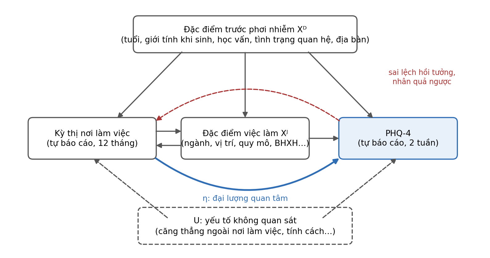

<!-- Bản văn bản của De_cuong_lan_2.docx, tạo tự động để đọc/tìm kiếm. Bản gốc là tệp .docx. -->

BỆNH LÝ HAY ĐỊNH KIẾN? KỲ THỊ NƠI LÀM VIỆC VÀ SỨC KHỎE TÂM THẦN CỦA NGƯỜI LAO ĐỘNG LGBT TẠI VIỆT NAM

Pathology or Prejudice? Workplace Stigma and Mental Health among LGBT Workers in Vietnam

Tóm tắt

Giới thiệu. Diễn ngôn coi đồng tính, song tính và chuyển giới là bệnh lý vẫn tồn tại trong xã hội Việt Nam, dù y khoa quốc tế đã từ bỏ quan điểm này và Bộ Y tế đã ban hành văn bản chính thức năm 2022. Phần lớn bằng chứng về quan hệ giữa kỳ thị và sức khỏe tâm thần của người thiểu số tình dục và giới đến từ Bắc Mỹ và Tây Âu, trong khi các nghiên cứu định lượng tại Việt Nam chưa xem nơi làm việc là một bối cảnh phân tích riêng. Nghiên cứu này xem xét liệu người lao động LGBT gặp kỳ thị thường xuyên hơn tại nơi làm việc có mức triệu chứng lo âu và trầm cảm cao hơn hay không.

Phương pháp. Nghiên cứu sử dụng dữ liệu từ một khảo sát trực tuyến cắt ngang, ẩn danh, thu thập từ tháng 7 đến tháng 9 năm 2026 với 850 phiếu; mẫu phân tích chính gồm 278 người lao động LGBT. Kỳ thị được đo bằng tám tình huống tại nơi làm việc trong 12 tháng gần nhất. Triệu chứng được đo bằng thang PHQ-4, gồm hai câu lo âu (GAD-2) và hai câu trầm cảm (PHQ-2). Mô hình hồi quy tuyến tính được ước lượng bằng phương pháp bình phương nhỏ nhất, điều chỉnh các đặc điểm có trước phơi nhiễm, với sai số chuẩn vững HC3. Kế hoạch phân tích được đăng ký trên Open Science Framework trước khi ước lượng mô hình chính.

Kết quả dự kiến. Nghiên cứu sẽ báo cáo hệ số và khoảng tin cậy của mối liên hệ giữa chỉ số kỳ thị với tổng điểm triệu chứng, điểm lo âu và điểm trầm cảm. Nghiên cứu cũng đánh giá mức độ phù hợp của dữ liệu với một đường dẫn qua việc che giấu danh tính, và trình bày các phân tích thăm dò về từng dạng kỳ thị, về khác biệt giữa các nhóm SOGIE và về vai trò điều tiết của mức thực thi chính sách đa dạng, bình đẳng và bao trùm (DEI) tại nơi làm việc.

Kết luận. Nghiên cứu kiểm tra một dự báo trung tâm của lý thuyết căng thẳng thiểu số trong một bối cảnh mà pháp luật lao động chưa quy định xu hướng tính dục và bản dạng giới là căn cứ cấm phân biệt đối xử. Mọi kết quả được diễn giải như mối liên hệ thống kê có điều chỉnh, không như tác động nhân quả.

Hàm ý chính sách. Nếu mối liên hệ được xác nhận, kỳ thị tại nơi làm việc cần được nhìn nhận như một yếu tố rủi ro đối với sức khỏe tâm thần nghề nghiệp, và các chương trình chăm sóc sức khỏe tâm thần tại nơi làm việc cần bao quát trải nghiệm kỳ thị dựa trên xu hướng tính dục và bản dạng giới.

Từ khóa: căng thẳng thiểu số; kỳ thị nơi làm việc; lo âu; trầm cảm; người lao động LGBT; chính sách DEI; Việt Nam.

# 1. Giới thiệu

## 1.1. Bối cảnh và tính cấp thiết của đề tài

Năm 1973, Hiệp hội Tâm thần học Hoa Kỳ đưa đồng tính ra khỏi danh mục rối loạn tâm thần. Năm 1990, Tổ chức Y tế Thế giới thông qua Bảng phân loại bệnh tật quốc tế lần thứ mười (ICD-10), trong đó đồng tính không còn là một chẩn đoán. Tại Việt Nam, ngày 03/8/2022, Bộ Y tế ban hành Công văn số 4132/BYT-PC, yêu cầu các cơ sở khám bệnh, chữa bệnh không coi đồng tính, song tính và chuyển giới là bệnh. Việc một cơ quan quản lý nhà nước phải ban hành văn bản như vậy cho thấy quan niệm bệnh lý hóa vẫn đủ phổ biến để gây ra hậu quả trong thực tiễn.

Quan niệm bệnh lý hóa ảnh hưởng trực tiếp đến cách diễn giải số liệu dịch tễ học. Các nghiên cứu quốc tế ghi nhận một cách nhất quán rằng người thuộc nhóm thiểu số tình dục có tỷ lệ rối loạn lo âu và trầm cảm cao hơn người dị tính (Meyer, 2003). Khoảng cách này có thể được diễn giải theo hai hướng đối lập. Hướng diễn giải thứ nhất xem bản dạng là nguồn gốc của triệu chứng. Hướng diễn giải thứ hai, dựa trên lý thuyết căng thẳng thiểu số, xem khoảng cách là hệ quả của những tác nhân gây căng thẳng mang tính xã hội mà người thiểu số phải đối mặt (Meyer, 1995, 2003). Tên đề tài đặt hai hướng diễn giải này cạnh nhau như một câu hỏi bối cảnh.

Một thiết kế nghiên cứu cắt ngang không cho phép phân xử dứt khoát giữa hai hướng diễn giải nêu trên. Tuy vậy, thiết kế này cho phép kiểm tra một dự báo mà chỉ hướng diễn giải thứ hai đưa ra một cách trực tiếp: trong cùng một nhóm thiểu số, mức độ triệu chứng biến thiên đồng biến theo mức độ kỳ thị mà từng cá nhân trải qua. Nếu gradient này không được quan sát, hướng diễn giải dựa trên căng thẳng thiểu số mất đi một căn cứ thực nghiệm trong bối cảnh Việt Nam. Nếu gradient này được quan sát, kết quả phù hợp với hướng diễn giải thứ hai nhưng chưa đủ để bác bỏ hướng diễn giải thứ nhất, vì một gradient tương tự cũng có thể phát sinh từ quan hệ nhân quả ngược hoặc từ thiên lệch hồi tưởng (mục 3.6). Nghiên cứu trình bày và diễn giải kết quả trong phạm vi giới hạn đó.

Nơi làm việc là bối cảnh phù hợp để kiểm tra dự báo này vì ba lý do. Thứ nhất, người trưởng thành dành phần lớn thời gian thức tại nơi làm việc. Thứ hai, quan hệ với đồng nghiệp, cấp trên và khách hàng mang tính lặp lại và khó tránh né. Thứ ba, khoản 8 Điều 3 Bộ luật Lao động 2019 liệt kê các căn cứ cấm phân biệt đối xử trong lao động nhưng không nêu xu hướng tính dục và bản dạng giới, nên kỳ thị dựa trên các đặc điểm này chưa được pháp luật lao động gọi tên.

## 1.2. Cơ sở lý thuyết

### 1.2.1. Lý thuyết căng thẳng thiểu số

Lý thuyết căng thẳng thiểu số phân biệt hai loại tác nhân gây căng thẳng (Meyer, 2003). Tác nhân xa là các sự kiện kỳ thị thực tế, chẳng hạn bị xúc phạm, bị đối xử bất công hoặc bị loại trừ. Tác nhân gần là các quá trình bên trong cá nhân, gồm sự cảnh giác trước khả năng bị từ chối, việc che giấu danh tính và kỳ thị nội tâm hóa. Hatzenbuehler (2009) bổ sung rằng kỳ thị tác động đến sức khỏe tâm thần thông qua các quá trình điều tiết cảm xúc, quan hệ xã hội và nhận thức. Ở cấp cấu trúc, Hatzenbuehler và cộng sự (2010) ghi nhận tỷ lệ rối loạn tâm thần tăng ở người đồng tính và song tính sống tại các bang Hoa Kỳ vừa thông qua lệnh cấm hôn nhân cùng giới, còn Herry và Dyar (2025) ghi nhận người thiểu số tình dục và đa dạng giới sống tại các bang có nhiều chính sách chống phân biệt đối xử hơn báo cáo ít kỳ thị hơn.

### 1.2.2. Kỳ thị tại nơi làm việc và quản lý danh tính

Waldo (1999) đề xuất một mô hình cấu trúc trong đó thái độ dị tính chuẩn mực tại nơi làm việc vận hành như một tác nhân căng thẳng thiểu số, biểu hiện qua cả những hành vi thường nhật như câu đùa, lời bình phẩm hay sự loại trừ khỏi các hoạt động chung. Đối với người có danh tính không thể nhận biết từ bên ngoài, quyết định công khai hay che giấu danh tính được đưa ra lặp lại trong từng tương tác. Clair, Beatty và MacLean (2005) mô tả quá trình quản lý danh tính vô hình tại nơi làm việc như một lựa chọn chịu ảnh hưởng của đặc điểm cá nhân và bối cảnh tổ chức. Ragins, Singh và Cornwell (2007) chỉ ra rằng nỗi sợ hậu quả của việc công khai gắn với môi trường làm việc và với mức độ hỗ trợ mà người lao động cảm nhận.

### 1.2.3. Lo âu và trầm cảm như hai chiều triệu chứng

Lo âu và trầm cảm là hai chiều triệu chứng có quan hệ chặt chẽ nhưng khác biệt. Phân tích nhân tố trong nghiên cứu gốc xây dựng thang PHQ-4 xác nhận hai nhân tố riêng biệt tương ứng với trầm cảm và lo âu (Kroenke và cộng sự, 2009). Về mặt khái niệm, các tác nhân gần như sự cảnh giác và sự chờ đợi bị từ chối (Meyer, 2003) có thể gắn với lo âu theo cơ chế khác với trầm cảm. Vì vậy, nghiên cứu phân tích riêng điểm lo âu và điểm trầm cảm, bên cạnh tổng điểm triệu chứng.

## 1.3. Tổng quan bằng chứng tại Việt Nam và khoảng trống nghiên cứu

Các báo cáo của UNDP và USAID (2014), Viện Nghiên cứu Xã hội, Kinh tế và Môi trường (iSEE, 2015) và Human Rights Watch (2020) ghi nhận kỳ thị đối với người LGBT trong gia đình, trường học, cơ sở y tế và nơi làm việc. Bên cạnh các báo cáo mô tả này, một số nghiên cứu định lượng đã được công bố. Đối với phụ nữ thiểu số tình dục, Nguyen, Poteat và cộng sự (2016) xây dựng và đánh giá một thang đo kỳ thị nội tâm hóa bằng tiếng Việt trên dữ liệu khảo sát trực tuyến với hơn 2.100 người tham gia. Nguyen, Bandeen-Roche và cộng sự (2016) thích ứng và đánh giá thang PHQ-9 như một công cụ đo mức độ triệu chứng trầm cảm trên mẫu 2.498 người. Tran và cộng sự (2020) khảo sát 302 người và sử dụng mô hình cấu trúc tuyến tính để xem xét quan hệ giữa việc tự bộc lộ xu hướng tính dục, bao gồm bộc lộ với đồng nghiệp, với kỳ thị nội tâm hóa và triệu chứng trầm cảm. Đối với nam quan hệ tình dục đồng giới, Ha và cộng sự (2015) khảo sát 451 người tại Hà Nội, đo ba dạng kỳ thị và ghi nhận đường dẫn gián tiếp từ kỳ thị đến hành vi tình dục nguy cơ thông qua trầm cảm và sử dụng chất. Ngo và cộng sự (2026) nghiên cứu mức độ phổ biến và các yếu tố liên quan của tự kỳ thị ở 250 người thuộc cộng đồng LGBTQ+ tại miền Bắc và miền Trung.

Các nghiên cứu nêu trên phần lớn tập trung vào một nhóm SOGIE, đo kỳ thị nội tâm hóa hoặc kỳ thị trong gia đình và cộng đồng, và không xem nơi làm việc là một bối cảnh phân tích riêng. Theo rà soát sơ bộ của tác giả, chưa có nghiên cứu nào tại Việt Nam đo lường kỳ thị thể hiện tại nơi làm việc ở người lao động thuộc nhiều nhóm SOGIE và ước lượng mối liên hệ giữa kỳ thị đó với triệu chứng lo âu và trầm cảm. Tác giả sẽ chỉ giữ nhận định này trong bản thảo sau khi hoàn tất một rà soát tài liệu có cấu trúc trên các cơ sở dữ liệu Scopus, Web of Science, PubMed, Google Scholar và các tạp chí khoa học trong nước. Quy trình tìm kiếm, tiêu chí lựa chọn và số lượng tài liệu ở từng bước sẽ được báo cáo kèm bản thảo.

## 1.4. Mục tiêu và câu hỏi nghiên cứu

Nghiên cứu có ba mục tiêu. Mục tiêu thứ nhất là ước lượng mối liên hệ giữa mức độ kỳ thị tại nơi làm việc và mức độ triệu chứng ở người lao động LGBT, đối với tổng điểm triệu chứng cũng như riêng đối với lo âu và trầm cảm. Mục tiêu thứ hai là xác định những dạng hành vi kỳ thị nào gắn với mức triệu chứng cao hơn. Mục tiêu thứ ba là xem xét, ở mức thăm dò, liệu mức thực thi chính sách DEI tại nơi làm việc có đi kèm một mối liên hệ yếu hơn giữa kỳ thị và triệu chứng hay không, và liệu mối liên hệ chính có khác nhau giữa các nhóm SOGIE hay không.

Câu hỏi nghiên cứu chính được phát biểu như sau: trong người lao động LGBT tại Việt Nam, mức độ kỳ thị thể hiện tại nơi làm việc có liên hệ với mức độ triệu chứng lo âu và trầm cảm hay không, sau khi điều chỉnh các đặc điểm có trước phơi nhiễm?

## 1.5. Giả thuyết nghiên cứu

Bảng 1 trình bày các giả thuyết và các phân tích thăm dò. Giả thuyết chính (H1) là kiểm định trung tâm của nghiên cứu. Các giả thuyết phụ (H2a, H2b, H3) được xác định trước khi ước lượng và được kiểm soát sai số theo họ kiểm định. Các phân tích thăm dò (E1-E5) được trình bày để mô tả và gợi hướng cho nghiên cứu sau, không được dùng để thay thế hoặc củng cố kết luận chính.

Bảng 1. Giả thuyết và phân tích thăm dò

| Ký hiệu | Nội dung | Vị trí | Thời điểm hình thành |
|---|---|---|---|
| H1 | Trong nhóm LGBT, chỉ số kỳ thị tại nơi làm việc liên hệ đồng biến với tổng điểm PHQ-4. | Giả thuyết chính | Nội dung có trong kế hoạch ban đầu; vị trí chính được xác lập sau khi tác giả tiếp xúc một phần với dữ liệu |
| H2a | Chỉ số kỳ thị liên hệ đồng biến với điểm lo âu (GAD-2). | Giả thuyết phụ | Bổ sung khi đăng ký, trước khi ước lượng |
| H2b | Chỉ số kỳ thị liên hệ đồng biến với điểm trầm cảm (PHQ-2). | Giả thuyết phụ | Bổ sung khi đăng ký, trước khi ước lượng |
| H3 | Các mối liên hệ giữa kỳ thị, che giấu danh tính và điểm PHQ-4 phù hợp với cấu trúc đường dẫn kỳ thị → che giấu danh tính → triệu chứng. | Giả thuyết phụ | Kế hoạch ban đầu |
| E1 | Mối liên hệ giữa kỳ thị và PHQ-4 khi kỳ thị được chia thành ba mức. | Thăm dò | Sau khi tiếp xúc với dữ liệu |
| E2 | Mối liên hệ giữa từng tình huống kỳ thị và PHQ-4. | Thăm dò | Sau khi tiếp xúc với dữ liệu |
| E3 | Phân bố điểm PHQ-4 giữa người non-LGBT, người LGBT chưa gặp và đã gặp kỳ thị. | Thăm dò, chỉ mô tả | Sau khi tiếp xúc với dữ liệu |
| E4 | Mối liên hệ chính khác nhau theo giới tính khi sinh và theo nhóm xu hướng tính dục. | Thăm dò | Bổ sung khi đăng ký, trước khi ước lượng |
| E5 | Mức thực thi DEI được cảm nhận làm suy yếu mối liên hệ giữa kỳ thị và PHQ-4. | Thăm dò | Bổ sung khi đăng ký, trước khi ước lượng |

Cột thời điểm hình thành được đưa vào bảng vì tính chất của một kiểm định phụ thuộc vào thời điểm giả thuyết được đặt ra. Kế hoạch phân tích ban đầu, được xây dựng trước khi thu thập dữ liệu, đặt thu nhập làm trọng tâm và đã bao gồm mối liên hệ giữa kỳ thị và sức khỏe tâm thần như một mắt xích trên đường dẫn đến thu nhập. Sau khi tiếp xúc một phần với dữ liệu, tác giả đặt mối liên hệ giữa kỳ thị và sức khỏe tâm thần vào vị trí phân tích chính và loại toàn bộ các phân tích về thu nhập khỏi phạm vi bài báo. Do đó, nghiên cứu được trình bày là một nghiên cứu khám phá có kế hoạch phân tích được công bố trước, không phải một kiểm định khẳng định.

Hình 1. Khung phân tích của nghiên cứu

# 2. Phương pháp nghiên cứu

Mục này tóm tắt nội dung chương phương pháp nghiên cứu, gồm thiết kế nghiên cứu, dữ liệu và mẫu, đo lường các biến, đại lượng cần ước lượng và chiến lược nhận diện, cùng đặc tả các mô hình kinh tế lượng.

## 2.1. Thiết kế nghiên cứu

Nghiên cứu sử dụng phương pháp định lượng với thiết kế khảo sát cắt ngang. Đơn vị phân tích là cá nhân người lao động. Phân tích chính được thực hiện trong nội bộ nhóm người lao động LGBT, nghĩa là nghiên cứu so sánh những người LGBT có mức độ kỳ thị khác nhau thay vì so sánh người LGBT với người non-LGBT. Thiết kế so sánh trong nội bộ nhóm có hai ưu điểm. Thứ nhất, thiết kế này giữ cố định tư cách thành viên của nhóm thiểu số, nên một gradient giữa kỳ thị và triệu chứng không thể được giải thích bằng việc thuộc nhóm thiểu số tự thân. Thứ hai, thiết kế này tránh được sai lệch phát sinh từ việc người LGBT và người non-LGBT được tiếp cận qua các kênh tuyển chọn khác nhau (mục 2.2). Dữ liệu của người non-LGBT chỉ được sử dụng cho mục đích mô tả.

## 2.2. Dữ liệu và mẫu nghiên cứu

### 2.2.1. Quy trình thu thập dữ liệu

Dữ liệu sơ cấp được thu thập bằng bảng hỏi trực tuyến, ẩn danh, triển khai trên nền tảng KoboToolbox từ ngày 24/7 đến ngày 28/9/2026. Người tham gia đủ điều kiện nếu từ 18 tuổi trở lên và hiện có công việc chính tạo thu nhập tại Việt Nam; hai điều kiện này được sàng lọc bằng hai câu hỏi ở đầu bảng hỏi. Do không tồn tại khung chọn mẫu cho người LGBT tại Việt Nam, tác giả áp dụng phương pháp chọn mẫu thuận tiện kết hợp với phương pháp quả cầu tuyết, thông qua mạng lưới cộng đồng và các kênh trực tuyến. Người LGBT và người non-LGBT được tiếp cận qua các kênh không hoàn toàn trùng nhau.

Trước khi trả lời, người tham gia đọc một trang thông tin nêu mục đích nghiên cứu, việc bảng hỏi có câu hỏi nhạy cảm, tính ẩn danh của khảo sát, quyền bỏ qua bất kỳ câu hỏi nào và quyền dừng khảo sát bất cứ lúc nào. Bảng hỏi không thu thập họ tên, số điện thoại, địa chỉ thư điện tử, nơi cư trú hay tên đơn vị công tác.

### 2.2.2. Luồng mẫu

Bảng 2 trình bày luồng mẫu từ số phiếu thu được đến các mẫu phân tích. Các con số đã được đối chiếu với tệp dữ liệu gốc. Mẫu phân tích của mỗi mô hình được xác định theo các biến mà chính mô hình đó sử dụng.

Bảng 2. Luồng mẫu và các mẫu phân tích

| Bước | Non-LGBT | LGBT |
|---|---|---|
| Tổng số phiếu thu được là 850. Sau khi loại 37 người dưới 18 tuổi và 86 người không có công việc chính tạo thu nhập, còn 727 người đủ điều kiện. | — | — |
| Có 87 người không xác định được nhóm ở câu tự nhận diện (32 người chọn "không muốn trả lời", 29 người chọn "không chắc/đang tự xác định", 26 người bỏ trống). Mẫu phân tích gồm 640 người. | 340 | 300 |
| Mẫu mô tả sức khỏe tâm thần (E3) gồm những người trả lời đủ bốn câu PHQ-4, tổng cộng 601 người. | 323 | 278 |
| Mẫu phân tích chính (H1-H3, E1, E2) gồm những người LGBT có đủ PHQ-4 và chỉ số kỳ thị. | — | 278 |
| Trong mẫu chính, số người có đủ các biến kiểm soát Xᴰ khi phương án "không muốn trả lời" được mã hóa thành một nhóm riêng (quy tắc chính). | — | 256 |
| Trong mẫu chính, số người có đủ các biến kiểm soát Xᴰ khi phương án "không muốn trả lời" được coi là giá trị khuyết (quy tắc thay thế). | — | 247 |
| Mẫu phân tích E5 gồm những người trong mẫu 256 có đủ chỉ số thực thi DEI. | — | 243 |

Khác biệt về kênh tiếp cận để lại dấu vết quan sát được trong dữ liệu. Trong mẫu 640 người, 54% người LGBT làm việc tại Thành phố Hồ Chí Minh so với 42% người non-LGBT, trong khi tỷ lệ làm việc ngoài Hà Nội, Thành phố Hồ Chí Minh và Đà Nẵng là 12% ở người LGBT so với 28% ở người non-LGBT. Khác biệt này là căn cứ để giới hạn phân tích chính trong nội bộ nhóm LGBT. Trong 278 người của mẫu chính có 87 người song tính, 74 người đồng tính nữ, 68 người đồng tính nam và 23 người toàn tính theo câu hỏi về xu hướng tính dục, và 13 người chuyển giới hoặc phi nhị nguyên theo câu hỏi về bản dạng giới.

## 2.3. Đo lường các biến

Bảng 3 tóm tắt cách đo lường và vai trò của từng biến trong mô hình. Các hệ số tin cậy được tính trên tệp dữ liệu gốc, loại trọn quan sát khi có câu khuyết.

Bảng 3. Đo lường các biến nghiên cứu

| Biến | Cách đo lường | Thang điểm | Vai trò |
|---|---|---|---|
| Tổng điểm triệu chứng (PHQ) | Tổng bốn câu của PHQ-4 (Kroenke và cộng sự, 2009) về tần suất triệu chứng trong hai tuần gần nhất; α = 0,81 (n = 601) | 0-12 | Biến phụ thuộc chính (H1) |
| Điểm lo âu (GAD-2) | Tổng hai câu lo âu của PHQ-4, lấy từ GAD-7 (Spitzer và cộng sự, 2006); hệ số tương quan giữa hai câu là 0,49 | 0-6 | Biến phụ thuộc (H2a) |
| Điểm trầm cảm (PHQ-2) | Tổng hai câu trầm cảm của PHQ-4, lấy từ PHQ-9 (Kroenke, Spitzer & Williams, 2001, 2003); hệ số tương quan giữa hai câu là 0,56 | 0-6 | Biến phụ thuộc (H2b) |
| Chỉ số kỳ thị (S) | Trung bình tần suất của bảy tình huống kỳ thị tại nơi làm việc trong 12 tháng gần nhất, phát triển trên cơ sở Waldo (1999) | 0-4 | Biến độc lập chính |
| Từng tình huống kỳ thị | Biến nhị phân nhận giá trị 1 nếu người trả lời gặp tình huống ít nhất một lần | 0/1 | Biến độc lập (E2) |
| Che giấu danh tính (C) | Trung bình bốn phát biểu dựa trên Ragins, Singh và Cornwell (2007) và Clair, Beatty và MacLean (2005); α = 0,78 (n = 290) | 1-5 | Biến trung gian giả định (H3) |
| Thực thi DEI được cảm nhận (Q) | Trung bình bốn phát biểu về thực thi chính sách tại nơi làm việc, tính khi có ít nhất ba câu hợp lệ; α = 0,66 (n = 458) | 1-5 | Biến điều tiết (E5) |
| Khối biến Xᴰ | Nhóm tuổi, giới tính khi sinh, học vấn, tình trạng quan hệ, địa bàn làm việc | Biến phân loại | Biến kiểm soát chính |
| Khối biến Xᴶ | Kinh nghiệm, ngành, vị trí, quan hệ việc làm, loại hình và quy mô nơi làm việc, bảo hiểm xã hội, số giờ làm việc | Biến phân loại | Biến kiểm soát bổ sung |

### 2.3.1. Biến phụ thuộc

Triệu chứng lo âu và trầm cảm được đo bằng PHQ-4 (Kroenke và cộng sự, 2009). Mỗi câu được chấm từ 0 (không hề) đến 3 (gần như mỗi ngày). Tác giả chưa tìm thấy nghiên cứu thẩm định phiên bản tiếng Việt của PHQ-4. Căn cứ gần nhất hiện có là nghiên cứu thích ứng và đánh giá PHQ-9 ở phụ nữ thiểu số tình dục Việt Nam (Nguyen, Bandeen-Roche và cộng sự, 2016), vì hai câu trầm cảm của PHQ-4 được lấy từ PHQ-9. Do đó, ngưỡng từ 6 điểm trở lên chỉ được dùng cho mục đích mô tả và không được diễn giải như tỷ lệ hiện mắc. Có 26,6% người trả lời đạt điểm 0, tức biến phụ thuộc có hiện tượng dồn về giá trị sàn; đặc điểm này được xử lý trong các kiểm tra độ bền (mục 3.7).

### 2.3.2. Biến độc lập chính

Kỳ thị tại nơi làm việc được đo bằng tám tình huống, chỉ hỏi những người tự nhận là LGBT. Câu hỏi có nội dung: "Trong 12 tháng gần nhất tại nơi làm việc hiện tại, anh/chị gặp các tình huống sau với tần suất như thế nào?" Tám tình huống gồm: bị nói đùa hoặc bình luận xúc phạm; bị hỏi những câu riêng tư không mong muốn; bị tiết lộ hoặc bị đe dọa tiết lộ xu hướng tính dục hoặc bản dạng giới khi chưa đồng ý; bị loại khỏi cơ hội đào tạo hoặc phát triển nghề nghiệp; bị đánh giá hiệu suất, trả lương hoặc thăng tiến không công bằng; bị phân công công việc theo hướng bất lợi; bị gây áp lực phải tuân theo khuôn mẫu giới; và gặp khó khăn khi sử dụng tên gọi, đại từ, trang phục hoặc nhà vệ sinh phù hợp với bản dạng giới. Mỗi tình huống được chấm từ 0 (không bao giờ) đến 4 (rất thường xuyên). Phương án "không áp dụng hoặc không muốn trả lời" được mã hóa là giá trị khuyết.

Tác giả xử lý danh mục này như một chỉ số cấu thành, không phải một thang đo phản ánh. Trong chỉ số cấu thành, mỗi tình huống là một loại sự kiện riêng biệt, và việc gặp một tình huống không kéo theo việc gặp các tình huống khác. Do đó, độ nhất quán nội tại không phải tiêu chí đánh giá chất lượng của chỉ số; hệ số α (0,61 cho bảy tình huống và 0,67 cho tám tình huống) chỉ được báo cáo để tham khảo. Chỉ số chính là trung bình của bảy tình huống đầu. Tình huống thứ tám không được đưa vào chỉ số chính vì 65 trong 297 người LGBT có trả lời phần này chọn "không áp dụng", chủ yếu do nội dung của tình huống gắn với người chuyển giới và phi nhị nguyên; nếu đưa tình huống này vào, chỉ số của các cá nhân sẽ được tính trên những tập tình huống khác nhau. Chỉ số được tính khi người trả lời có ít nhất bốn trong bảy tình huống hợp lệ. Trong thực tế, cả 278 người của mẫu chính đều có từ năm tình huống hợp lệ trở lên, nên quy tắc này không loại quan sát nào.

Thang đo kỳ thị chưa được chuẩn hóa. Thang được xây dựng qua trao đổi giữa tác giả và giảng viên hướng dẫn, có tham vấn chuyên gia, được Việt hóa theo góp ý của chuyên gia và được hiệu chỉnh qua một khảo sát thử với 30 người. Bài báo sẽ trình bày nguồn gốc của từng tình huống và quy trình xây dựng thang đo trong tài liệu bổ sung.

### 2.3.3. Biến trung gian giả định, biến điều tiết và biến kiểm soát

Che giấu danh tính được đo bằng bốn phát biểu theo thang Likert năm mức, phản ánh nỗ lực che giấu, việc tránh nói về đời sống cá nhân, sự lo lắng bị phát hiện và sự mệt mỏi do phải kiểm soát thông tin. Vì phát biểu về sự mệt mỏi có nội dung gần với PHQ-4, H3 được ước lượng lại với chỉ số che giấu gồm ba phát biểu còn lại. Mức thực thi DEI được cảm nhận được đo bằng bốn phát biểu: người lao động cảm thấy an toàn khi phản ánh về phân biệt đối xử; quản lý trực tiếp tôn trọng người LGBT; hành vi nói đùa hoặc xúc phạm người LGBT bị nhắc nhở hoặc xử lý; và nhân viên được sử dụng tên gọi, đại từ, trang phục phù hợp với bản dạng giới. Biến này do chính người lao động báo cáo, nên phản ánh nhận thức của người lao động chứ không phải đặc điểm khách quan của tổ chức. Các biến kiểm soát được chia thành hai khối theo vị trí thời gian so với phơi nhiễm, như được lập luận ở mục 2.4.

## 2.4. Đại lượng ước lượng và chiến lược nhận diện

Đại lượng cần ước lượng trong phân tích chính, ký hiệu η, là chênh lệch kỳ vọng của điểm PHQ-4 giữa hai người lao động LGBT có chỉ số kỳ thị chênh nhau một đơn vị trên thang 0-4, trong cùng một nhóm đặc điểm Xᴰ. Đại lượng này là một tham số liên hệ trung bình có điều kiện. η chỉ có thể được diễn giải như tác động nhân quả khi hai giả định được thỏa mãn: không tồn tại yếu tố chưa được điều chỉnh nào đồng thời ảnh hưởng đến mức độ kỳ thị và mức độ triệu chứng, và chỉ số kỳ thị không bị chính tình trạng triệu chứng làm sai lệch. Thiết kế cắt ngang với dữ liệu tự báo cáo không cho phép xác lập hai giả định này, nên nghiên cứu không diễn giải η theo nghĩa nhân quả.

Hình 2. Đồ thị nhân quả giản lược dùng để lựa chọn biến kiểm soát

Tác giả lựa chọn biến kiểm soát dựa trên đồ thị nhân quả (Greenland, Pearl & Robins, 1999) và nguyên tắc điều chỉnh các nguyên nhân có trước phơi nhiễm của biến phơi nhiễm hoặc biến kết quả (VanderWeele, 2019). Các đặc điểm trong khối Xᴰ hình thành trước khi người lao động gặp kỳ thị tại nơi làm việc hiện tại và có thể ảnh hưởng đồng thời đến mức độ kỳ thị và sức khỏe tâm thần, nên được điều chỉnh trong đặc tả chính. Vị trí của khối Xᴶ không xác định được. Một mặt, loại hình và quy mô nơi làm việc có thể quyết định mức độ người lao động bị phơi nhiễm với kỳ thị, tức đóng vai trò yếu tố gây nhiễu. Mặt khác, kỳ thị có thể đẩy người lao động vào vị trí thấp hơn hoặc vào quan hệ việc làm kém ổn định hơn, tức Xᴶ nằm trên đường dẫn từ kỳ thị đến triệu chứng. Việc điều chỉnh một biến trung gian sẽ loại bỏ một phần của chính mối liên hệ cần đo (Angrist & Pischke, 2009). Vì vậy, đặc tả chính chỉ điều chỉnh Xᴰ, còn đặc tả thứ hai điều chỉnh thêm Xᴶ. Lựa chọn này dựa trên thứ tự thời gian giữa các biến, không dựa trên kết quả ước lượng.

## 2.5. Đặc tả mô hình

### 2.5.1. Mô hình chính

Mô hình kiểm định H1 có dạng:

PHQᵢ = α + η·Sᵢ + γ′Xᵢᴰ + εᵢ

trong đó PHQᵢ là tổng điểm PHQ-4 của người lao động i, Sᵢ là chỉ số kỳ thị bảy tình huống, Xᵢᴰ là véc-tơ các biến kiểm soát có trước phơi nhiễm và εᵢ là sai số. H1 được ủng hộ khi η dương và có ý nghĩa thống kê ở mức 5% trong kiểm định hai phía. Mô hình kiểm định H2a và H2b có cùng vế phải, với biến phụ thuộc lần lượt là điểm GAD-2 và điểm PHQ-2.

### 2.5.2. Mô hình kiểm tra đường dẫn qua che giấu danh tính

H3 được kiểm định bằng hai phương trình:

Cᵢ = α₁ + a·Sᵢ + γ₁′Xᵢᴰ + uᵢ

PHQᵢ = α₂ + b·Cᵢ + c′·Sᵢ + γ₂′Xᵢᴰ + vᵢ

trong đó Cᵢ là chỉ số che giấu danh tính. Dữ liệu được coi là phù hợp với cấu trúc đường dẫn khi hệ số a và hệ số b cùng dương và cùng có ý nghĩa thống kê. Giá trị p của H3 được xác định bằng giá trị lớn hơn trong hai giá trị p của a và b, theo nguyên tắc kiểm định giao - hợp.

### 2.5.3. Mô hình cho các phân tích thăm dò

Phân tích E1 thay Sᵢ bằng hai biến giả biểu thị mức kỳ thị thấp và cao, với nhóm không gặp kỳ thị làm nhóm tham chiếu và ngưỡng phân chia là trung vị của chỉ số trong số người đã gặp kỳ thị. Phân tích E2 ước lượng tám mô hình riêng, mỗi mô hình thay Sᵢ bằng biến nhị phân của một tình huống. Phân tích E4 bổ sung vào mô hình chính tương tác giữa Sᵢ và giới tính khi sinh (159 người được chỉ định là nữ và 97 người được chỉ định là nam khi sinh trong mẫu 256 người), và tương tác giữa Sᵢ và nhóm xu hướng tính dục (103 người song tính hoặc toàn tính, 64 người đồng tính nữ, 64 người đồng tính nam). Phân tích E5 ước lượng mô hình:

PHQᵢ = α + η·Sᵢ + δ·Qᵢ + κ·(Sᵢ × Qᵢ) + γ′Xᵢᴰ + εᵢ

trong đó Qᵢ là mức thực thi DEI được cảm nhận, đã được trung tâm hóa quanh giá trị trung bình. Hệ số κ âm phù hợp với giả thuyết rằng mức thực thi DEI cao hơn đi kèm một mối liên hệ yếu hơn giữa kỳ thị và triệu chứng.

# 3. Kế hoạch phân tích dữ liệu

## 3.1. Công cụ phân tích

Tác giả sử dụng Stata 17 cho toàn bộ quá trình làm sạch dữ liệu, thống kê mô tả và ước lượng mô hình. Các lệnh chính gồm regress với tùy chọn vce(hc3) cho hồi quy tuyến tính với sai số chuẩn vững, fracreg logit cho hồi quy logit phân số, mkspline cho hàm spline bậc ba có giới hạn, mi impute chained cho gán giá trị đa lần và bootstrap cho khoảng tin cậy của hiệu ứng gián tiếp. Phân tích độ nhạy theo Cinelli và Hazlett (2020) được thực hiện bằng gói sensemakr, vốn có phiên bản cho Stata và R. Mã phân tích được lưu dưới dạng tệp do-file để bảo đảm khả năng tái lập.

## 3.2. Làm sạch và chuẩn bị dữ liệu

Quá trình chuẩn bị dữ liệu gồm bốn bước. Bước thứ nhất áp dụng tiêu chí đủ điều kiện và xác định nhóm LGBT theo câu tự nhận diện. Bước thứ hai mã hóa các giá trị đặc biệt: mã "không áp dụng hoặc không muốn trả lời" ở thang kỳ thị và thang thực thi DEI được chuyển thành giá trị khuyết, còn phương án "không muốn trả lời" ở các biến nhân khẩu học được giữ thành một nhóm riêng theo quy tắc chính. Bước thứ ba xây dựng các chỉ số tổng hợp theo quy tắc ở Bảng 3. Bước thứ tư đánh dấu các phiếu có dấu hiệu chất lượng thấp. Vì biểu mẫu chỉ ghi thời điểm nộp phiếu mà không ghi thời gian hoàn thành, tác giả không thể loại các phiếu được trả lời quá nhanh. Do các thang PHQ-4, che giấu danh tính và thực thi DEI không có câu đảo chiều, việc chọn cùng một mức cho mọi câu của một thang có thể là câu trả lời hợp lệ. Vì vậy, tác giả chỉ đánh dấu những phiếu chọn cùng một mức ở cả ba thang cùng lúc và những phiếu có thông tin mâu thuẫn rõ ràng, chẳng hạn nhóm tuổi 18-24 kèm vị trí quản lý cấp cao. Các phiếu được đánh dấu vẫn được giữ trong phân tích chính và chỉ bị loại trong một phép kiểm tra độ bền.

## 3.3. Thống kê mô tả và đánh giá thang đo

Tác giả trình bày đặc điểm nhân khẩu học của mẫu theo nhóm LGBT và non-LGBT, phân bố của PHQ-4, GAD-2, PHQ-2 và chỉ số kỳ thị, tỷ lệ người đã gặp từng tình huống kỳ thị, và hệ số tin cậy của các thang đo. Đối với nhóm LGBT, tác giả ước lượng thêm một hồi quy mô tả của PHQ-4 theo các biến nhân khẩu học để xác định những đặc điểm đi kèm mức triệu chứng cao hơn trước khi đưa kỳ thị vào mô hình. Phân bố PHQ-4 theo ba nhóm non-LGBT, LGBT chưa gặp kỳ thị và LGBT đã gặp kỳ thị (E3) chỉ được trình bày ở dạng mô tả, không kèm kiểm định giả thuyết. Phép so sánh này không cân xứng vì ba lý do: nhóm non-LGBT không được hỏi về trải nghiệm tiêu cực tại nơi làm việc, căng thẳng thiểu số ngoài nơi làm việc không được đo, và người LGBT chưa gặp kỳ thị có thể là người đang che giấu danh tính.

## 3.4. Ước lượng mô hình chính và lý do lựa chọn phương pháp

Mô hình chính được ước lượng bằng phương pháp bình phương nhỏ nhất thông thường (OLS). Tác giả lựa chọn OLS vì hệ số của mô hình tuyến tính có cách diễn giải trực tiếp là chênh lệch điểm PHQ-4 tương ứng với một đơn vị chênh lệch của chỉ số kỳ thị, phù hợp với định nghĩa của đại lượng η ở mục 2.4. Vì PHQ-4 là biến bị chặn trong khoảng 0-12 và dồn về giá trị sàn, tác giả ước lượng thêm một mô hình thay thế phù hợp với tính chất bị chặn của biến phụ thuộc (mục 3.7). Đặc tả thứ hai bổ sung khối Xᴶ; khoảng cách giữa hệ số η của hai đặc tả cho biết mức độ mối liên hệ có thể đi qua các đặc điểm việc làm.

## 3.5. Kiểm định chẩn đoán mô hình

### 3.5.1. Phương sai sai số thay đổi

Do PHQ-4 bị chặn và dồn về giá trị sàn, phương sai của sai số nhiều khả năng thay đổi theo giá trị dự báo. Tác giả báo cáo kiểm định Breusch - Pagan và kiểm định White để mô tả mức độ phương sai sai số thay đổi. Bất kể kết quả của hai kiểm định này, mọi mô hình tuyến tính đều sử dụng sai số chuẩn vững HC3, vì sai số chuẩn HC3 cho suy luận đáng tin cậy hơn HC1 ở mẫu vài trăm quan sát có nhiều biến phân loại (Long & Ervin, 2000). Lựa chọn này được cố định trước khi ước lượng để không tạo thêm một bậc tự do trong phân tích.

### 3.5.2. Đa cộng tuyến

Tác giả tính hệ số phóng đại phương sai (VIF) cho các biến trong mô hình chính. Vì các biến trong khối Xᴰ và Xᴶ đều là biến phân loại, hệ số VIF tổng quát được dùng để đánh giá mức độ đa cộng tuyến giữa các nhóm biến giả của cùng một biến.

### 3.5.3. Dạng hàm và quan sát có ảnh hưởng lớn

Tác giả sử dụng kiểm định RESET của Ramsey để đánh giá khả năng mô hình tuyến tính bỏ sót các thành phần phi tuyến. Khả năng mối liên hệ không tuyến tính được kiểm tra trực tiếp bằng các đặc tả thay thế ở mục 3.7. Các quan sát có ảnh hưởng lớn được xác định bằng khoảng cách Cook và giá trị đòn bẩy. Tác giả không loại các quan sát này khỏi phân tích chính, nhưng ước lượng lại mô hình sau khi loại chúng để đánh giá mức độ phụ thuộc của kết quả vào một số ít quan sát.

## 3.6. Xử lý vấn đề nội sinh

### 3.6.1. Các nguồn nội sinh

Mối liên hệ giữa kỳ thị và triệu chứng có thể bị sai lệch bởi bốn nguồn nội sinh, và cả bốn nguồn đều có xu hướng làm hệ số η lớn hơn giá trị thực. Nguồn thứ nhất là biến bị bỏ sót: căng thẳng thiểu số ngoài nơi làm việc, chẳng hạn từ gia đình, không được đo và có thể tương quan đồng thời với kỳ thị tại nơi làm việc và với triệu chứng. Nguồn thứ hai là quan hệ nhân quả ngược: triệu chứng có thể làm người lao động dễ trở thành mục tiêu của kỳ thị hơn. Nguồn thứ ba là thiên lệch hồi tưởng: người đang có triệu chứng trầm cảm có thể nhớ lại và báo cáo nhiều sự kiện tiêu cực hơn. Nguồn thứ tư là thiên lệch phương pháp chung: cùng một người báo cáo cả biến phơi nhiễm và biến kết quả trong cùng một bảng hỏi (Podsakoff và cộng sự, 2003). Tiêu chí liều - đáp ứng của Hill (1965) chỉ là một căn cứ để cân nhắc khả năng nhân quả, không phải bằng chứng nhân quả.

### 3.6.2. Lý do không sử dụng biến công cụ, ghép điểm xu hướng và mô hình Heckman

Phương pháp biến công cụ đòi hỏi một biến ảnh hưởng đến mức độ kỳ thị nhưng không ảnh hưởng trực tiếp đến triệu chứng. Bộ dữ liệu không có biến nào thỏa mãn điều kiện loại trừ này. Các biến có thể được cân nhắc, chẳng hạn mức thực thi DEI, ngành hoặc địa bàn làm việc, đều có khả năng ảnh hưởng trực tiếp đến sức khỏe tâm thần, nên việc sử dụng chúng làm biến công cụ sẽ tạo ra ước lượng chệch thay vì loại bỏ chệch. Phương pháp ghép điểm xu hướng dựa trên cùng giả định lựa chọn dựa trên biến quan sát được như hồi quy có kiểm soát, nên không xử lý được gây nhiễu từ biến không quan sát; phương pháp này cũng kém phù hợp với một biến phơi nhiễm liên tục. Mô hình lựa chọn mẫu của Heckman không áp dụng được vì biến kết quả được quan sát cho mọi người trong mẫu, còn quá trình tự lựa chọn vào khảo sát không thể mô hình hóa khi không có dữ liệu về những người không tham gia. Việc không sử dụng ba phương pháp này là một quyết định dựa trên điều kiện nhận diện, không phải một hạn chế về kỹ thuật.

### 3.6.3. Các biện pháp giảm thiểu và định lượng sai lệch

Tác giả áp dụng năm biện pháp. Biện pháp thứ nhất là lựa chọn biến kiểm soát theo đồ thị nhân quả, chỉ điều chỉnh các đặc điểm có trước phơi nhiễm trong đặc tả chính (mục 2.4). Biện pháp thứ hai là định lượng mức độ nhạy của kết quả với gây nhiễu không quan sát theo phương pháp của Cinelli và Hazlett (2020). Phương pháp này tính giá trị độ bền, tức mức tương quan riêng phần tối thiểu mà một biến bị bỏ sót phải có với cả chỉ số kỳ thị và PHQ-4 để đưa η về 0 hoặc làm khoảng tin cậy chứa 0, rồi so sánh mức này với sức mạnh giải thích của các biến quan sát được như giới tính khi sinh và học vấn. Biện pháp thứ ba là phân tích ở cấp từng tình huống (E2) để đánh giá thiên lệch hồi tưởng: nếu mối liên hệ chỉ xuất hiện ở các tình huống đòi hỏi người trả lời tự quy một quyết định nhân sự cho xu hướng tính dục hoặc bản dạng giới của mình (tình huống 4, 5 và 6) mà không xuất hiện ở các tình huống mô tả sự kiện cụ thể (tình huống 1, 2, 3 và 7), kết quả gợi ý khả năng thiên lệch quy nguyên hoặc hồi tưởng. Biện pháp thứ tư liên quan đến thiết kế bảng hỏi: thang kỳ thị và thang PHQ-4 nằm ở hai phần khác nhau, dùng thang điểm khác nhau (0-4 và 0-3) và khoảng thời gian tham chiếu khác nhau (12 tháng và hai tuần), phù hợp với các biện pháp phân tách về thủ tục mà Podsakoff và cộng sự (2003) khuyến nghị để giảm thiên lệch phương pháp chung. Biện pháp thứ năm là quy tắc diễn giải: mọi hệ số được trình bày như mối liên hệ có điều chỉnh. Tác giả không sử dụng kiểm định một nhân tố của Harman, vì chính Podsakoff và cộng sự (2003) đánh giá kiểm định này không đủ khả năng phát hiện thiên lệch phương pháp chung, và không sử dụng phương pháp ổn định hệ số của Oster (2019), vì giả định lựa chọn tỷ lệ của phương pháp này khó được biện minh đối với một biến kết quả tâm lý tự báo cáo.

## 3.7. Kiểm tra độ bền

Bảng 4 liệt kê các kiểm tra độ bền. Mỗi kiểm tra được đưa vào vì nó trả lời một nghi vấn cụ thể mà mô hình chính không trả lời được. Tác giả không đặt một ngưỡng tỷ lệ đặc tả cùng dấu để tuyên bố kết quả vững, mà báo cáo toàn bộ kết quả và chỉ ra lựa chọn phân tích nào làm thay đổi kết luận suy luận.

Bảng 4. Các kiểm tra độ bền

| Nghi vấn | Kiểm tra | Cách đọc kết quả |
|---|---|---|
| Đặc điểm việc làm có nằm trên đường dẫn hay không | Đặc tả thứ hai bổ sung khối Xᴶ | Hệ số η giảm đáng kể cho thấy một phần mối liên hệ có thể đi qua đặc điểm việc làm |
| Mối liên hệ có tuyến tính hay không | Đặc tả gồm biến giả đã gặp kỳ thị và cường độ kỳ thị trong số người đã gặp; spline bậc ba có giới hạn với ba nút tại phân vị 10, 50 và 90 của chỉ số trong số người đã gặp kỳ thị | Cho biết mối liên hệ tập trung ở bước chuyển từ không gặp sang có gặp kỳ thị hay tăng dần theo cường độ |
| Tính chất bị chặn của PHQ-4 | Hồi quy logit phân số trên PHQ-4/12 (Papke & Wooldridge, 1996), báo cáo hiệu ứng biên trung bình | Hiệu ứng biên cùng dấu và cùng độ lớn với η cho thấy kết quả không phụ thuộc vào giả định tuyến tính của OLS |
| Gây nhiễu không quan sát | Phân tích độ nhạy của Cinelli và Hazlett (2020) | Giá trị độ bền lớn hơn sức mạnh của các biến quan sát được cho thấy kết quả khó bị xóa bởi một biến bị bỏ sót có sức mạnh tương đương |
| Dữ liệu khuyết | Gán giá trị đa lần theo chuỗi phương trình với 20 bộ dữ liệu (van Buuren & Groothuis-Oudshoorn, 2011) | Kết quả tương tự phân tích trường hợp đủ dữ liệu cho thấy dữ liệu khuyết không làm sai lệch đáng kể ước lượng |
| Phiếu chất lượng thấp | Loại các phiếu được đánh dấu ở mục 3.2 | Kết quả ổn định cho thấy kết luận không phụ thuộc vào các phiếu này |
| Quan sát có ảnh hưởng lớn | Loại các quan sát có khoảng cách Cook lớn | Kết quả ổn định cho thấy kết luận không phụ thuộc vào một số ít quan sát |
| Nội dung trùng lặp giữa thang che giấu và PHQ-4 | Ước lượng lại H3 với chỉ số che giấu ba câu | Kết quả ổn định cho thấy H3 không bị chi phối bởi phát biểu về sự mệt mỏi |
| Phụ thuộc vào lựa chọn phân tích | Đường cong đặc tả (Simonsohn, Simmons & Nelson, 2020) với 32 đặc tả, kết hợp bốn cách tính chỉ số kỳ thị, hai bộ biến kiểm soát, hai định nghĩa nhóm LGBT và hai phương án có hoặc không loại người chuyển giới, phi nhị nguyên | Trung vị và khoảng biến thiên của các ước lượng cho biết mức độ kết luận phụ thuộc vào các lựa chọn phân tích |

## 3.8. Phân tích phụ, phân tích thăm dò và kiểm soát kiểm định đa lần

H2a, H2b và H3 tạo thành một họ kiểm định phụ. Tác giả sử dụng thủ tục Holm (1979) để kiểm soát sai số loại I theo họ. Thủ tục này điều chỉnh giá trị p theo thứ tự tăng dần và ít bảo thủ hơn hiệu chỉnh Bonferroni trong khi vẫn kiểm soát được xác suất mắc ít nhất một sai lầm loại I trong họ. Đối với H3, ước lượng hiệu ứng gián tiếp a × b bằng bootstrap 5.000 lần với khoảng tin cậy percentile (Preacher & Hayes, 2008; Hayes, 2018; Fritz, Taylor & MacKinnon, 2012) chỉ được đưa vào tài liệu bổ sung. Lý do là phân tích trung gian trên dữ liệu cắt ngang có thể cho ước lượng chệch đáng kể so với quá trình diễn ra theo thời gian (Maxwell & Cole, 2007), và che giấu danh tính cũng có thể làm giảm phơi nhiễm với kỳ thị, tức thứ tự giữa hai biến không được bảo đảm.

Các phân tích thăm dò có nhiều phép so sánh, gồm tám mô hình của E2 và các hệ số tương tác của E4, được hiệu chỉnh bằng thủ tục Benjamini và Hochberg (1995) để kiểm soát tỷ lệ phát hiện sai. Một hệ số có ý nghĩa thống kê đặt cạnh một hệ số không có ý nghĩa thống kê không được diễn giải như bằng chứng rằng hai hệ số khác nhau (Gelman & Stern, 2006).

## 3.9. Xử lý dữ liệu khuyết

Phân tích chính sử dụng các quan sát có đủ dữ liệu. Cách tiếp cận này chỉ cho ước lượng không chệch khi khả năng khuyết không phụ thuộc vào chính giá trị bị khuyết. Vì vậy, tác giả mô tả cấu trúc dữ liệu khuyết theo các đặc điểm quan sát được, so sánh người có và không có đủ thông tin về PHQ-4 và Xᴰ, và ước lượng lại mô hình chính bằng phương pháp gán giá trị đa lần theo chuỗi phương trình với 20 bộ dữ liệu. Mô hình gán giá trị bao gồm biến kết quả, biến phơi nhiễm, các biến kiểm soát và các biến phụ trợ. Nếu kết quả khác biệt rõ giữa hai cách xử lý, sự khác biệt được báo cáo như một giới hạn và không được dùng để lựa chọn kết quả thuận lợi hơn.

## 3.10. Quy tắc suy luận và diễn giải kết quả

Mức ý nghĩa thống kê được đặt ở 5% cho kiểm định hai phía. Kết quả có giá trị p lớn hơn 5% không được mô tả là "gần có ý nghĩa". Bên cạnh giá trị p, tác giả báo cáo khoảng tin cậy 95% của mọi hệ số, vì khoảng tin cậy cho biết cả hướng, độ lớn và độ chính xác của ước lượng.

Một tính toán sơ bộ trước khi ước lượng, sử dụng độ lệch chuẩn của PHQ-4 (3,19) và của chỉ số kỳ thị (0,48) trong 256 quan sát của mẫu chính, cho thấy hiệu ứng nhỏ nhất có thể phát hiện ở mức ý nghĩa 5% và độ mạnh thống kê 80% vào khoảng 1,2 điểm PHQ-4 trên một đơn vị chỉ số kỳ thị, tương đương khoảng 0,56 điểm trên một độ lệch chuẩn của chỉ số. Tính toán này bỏ qua phần phương sai được Xᴰ giải thích, yếu tố làm con số trở nên thận trọng hơn, và bỏ qua tương quan giữa chỉ số kỳ thị với Xᴰ, yếu tố làm con số trở nên lạc quan hơn; do đó con số chỉ mang tính định hướng. Sau khi ước lượng, tác giả báo cáo hiệu ứng nhỏ nhất có thể phát hiện, xấp xỉ bằng 2,8 lần sai số chuẩn của η. Nếu khoảng tin cậy của η bao gồm cả giá trị 0 và những giá trị có ý nghĩa thực tiễn, kết luận được đưa ra là "chưa xác định", không phải "không có liên hệ".

## 3.11. Đăng ký trước và công bố thông tin đã biết

Kế hoạch phân tích được đăng ký trên Open Science Framework trước khi ước lượng mô hình chính. Bản đăng ký bao gồm đặc tả của H1 và lý do lựa chọn Xᴰ, quy tắc mã hóa phương án "không muốn trả lời", quy tắc kiểm định H3, danh mục kiểm tra độ bền, các họ kiểm định và thủ tục hiệu chỉnh, quy tắc đánh dấu phiếu chất lượng thấp, và cách diễn giải định trước cho từng khả năng kết quả.

Bản đăng ký cũng công bố những phân tích tác giả đã thực hiện trước thời điểm đăng ký. Các phân tích sơ bộ này được thực hiện bằng Python (thư viện statsmodels), với cả hai khối biến kiểm soát và sai số chuẩn HC1, gồm: so sánh PHQ-4 giữa ba nhóm; dạng ba mức của chỉ số kỳ thị tám tình huống; hai thang con kỳ thị liên cá nhân và thể chế; mô hình trung gian song song qua ba khía cạnh của che giấu danh tính; và các phân tích về thu nhập đã bị loại khỏi phạm vi bài báo. Phân tích chính, các giả thuyết H2a và H2b, các phân tích E2, E4, E5 và toàn bộ kiểm tra độ bền chưa được thực hiện tại thời điểm viết đề cương. Mã phân tích, bảng mã hóa biến và các bảng thống kê tổng hợp sẽ được công bố cùng bản đăng ký.

# 4. Kết quả dự kiến

Phần kết quả được trình bày theo trình tự từ mô tả đến suy luận: đặc điểm mẫu, khác biệt nhân khẩu học về triệu chứng, mối liên hệ trực tiếp, đường dẫn qua che giấu danh tính và các phân tích thăm dò. Các bảng dưới đây là khung trình bày; số liệu chỉ được điền sau khi các phân tích đã đăng ký được thực hiện.

## 4.1. Đặc điểm mẫu

Bảng 5 mô tả thành phần của mẫu theo nhóm LGBT và non-LGBT. Bảng này cho phép người đọc đánh giá phạm vi khái quát của kết quả và nhận diện những khác biệt về thành phần giữa hai nhóm, chẳng hạn khác biệt về địa bàn làm việc phát sinh từ kênh tuyển chọn. Bảng này cũng là căn cứ để người đọc hiểu vì sao phân tích chính chỉ được thực hiện trong nội bộ nhóm LGBT.

Bảng 5. Đặc điểm mẫu

| Đặc điểm | Non-LGBT (n = 323) | LGBT (n = 278) |
|---|---|---|
| Nhóm tuổi | n (%) | n (%) |
| Giới tính khi sinh | n (%) | n (%) |
| Bản dạng giới thiểu số | n (%) | n (%) |
| Xu hướng tính dục | n (%) | n (%) |
| Học vấn; tình trạng quan hệ; địa bàn làm việc | n (%) | n (%) |
| PHQ-4; GAD-2; PHQ-2 | Trung bình (độ lệch chuẩn) | Trung bình (độ lệch chuẩn) |

## 4.2. Khác biệt nhân khẩu học về triệu chứng

Bảng 6 trình bày hồi quy mô tả của PHQ-4 theo các đặc điểm nhân khẩu học trong nhóm LGBT. Bảng này có hai tác dụng. Thứ nhất, bảng cho biết những nhóm nào có mức triệu chứng cao hơn trước khi xét đến kỳ thị, từ đó cho thấy vì sao cần điều chỉnh các đặc điểm này trong mô hình chính. Thứ hai, bảng cho phép đối chiếu mẫu nghiên cứu với các nghiên cứu khác về khác biệt triệu chứng theo giới tính, độ tuổi và xu hướng tính dục.

Bảng 6. Khác biệt nhân khẩu học về điểm PHQ-4 trong nhóm LGBT

| Biến | b | Sai số chuẩn | Khoảng tin cậy 95% | p |
|---|---|---|---|---|
| Nhóm tuổi (so với nhóm 18-24) |  |  |  |  |
| Giới tính khi sinh (nữ so với nam) |  |  |  |  |
| Xu hướng tính dục (so với song tính) |  |  |  |  |
| Học vấn; tình trạng quan hệ; địa bàn làm việc |  |  |  |  |

## 4.3. Mối liên hệ giữa kỳ thị và triệu chứng

Bảng 7 là bảng kết quả trung tâm của nghiên cứu. Bảng trình bày hệ số η cho tổng điểm PHQ-4 (H1), điểm lo âu (H2a) và điểm trầm cảm (H2b), với hai đặc tả đặt cạnh nhau. Việc đặt hai đặc tả cạnh nhau cho phép người đọc thấy mức thay đổi của hệ số khi các đặc điểm việc làm được điều chỉnh. Việc đặt ba biến phụ thuộc cạnh nhau cho phép so sánh độ lớn của mối liên hệ giữa lo âu và trầm cảm, với lưu ý rằng một khác biệt nhỏ giữa hai hệ số không phải bằng chứng hai chiều triệu chứng phản ứng khác nhau.

Bảng 7. Mối liên hệ giữa chỉ số kỳ thị và triệu chứng (H1, H2a, H2b)

| Biến phụ thuộc | b (sai số chuẩn), đặc tả 1: Xᴰ | Khoảng tin cậy 95%; p | b (sai số chuẩn), đặc tả 2: Xᴰ + Xᴶ | Khoảng tin cậy 95%; p |
|---|---|---|---|---|
| PHQ-4 (H1) |  |  |  |  |
| GAD-2, lo âu (H2a) |  |  |  |  |
| PHQ-2, trầm cảm (H2b) |  |  |  |  |

## 4.4. Đường dẫn qua che giấu danh tính

Bảng 8 trình bày hai hệ số a và b của H3 cùng hệ số c′ của kỳ thị sau khi điều chỉnh che giấu danh tính. Bảng này cho phép đánh giá liệu dữ liệu có phù hợp với cấu trúc đường dẫn kỳ thị → che giấu danh tính → triệu chứng hay không. Hình 3 sẽ trình bày cùng các hệ số này dưới dạng sơ đồ đường dẫn, với hệ số được ghi trên từng mũi tên, để người đọc nắm được cấu trúc của mối liên hệ.

Bảng 8. Đường dẫn qua che giấu danh tính (H3)

| Đường dẫn | b (sai số chuẩn) | Khoảng tin cậy 95% | p |
|---|---|---|---|
| Kỳ thị → che giấu danh tính (a) |  |  |  |
| Che giấu danh tính → PHQ-4 (b) |  |  |  |
| Kỳ thị → PHQ-4, sau khi điều chỉnh che giấu danh tính (c′) |  |  |  |

## 4.5. Các phân tích thăm dò

Bảng 9 tập hợp kết quả của các phân tích thăm dò. Kết quả E2 cho biết những dạng hành vi kỳ thị nào gắn với mức triệu chứng cao hơn và là căn cứ cho việc đánh giá thiên lệch hồi tưởng ở mục 3.6.3. Kết quả E4 cho biết mối liên hệ chính có khác nhau giữa các nhóm hay không. Kết quả E5 cho biết mức thực thi DEI được cảm nhận có đi kèm một mối liên hệ yếu hơn hay không. Giá trị p trong bảng là giá trị đã được hiệu chỉnh theo thủ tục Benjamini và Hochberg. Tài liệu bổ sung sẽ trình bày dạng ba mức (E1), phân bố ba nhóm (E3), bảng tóm tắt các kiểm tra độ bền, đường cong đặc tả và ước lượng bootstrap của hiệu ứng gián tiếp.

Bảng 9. Kết quả các phân tích thăm dò (E2, E4, E5)

| Hệ số | b (sai số chuẩn) | Khoảng tin cậy 95% | p đã hiệu chỉnh |
|---|---|---|---|
| Từng tình huống 1-8 → PHQ-4 (E2) |  |  |  |
| Kỳ thị × giới tính khi sinh (E4) |  |  |  |
| Kỳ thị × nhóm xu hướng tính dục (E4) |  |  |  |
| Kỳ thị × mức thực thi DEI (E5) |  |  |  |

# 5. Thảo luận dự kiến

## 5.1. Mối liên hệ chính và câu hỏi bệnh lý hay định kiến

Nếu H1 được ủng hộ, tác giả sẽ trình bày kết quả như bằng chứng phù hợp với lý thuyết căng thẳng thiểu số trong bối cảnh Việt Nam, đồng thời nêu rõ bốn nguồn nội sinh mà thiết kế nghiên cứu không loại trừ được (mục 3.6.1). Kết quả phân tích độ nhạy được dùng để cho biết một biến bị bỏ sót phải có sức mạnh đến mức nào mới xóa được mối liên hệ. Nếu H1 không được ủng hộ, tác giả sẽ đánh giá độ rộng của khoảng tin cậy trước khi kết luận, nhằm phân biệt giữa trường hợp dữ liệu cho thấy mối liên hệ nhỏ và trường hợp dữ liệu không đủ chính xác để kết luận.

## 5.2. Lo âu và trầm cảm

Nếu kỳ thị liên hệ rõ hơn với lo âu so với trầm cảm, kết quả phù hợp với vai trò của sự cảnh giác và sự chờ đợi bị từ chối trong lý thuyết căng thẳng thiểu số. Nếu mối liên hệ rõ ở cả hai chiều, kỳ thị tại nơi làm việc có thể gắn với gánh nặng triệu chứng nói chung hơn là với một chiều cụ thể. Vì mỗi chiều chỉ được đo bằng hai câu, tác giả sẽ không diễn giải một khác biệt nhỏ giữa hai hệ số như bằng chứng về cơ chế khác nhau.

## 5.3. Dạng kỳ thị

Kết quả E2 cho biết những hành vi kỳ thị nào gắn với triệu chứng. Nếu mối liên hệ tập trung ở các tình huống liên cá nhân như câu đùa xúc phạm hoặc câu hỏi xâm phạm đời tư, kết quả cho thấy những hành vi thường bị xem nhẹ cũng có thể gắn với gánh nặng sức khỏe tâm thần. Vì các tình huống mang tính thể chế rất hiếm trong mẫu (1,6% người trả lời từng bị loại khỏi cơ hội đào tạo, 9,1% từng bị đánh giá hoặc trả lương không công bằng và 11,9% từng bị phân công bất lợi, tính trên câu trả lời hợp lệ), các hệ số tương ứng sẽ có khoảng tin cậy rộng và được diễn giải thận trọng.

## 5.4. Môi trường chính sách của tổ chức và khác biệt giữa các nhóm

Kết quả E5 cho phép thảo luận vai trò của doanh nghiệp: ở nơi người lao động cảm nhận chính sách DEI được thực thi tốt hơn, mối liên hệ giữa kỳ thị và triệu chứng có yếu hơn hay không. Kết quả E4 cho biết mối liên hệ chính có khác nhau giữa người được chỉ định là nam và nữ khi sinh, và giữa các nhóm xu hướng tính dục, hay không. Vì cả hai phân tích đều là thăm dò, và vì mức thực thi DEI do chính người trả lời báo cáo, kết quả chỉ được dùng để gợi hướng cho nghiên cứu sau.

# 6. Hàm ý chính sách

Các hàm ý dưới đây phụ thuộc vào kết quả của các phân tích đã đăng ký và chỉ dựa trên mối liên hệ cắt ngang trong một mẫu thuận tiện. Do đó, các hàm ý được trình bày dưới dạng có điều kiện và không được xem là khuyến nghị dựa trên đánh giá tác động.

## 6.1. Đối với sức khỏe tâm thần nghề nghiệp

Nếu H1 được ủng hộ, kỳ thị tại nơi làm việc cần được nhìn nhận như một yếu tố rủi ro đối với sức khỏe tâm thần của người lao động LGBT, chứ không chỉ là một vấn đề quan hệ lao động. Khi đó, các chương trình chăm sóc sức khỏe tâm thần tại nơi làm việc cần bao quát trải nghiệm kỳ thị dựa trên xu hướng tính dục và bản dạng giới, và cơ chế tiếp nhận phản ánh cần bao quát cả những hành vi thường bị xem nhẹ như câu đùa xúc phạm hay câu hỏi xâm phạm đời tư.

## 6.2. Đối với lĩnh vực y tế

Công văn 4132/BYT-PC đã yêu cầu các cơ sở khám bệnh, chữa bệnh không coi đồng tính, song tính và chuyển giới là bệnh. Nếu mức triệu chứng của người lao động LGBT biến thiên theo mức kỳ thị mà họ gặp, người cung cấp dịch vụ sức khỏe tâm thần cần đánh giá trải nghiệm kỳ thị như một tác nhân gây căng thẳng, thay vì xem bản dạng là nguồn gốc của triệu chứng.

## 6.3. Đối với doanh nghiệp

Nếu kết quả E5 cho thấy mối liên hệ yếu hơn ở nơi chính sách DEI được thực thi tốt hơn, kết quả gợi ý rằng mức độ thực thi mà người lao động cảm nhận có ý nghĩa quan trọng hơn sự tồn tại của văn bản chính sách. Hàm ý này chỉ dừng ở mức gợi ý vì E5 là một phân tích thăm dò.

# 7. Hạn chế và hướng nghiên cứu tiếp theo

## 7.1. Hạn chế về thiết kế

Dữ liệu được thu thập tại một thời điểm, nên nghiên cứu không xác lập được thứ tự thời gian giữa kỳ thị và triệu chứng. Câu hỏi chính được đặt vào vị trí trung tâm sau khi tác giả tiếp xúc một phần với dữ liệu, nên kết quả không có giá trị của một kiểm định khẳng định.

## 7.2. Hạn chế về mẫu

Mẫu thuận tiện tập trung ở khu vực đô thị, chỉ gồm người đang có việc làm, và người LGBT và người non-LGBT được tuyển chọn qua các kênh khác nhau một phần. Những người đang tự xác định danh tính hoặc không muốn trả lời câu tự nhận diện bị loại khỏi phân tích, dù đây có thể là những người mà kỳ thị tại nơi làm việc ảnh hưởng nhiều nhất đến việc tự nhận diện. Nhóm chuyển giới và phi nhị nguyên chỉ có 13 người trong mẫu chính, nên nghiên cứu không phân tích riêng nhóm này, dù đây là nhóm được ghi nhận chịu bất lợi kinh tế - xã hội rõ rệt hơn (Carpenter, Eppink & Gonzales, 2020).

## 7.3. Hạn chế về đo lường

Thang đo kỳ thị chưa được chuẩn hóa. Thang PHQ-4 chưa có nghiên cứu thẩm định phiên bản tiếng Việt. Thang che giấu danh tính chỉ gồm bốn phát biểu, trong đó một phát biểu có nội dung gần với PHQ-4. Mức thực thi DEI do chính người lao động báo cáo. Nghiên cứu chỉ đo kỳ thị tại nơi làm việc và không đo căng thẳng thiểu số trong gia đình hay cộng đồng.

## 7.4. Hướng nghiên cứu tiếp theo

Hướng nghiên cứu có giá trị nhất là thu thập một mẫu độc lập với ít nhất hai thời điểm đo, sau khi có phê duyệt đạo đức và với kế hoạch phân tích được đăng ký trước, để kiểm định khẳng định H1. Nghiên cứu tiếp theo nên sử dụng song song một thang đo kỳ thị đã được chuẩn hóa và các tình huống cụ thể tại nơi làm việc, đo căng thẳng thiểu số ngoài nơi làm việc, cung cấp thông tin hỗ trợ tâm lý cho người tham gia, và bổ sung một thành phần định tính để kiểm tra cách người lao động hiểu các tình huống kỳ thị.

# 8. Kết luận

Nghiên cứu kiểm tra một dự báo trung tâm của lý thuyết căng thẳng thiểu số tại nơi làm việc ở Việt Nam, một bối cảnh mà pháp luật lao động chưa quy định xu hướng tính dục và bản dạng giới là căn cứ cấm phân biệt đối xử và chính sách chủ yếu khác biệt ở cấp doanh nghiệp. Nghiên cứu có ba đóng góp dự kiến. Đóng góp thứ nhất là bằng chứng từ một bối cảnh ngoài Bắc Mỹ và Tây Âu, ở người lao động thuộc nhiều nhóm SOGIE. Đóng góp thứ hai là một thước đo kỳ thị chi tiết theo từng hành vi tại nơi làm việc, được phân tích riêng đối với lo âu và trầm cảm. Đóng góp thứ ba là một quy trình suy luận minh bạch, gồm một kiểm định chính, hiệu chỉnh kiểm định đa lần, đăng ký trước và phân tích độ nhạy. Mọi kết quả sẽ được trình bày như mối liên hệ có điều chỉnh, cùng với việc công khai những nhóm mà dữ liệu không đại diện được.

# 9. Đạo đức nghiên cứu và đề xuất xét duyệt

## 9.1. Yêu cầu trình bày

Theo bài mẫu về cách trình bày (Herry & Dyar, 2025), vấn đề đạo đức được trình bày ở hai vị trí. Trong mục người tham gia và quy trình, các tác giả nêu rằng nghiên cứu được hội đồng đạo đức phê duyệt tại cơ sở thu thập dữ liệu và cơ sở lưu trữ dữ liệu, và người tham gia đồng ý tham gia trước khi trả lời khảo sát. Ở cuối bài, phần tuyên bố nêu lời cảm ơn, đóng góp của tác giả, nguồn tài trợ, tính sẵn có của dữ liệu và xung đột lợi ích. Như vậy, bài báo cần tối thiểu một văn bản xét duyệt đạo đức của cơ sở, một mô tả quy trình đồng thuận, và một mô tả nơi thu thập và lưu trữ dữ liệu.

## 9.2. Tình trạng hiện tại

Dữ liệu được thu thập từ ngày 24/7 đến ngày 28/9/2026 trên KoboToolbox khi nghiên cứu chưa có phê duyệt hoặc xác nhận miễn xét duyệt của hội đồng đạo đức. Người tham gia đọc trang thông tin ở đầu bảng hỏi và thể hiện sự đồng ý bằng việc tiếp tục trả lời; tệp dữ liệu không có trường ghi nhận đồng thuận riêng. Bảng hỏi không cung cấp thông tin về nguồn hỗ trợ tâm lý. Bộ dữ liệu chứa thông tin về xu hướng tính dục và tình trạng sức khỏe, hai loại thông tin được Nghị định số 356/2025/NĐ-CP quy định chi tiết Luật Bảo vệ dữ liệu cá nhân số 91/2025/QH15 (có hiệu lực từ ngày 01/01/2026) xếp vào danh mục dữ liệu cá nhân nhạy cảm.

## 9.3. Đề xuất xét duyệt

Căn cứ vào yêu cầu trình bày nêu trên, tác giả đề xuất quy trình xét duyệt nghiên cứu như sau:

- Trinhf cơ quan xét duyệt. Tác giả nộp hồ sơ tới bộ phận quản lý khoa học của Học viện Ngân hàng để xác định hội đồng hoặc đơn vị có thẩm quyền xét duyệt. Học viện vừa là nơi thực hiện nghiên cứu vừa là nơi lưu trữ dữ liệu.

- Hồ sơ đề nghị. Hồ sơ gồm đề cương này, bảng hỏi nguyên văn kèm trang thông tin cho người tham gia, mô tả kênh tuyển chọn, đánh giá rủi ro và lợi ích, kế hoạch bảo vệ dữ liệu có tham chiếu Luật Bảo vệ dữ liệu cá nhân và Nghị định 356/2025/NĐ-CP, và các biện pháp khắc phục nêu dưới đây.

- Công bố dữ liệu. Dữ liệu thô không được công bố. Tác giả chỉ công bố mã phân tích, bảng mã hóa và các thống kê tổng hợp; trong các bảng chéo theo nhóm SOGIE, đặc điểm nhân khẩu học hoặc đặc điểm nơi làm việc, các ô có dưới 10 người được ẩn. Vì toàn bộ 850 phiếu chỉ có 16 người tự nhận là người chuyển giới hoặc phi nhị nguyên, nhóm này không được trình bày như một nhóm riêng.

# Tài liệu tham khảo

Văn bản pháp lý

Bộ Y tế. (2022). Công văn số 4132/BYT-PC ngày 03/8/2022 về việc chấn chỉnh công tác khám bệnh, chữa bệnh đối với người đồng tính, song tính và chuyển giới.

Chính phủ nước Cộng hòa xã hội chủ nghĩa Việt Nam. (2025). Nghị định số 356/2025/NĐ-CP quy định chi tiết một số điều và biện pháp thi hành Luật Bảo vệ dữ liệu cá nhân.

Quốc hội nước Cộng hòa xã hội chủ nghĩa Việt Nam. (2019). Bộ luật Lao động, Luật số 45/2019/QH14.

Quốc hội nước Cộng hòa xã hội chủ nghĩa Việt Nam. (2025). Luật Bảo vệ dữ liệu cá nhân, Luật số 91/2025/QH15.

Tài liệu học thuật

Angrist, J. D., & Pischke, J.-S. (2009). Mostly harmless econometrics: An empiricist's companion. Princeton University Press.

Benjamini, Y., & Hochberg, Y. (1995). Controlling the false discovery rate: A practical and powerful approach to multiple testing. Journal of the Royal Statistical Society: Series B, 57(1), 289-300.

Carpenter, C. S., Eppink, S. T., & Gonzales, G. (2020). Transgender status, gender identity, and socioeconomic outcomes in the United States. ILR Review, 73(3), 573-599.

Cinelli, C., & Hazlett, C. (2020). Making sense of sensitivity: Extending omitted variable bias. Journal of the Royal Statistical Society: Series B, 82(1), 39-67.

Clair, J. A., Beatty, J. E., & MacLean, T. L. (2005). Out of sight but not out of mind: Managing invisible social identities in the workplace. Academy of Management Review, 30(1), 78-95.

Fritz, M. S., Taylor, A. B., & MacKinnon, D. P. (2012). Explanation of two anomalous results in statistical mediation analysis. Multivariate Behavioral Research, 47(1), 61-87. https://doi.org/10.1080/00273171.2012.640596

Gelman, A., & Stern, H. (2006). The difference between "significant" and "not significant" is not itself statistically significant. The American Statistician, 60(4), 328-331.

Greenland, S., Pearl, J., & Robins, J. M. (1999). Causal diagrams for epidemiologic research. Epidemiology, 10(1), 37-48.

Ha, H., Risser, J. M. H., Ross, M. W., Huynh, N. T., & Nguyen, H. T. M. (2015). Homosexuality-related stigma and sexual risk behaviors among men who have sex with men in Hanoi, Vietnam. Archives of Sexual Behavior, 44(2), 349-356. https://doi.org/10.1007/s10508-014-0450-8

Hatzenbuehler, M. L. (2009). How does sexual minority stigma "get under the skin"? A psychological mediation framework. Psychological Bulletin, 135(5), 707-730.

Hatzenbuehler, M. L., McLaughlin, K. A., Keyes, K. M., & Hasin, D. S. (2010). The impact of institutional discrimination on psychiatric disorders in lesbian, gay, and bisexual populations: A prospective study. American Journal of Public Health, 100(3), 452-459.

Hayes, A. F. (2018). Introduction to mediation, moderation, and conditional process analysis: A regression-based approach (2nd ed.). Guilford Press.

Herry, E., & Dyar, C. (2025). LGBTQ+ policies in the United States and mental health: The mediating role of sexual orientation discrimination among sexual minority women and gender diverse individuals assigned female at birth. Sexuality Research and Social Policy. https://doi.org/10.1007/s13178-025-01246-w

Hill, A. B. (1965). The environment and disease: Association or causation? Proceedings of the Royal Society of Medicine, 58(5), 295-300.

Holm, S. (1979). A simple sequentially rejective multiple test procedure. Scandinavian Journal of Statistics, 6(2), 65-70.

Human Rights Watch. (2020). "My teacher said I had a disease": Barriers to the right to education for LGBT youth in Vietnam. HRW.

iSEE. (2015). Is it because I am LGBT? Discrimination based on sexual orientation and gender identity in Viet Nam. Institute for Studies of Society, Economy and Environment.

Kroenke, K., Spitzer, R. L., & Williams, J. B. W. (2001). The PHQ-9: Validity of a brief depression severity measure. Journal of General Internal Medicine, 16(9), 606-613.

Kroenke, K., Spitzer, R. L., & Williams, J. B. W. (2003). The Patient Health Questionnaire-2: Validity of a two-item depression screener. Medical Care, 41(11), 1284-1292.

Kroenke, K., Spitzer, R. L., Williams, J. B. W., & Löwe, B. (2009). An ultra-brief screening scale for anxiety and depression: The PHQ-4. Psychosomatics, 50(6), 613-621.

Long, J. S., & Ervin, L. H. (2000). Using heteroscedasticity consistent standard errors in the linear regression model. The American Statistician, 54(3), 217-224.

Maxwell, S. E., & Cole, D. A. (2007). Bias in cross-sectional analyses of longitudinal mediation. Psychological Methods, 12(1), 23-44.

Meyer, I. H. (1995). Minority stress and mental health in gay men. Journal of Health and Social Behavior, 36(1), 38-56.

Meyer, I. H. (2003). Prejudice, social stress, and mental health in lesbian, gay, and bisexual populations: Conceptual issues and research evidence. Psychological Bulletin, 129(5), 674-697.

Ngo, T. T., To, T. N., Luong, T. V. A., Ngo, V. H., Tran, M. C., Trinh, T. T. H., & Nguyen, T. T. H. (2026). Self-stigma and associated factors among the LGBTQ+ community in northern and central Vietnam in 2024. Tạp chí Nghiên cứu Y học, 202(5E18), 399-406. https://doi.org/10.52852/tcncyh.v202i5E18.4681

Nguyen, T. Q., Bandeen-Roche, K., Bass, J. K., German, D., Nguyen, N. T. T., & Knowlton, A. R. (2016). A tool for sexual minority mental health research: The Patient Health Questionnaire (PHQ-9) as a depressive symptom severity measure for sexual minority women in Viet Nam. Journal of Gay & Lesbian Mental Health, 20(2), 173-191. https://doi.org/10.1080/19359705.2015.1080204

Nguyen, T. Q., Poteat, T., Bandeen-Roche, K., German, D., Nguyen, Y. H., Vu, L. K.-C., Nguyen, N. T.-T., & Knowlton, A. R. (2016). The Internalized Homophobia Scale for Vietnamese sexual minority women: Conceptualization, factor structure, reliability, and associations with hypothesized correlates. Archives of Sexual Behavior, 45(6), 1329-1346. https://doi.org/10.1007/s10508-016-0694-6

Oster, E. (2019). Unobservable selection and coefficient stability: Theory and evidence. Journal of Business & Economic Statistics, 37(2), 187-204.

Papke, L. E., & Wooldridge, J. M. (1996). Econometric methods for fractional response variables with an application to 401(k) plan participation rates. Journal of Applied Econometrics, 11(6), 619-632.

Podsakoff, P. M., MacKenzie, S. B., Lee, J.-Y., & Podsakoff, N. P. (2003). Common method biases in behavioral research: A critical review of the literature and recommended remedies. Journal of Applied Psychology, 88(5), 879-903.

Preacher, K. J., & Hayes, A. F. (2008). Asymptotic and resampling strategies for assessing and comparing indirect effects in multiple mediator models. Behavior Research Methods, 40(3), 879-891.

Ragins, B. R., Singh, R., & Cornwell, J. M. (2007). Making the invisible visible: Fear and disclosure of sexual orientation at work. Journal of Applied Psychology, 92(4), 1103-1118.

Simonsohn, U., Simmons, J. P., & Nelson, L. D. (2020). Specification curve analysis. Nature Human Behaviour, 4(11), 1208-1214.

Spitzer, R. L., Kroenke, K., Williams, J. B. W., & Löwe, B. (2006). A brief measure for assessing generalized anxiety disorder: The GAD-7. Archives of Internal Medicine, 166(10), 1092-1097.

Tran, T. M. D., Ha, K. O., Bui, T. H. T., & Nguyen, T. A. T. (2020). Sexual self-disclosure, internalized homophobia and depression symptoms among sexual minority women in Vietnam. Health Psychology Open, 7. https://doi.org/10.1177/2055102920959576

UNDP & USAID. (2014). Being LGBT in Asia: Viet Nam country report. UNDP.

van Buuren, S., & Groothuis-Oudshoorn, K. (2011). mice: Multivariate imputation by chained equations in R. Journal of Statistical Software, 45(3), 1-67.

VanderWeele, T. J. (2019). Principles of confounder selection. European Journal of Epidemiology, 34(3), 211-219.

Waldo, C. R. (1999). Working in a majority context: A structural model of heterosexism as minority stress in the workplace. Journal of Counseling Psychology, 46(2), 218-232.
